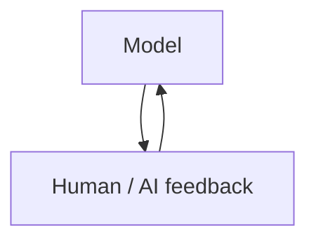

# From Models to Frontiers

*Advanced topics in large language modeling — Volume III*

*Sharif Uddin*

## Audience

Researchers, senior engineers, and technical leads who already build or critically evaluate LLM-based systems and want depth on **scaling**, **theory**, **alignment and safety**, **efficiency**, and **emerging paradigms** (multimodal models, agents, and open research questions). Readers should be comfortable with the vocabulary and day-to-day practice covered in *From Prompts to Systems* (Volume II); this volume assumes you can read papers and implementation-oriented documentation without needing every acronym explained from scratch.

---

## Introduction

### What this book is for

The first two volumes move from **what language models are** to **how to use them well in real workflows**. *From Models to Frontiers* steps back and forward at once: backward to the **scientific and engineering forces** that make today’s models possible, and forward to the **research directions** that will shape the next years—scaling and data, alignment, robustness, efficient training and deployment, multimodality, agents, and the open problems that still lack satisfactory answers.

The goal is not to replace a PhD curriculum or a full systems course. It is to give you a **structured map of the frontier**: enough depth to read primary sources with judgment, to participate in technical debates, and to decide where your own learning or R&D should go next—whether you care about safety, performance, cost, or fundamental understanding.

### How this volume is organized

The outline groups topics into **pillars** that recur in both industry and academia: **scale and pretraining**, **alignment and societal impact**, **efficiency**, **capabilities beyond text**, and **open questions**. Within each part, chapters mix **conceptual framing** with **representative techniques** (to be expanded as you draft). Some themes—e.g. evaluation, interpretability, governance—appear in more than one part because they cut across pillars.

### Prerequisites and suggested use

You will get the most from this book if you can follow discussions of **loss curves**, **fine-tuning**, **RLHF-style feedback**, and **API-level agent loops** at a high level. Where a topic depends on linear algebra, probability, or distributed systems, the text will signal that and point to standard references rather than rederive everything.

Use the outline as a **manuscript contract**: each section can grow into a chapter or be merged or split as your writing evolves. Keep a running bibliography in **Notes** or a separate references file when you start citing papers in earnest.

---

## Full text — Parts I through V

# Part I — Scale, data, and the pretraining stack

*Sharif Uddin*

*[From Models to Frontiers](from-models-to-frontiers.md) · Volume III*

---

This part is about **why** large models look the way they do: **scaling trends**, **data** at web scale, **architecture** choices at survey depth, and **post-training** stages that turn a base model into something you can ship. It complements Volume II’s practice with **research- and systems-level** framing.

---

## Contents of this part

*In the full volume table of contents, these correspond to sections 1–4.*

| | Chapter | What you will take away |
|---|--------|-------------------------|
| **1** | Scaling laws and predictable returns | Compute, data, size, loss—budgeting without mysticism |
| **2** | Data at scale: curation, contamination, documentation | Filtering, leakage, datasheets |
| **3** | Architecture variants and inductive biases | Transformers, MoE, long context—what scale vs prior explains |
| **4** | Post-training: beyond next-token prediction | SFT, preferences, multistage pipelines |

**Contents (plain list — same as table):**

1. Scaling laws — predictable returns and limits.  
2. Data at scale — curation, contamination, documentation.  
3. Architecture variants — survey-level; inductive biases.  
4. Post-training — instruction tuning and preference optimization.

---

## Chapter 1 — Scaling laws and predictable returns

**Scaling laws** summarize empirical relationships: for a family of models, **loss** (or downstream metrics) often improves predictably as you increase **compute**, **data**, or **parameters**—holding other factors roughly constant.

### Chinchilla-style tradeoffs

Rough guidance from the Chinchilla line of work: given a **fixed compute** budget, **undertraining** huge models on too little data is wasteful; **balance** model size and **tokens seen**. Exact numbers depend on **recipe** and **architecture**—treat laws as **planning tools**, not universal constants.

### Limits of the intuition

**Data quality** beats raw token count when domains shift. **Saturation** appears when benchmarks max out or **memorization** dominates. **Domain shift** breaks naive scaling plots. **Inference** and **alignment** costs may dominate **product** economics even when training scaled well.

> **In this chapter.** Scaling laws help budget experiments; they do not replace measurement on **your** task and distribution.

---

## Chapter 2 — Data at scale: curation, contamination, and documentation

**Web-scale** corpora need **filtering** (quality, toxicity, PII), **deduplication** (exact and fuzzy), and often **language** or **domain** balancing. Aggressive dedup can **remove** useful repetitions (e.g. boilerplate) or **skew** rare domains—**tradeoffs**, not free wins.

### Contamination and benchmarks

**Test-set leakage** inflates scores. **Documentation** of training cutoffs and **benchmark** construction matters for **honest** comparisons. Treat leaderboard numbers with **provenance**.

### Datasheets for datasets

**Datasheets** and **data statements** document **intent**, **provenance**, **limitations**, and **biases**—minimal professionalism for datasets that train **foundation** models.

> **In this chapter.** Data is the second half of scaling; curation and documentation are part of **science**, not housekeeping.

---

## Chapter 3 — Architecture variants and inductive biases

Transformers remain **dominant**, but variants matter: **long-context** methods (attention approximations, sliding windows), **mixture-of-experts** (sparse activation for scale), **state-space** and hybrid models in some niches. At **survey** level: know **what problem** each family addresses.

### Scale vs prior

Some behaviors **emerge** with scale; others are **built in** by **architecture** and **objective**. Separating the two requires **controlled** comparisons—not only headline parameters.

> **In this chapter.** Architecture is a lever; empirical validation on your workload beats brand names.

---

## Chapter 4 — Post-training: beyond next-token prediction

**Pretraining** optimizes **next-token** loss on broad text. **Instruction tuning** (supervised fine-tuning on demonstrations) teaches **task format** and **dialogue**. **Preference** optimization (**RLHF**, **DPO**, cousins) nudges outputs toward **human-rated** or **AI-rated** preferences.

### Multistage pipelines

Typical story: **pretrain** → **SFT** → **preference** training → optional **iterative** rounds with **evaluation** gates. Each stage can **shift** capabilities and **failure modes**—**not** interchangeable knobs.

> **In this chapter.** Post-training aligns **behavior** to deployment needs; it is not “one more epoch” of pretraining.

---

## Try it

1. **Scaling intuition.** In two sentences, explain why **doubling parameters** without more **data** may **not** follow the same loss curve as a balanced scaling policy.

2. **Leakage.** Name **one** way benchmark **contamination** can inflate scores and **one** mitigation researchers use.

---

*End of Part I. Previous: [From Prompts to Systems — Volume II](../from-prompts-to-systems/from-prompts-to-systems.md) · Next: [Part II — Alignment, safety, and robustness](from-models-to-frontiers-part-ii-alignment-safety-and-robustness.md) · Or [main volume](from-models-to-frontiers.md).*

---

# Part II — Alignment, safety, and robustness

*Sharif Uddin*

*[From Models to Frontiers](from-models-to-frontiers.md) · Volume III*

---

**Alignment** is not a single slider. This part covers **goals and tensions**, **evaluation under attack**, **interpretability and monitoring**, and **governance**—at a level that connects **papers** to **deployment** without pretending the field is solved.

---

## Contents of this part

*In the full volume table of contents, these correspond to sections 5–8.*

| | Chapter | What you will take away |
|---|--------|-------------------------|
| **1** | Alignment in practice: goals and tensions | Helpfulness vs honesty vs harmlessness; Goodhart |
| **2** | Red teaming, eval harnesses, adversarial robustness | Jailbreaks, shift, long-horizon use |
| **3** | Interpretability and monitoring | Representations vs behavior; drift and escalation |
| **4** | Governance, deployment, and dual-use | Release, capability evals, policy pointers |

**Contents (plain list — same as table):**

1. Alignment goals and tensions — tradeoffs and gaming.  
2. Red teaming and robustness — eval harnesses, adversaries.  
3. Interpretability and monitoring — what you can monitor in prod.  
4. Governance and dual-use — release and institutions.

---

## Chapter 1 — Alignment in practice: goals and tensions

Common shorthand—**helpful, honest, harmless**—masks **tensions**: **helpful** answers can be **harmful** if wrong; **refusal** can be **honest** but **unhelpful**. **Metrics** for each axis conflict under **optimization**—**Goodhart** effects when teams maximize one score.

### Specification gaming

Models (and **humans** in the loop) optimize **measurable** proxies. **Red-team** for **proxy failure**; **combine** behavioral tests with **judgment**.

> **In this chapter.** Alignment is multi-objective; watch for gaming the metric you publish internally.

---

## Chapter 2 — Red teaming, eval harnesses, and adversarial robustness

**Red teaming** means **structured** attempts to elicit **harm** or **policy violations**—by **humans** and **automation**. **Jailbreaks** evolve with **mitigations**; **static** test suites go stale.

### Distribution shift and long horizons

**Train** distributions rarely match **deployment**. **Long-horizon** tasks compound **small** errors. **Robustness** requires **stress tests**, not only average-case accuracy.

> **In this chapter.** Safety evals are **living** systems; adversaries do not stop at your last benchmark.

---

## Chapter 3 — Interpretability and monitoring

**Interpretability** spans **mechanistic** (circuits, features in weights) and **behavioral** (does it do what we want on tests?). For **operators**, **behavioral** monitoring plus **limited** mechanistic insight often beats **pretty** visualizations with no **action**.

### Monitoring deployed systems

Track **drift** in inputs and outputs, **misuse** patterns, and **escalation** paths to **human** review. **Interpretability** without **governance** does not **fix** incidents.

> **In this chapter.** Know what you can **measure** in production; invest in **alerts** and **playbooks**.

---

## Chapter 4 — Governance, deployment, and dual-use

**Release** strategies range from **full open** weights to **API-only** with **safety** filters. **Capability evaluations** attempt to **bound** risk before **wide** release—**imperfect** but better than **vibes**.

### Dual-use and policy

Powerful models enable **benefit** and **misuse**; **international** and **institutional** contexts differ. This book **points** to policy literatures rather than **prescribing** law.

> **In this chapter.** Governance is **choices** under uncertainty; pair technical evals with **stakeholder** process.

---

## Try it

1. **Tradeoff.** Name **two** alignment goals that can **conflict** on the same user query and how you might **disambiguate** in product policy.

2. **Red team.** Draft **one** adversarial user goal (non-harmful to describe) that tests **over-refusal** vs **under-safety**—what would you **measure**?

---

*End of Part II. Previous: [Part I — Scale, data, and the pretraining stack](from-models-to-frontiers-part-i-scale-data-and-the-pretraining-stack.md) · Next: [Part III — Efficiency: training, inference, and systems](from-models-to-frontiers-part-iii-efficiency-training-inference-and-systems.md) · Or [main volume](from-models-to-frontiers.md).*

---

# Part III — Efficiency: training, inference, and systems

*Sharif Uddin*

*[From Models to Frontiers](from-models-to-frontiers.md) · Volume III*

---

**Efficiency** decides what is **affordable** to train and **cheap** enough to serve. This part spans **training** systems, **inference** tricks, and **hardware** context at a **decision-maker** level—not a cluster manual.

---

## Contents of this part

*In the full volume table of contents, these correspond to sections 9–11.*

| | Chapter | What you will take away |
|---|--------|-------------------------|
| **1** | Training efficiency | Precision, parallelism, checkpoints, curriculum |
| **2** | Inference efficiency | Quantization, distillation, KV cache, latency–quality–cost |
| **3** | Specialized hardware and software stacks | GPUs/TPUs, compilers, APIs vs custom silicon |

**Contents (plain list — same as table):**

1. Training efficiency — scale compute wisely.  
2. Inference efficiency — serve cheaply at quality.  
3. Hardware and stacks — constraints on design.

---

## Chapter 1 — Training efficiency

**Mixed precision** (e.g. bf16/fp16) cuts **memory** and increases **throughput** when numerically stable. **Parallelism** (data, tensor, pipeline, expert) trades **complexity** for **scale**. **Checkpointing** and **fault tolerance** matter when jobs run **days** and **fail**.

### Curriculum and data order

**Data ordering** and **curriculum** can affect **convergence** and **final** behavior—often underexplored vs raw **FLOPs**.

> **In this chapter.** Training efficiency is **systems + ML**; profile before **mythical** optimizations.

---

## Chapter 2 — Inference efficiency

**Quantization** reduces **weight** and **activation** precision for **smaller** footprints and **faster** matmuls—watch **accuracy** cliffs per task. **Distillation** transfers behavior from **teacher** to **student**. **Speculative decoding** uses **small** models to **draft** tokens for **large** models. **KV-cache** memory dominates **long** contexts at **serve** time.

### Latency, quality, cost

Product decisions live on a **Pareto** surface—**no** single “best” model. **Measure** **SLOs** and **$/query**.

> **In this chapter.** Inference economics often **dominate** training **amortized** over users—optimize the **right** stage.

---

## Chapter 3 — Specialized hardware and software stacks

**GPUs** and **TPUs** remain central; **compiler** stacks (kernel fusion, layout) change **real** throughput. **Hosted APIs** outsource **capacity planning**; **self-hosted** shifts **burden** to your **team**.

### Custom silicon

**ASICs** for inference/training **reshape** **$/token** when **volume** justifies **NRE**. **Decision** level: know **when** vendor **roadmaps** matter to **your** **scale**.

> **In this chapter.** Hardware is **not** neutral—it **filters** which **techniques** are practical at **your** size.

---

## Try it

1. **Inference tradeoff.** Pick **one** technique (quantization, speculative decoding, smaller model). Name **what** you gain and **what** you risk.

2. **Bottleneck.** For a **long-context** chat product, is **training** or **inference** more likely to dominate **marginal** cost at scale? One sentence **why**.

---

*End of Part III. Previous: [Part II — Alignment, safety, and robustness](from-models-to-frontiers-part-ii-alignment-safety-and-robustness.md) · Next: [Part IV — Beyond text: multimodal models and agents](from-models-to-frontiers-part-iv-beyond-text-multimodal-models-and-agents.md) · Or [main volume](from-models-to-frontiers.md).*

---

# Part IV — Beyond text: multimodal models and agents

*Sharif Uddin*

*[From Models to Frontiers](from-models-to-frontiers.md) · Volume III*

---

Language is not the only **interface** to the world. This part surveys **multimodal** fusion, **tool use and grounding** at research depth, and **agents**—**planning**, **memory**, and **reliability** over **many** steps.

---

## Contents of this part

*In the full volume table of contents, these correspond to sections 12–14.*

| | Chapter | What you will take away |
|---|--------|-------------------------|
| **1** | Multimodal foundations | Vision–language, audio–language, unified vs modular |
| **2** | Tool use, retrieval, and grounding | RAG vs fine-tune vs context; freshness |
| **3** | Agents: planning, memory, multi-step reliability | Architectures, failures, open problems |

**Contents (plain list — same as table):**

1. Multimodal foundations — fusion patterns and eval.  
2. Tool use and grounding — when to retrieve vs memorize.  
3. Agents — planning, memory, evaluation over time.

---

## Chapter 1 — Multimodal foundations

**Vision–language** models map **images and text** into **shared** representational spaces—**contrastive** pretraining, **generative** objectives, or **encoder–decoder** stacks. **Audio–language** follows similar **patterns** with **different** **tokenization** (spectrograms, discrete speech units).

### Unified vs modular

**Unified** transformers over **flattened** multimodal token streams vs **modular** encoders feeding **fusion** layers—**tradeoffs** in **data**, **latency**, and **interpretability**. **Evaluation** is harder than text-only: **grounding**, **hallucinated** objects, **fairness** across **modalities**.

> **In this chapter.** Multimodal is **not** text plus a side channel—it changes **errors** and **metrics**.

---

## Chapter 2 — Tool use, retrieval, and grounding

Volume II treated **RAG** as engineering. Here the question is when **retrieval** beats long context or fine-tuning for **freshness** and **provenance**, and when **parametric** memory suffices. Grounding in external knowledge needs clear **protocols**—models confabulate citations without tool **discipline**.

> **In this chapter.** Grounding is a **systems** property: **tools**, **retrieval**, and **prompts** together.

---

## Chapter 3 — Agents: planning, memory, and multi-step reliability

**Agents** loop: observe → plan → act (tools, APIs) → update state. **Failure modes** include drift, infinite loops, wrong tool arguments, and unsafe chains of actions.

### Open problems

Credit assignment over long horizons, safe interruptibility, evaluation of open-ended tasks, and alignment when reward is delayed—all **active research**.

> **In this chapter.** Agents multiply risk and debugging surface—invest in eval harnesses before hype.

---

## Try it

1. **Multimodal.** Name one evaluation risk specific to vision–language models that does not arise in text-only QA.

2. **Agent.** Describe one failure mode for a tool-using agent and one mitigation (architecture or process).

---

*End of Part IV. Previous: [Part III — Efficiency: training, inference, and systems](from-models-to-frontiers-part-iii-efficiency-training-inference-and-systems.md) · Next: [Part V — Frontiers and open problems](from-models-to-frontiers-part-v-frontiers-and-open-problems.md) · Or [main volume](from-models-to-frontiers.md).*

---

# Part V — Frontiers and open problems

*Sharif Uddin*

*[From Models to Frontiers](from-models-to-frontiers.md) · Volume III*

---

The **frontier** is not only **bigger** models—it is **better** **evaluation**, **deeper** **science**, and **honest** **uncertainty**. This closing part discusses **evaluating** **capabilities**, **open** **research** **themes**, and **how** to **read** the **field** **without** **drowning**.

---

## Contents of this part

*In the full volume table of contents, these correspond to sections 15–17.*

| | Chapter | What you will take away |
|---|--------|-------------------------|
| **1** | Evaluation at the frontier | Capability vs process; dynamic benchmarks; impact lens |
| **2** | Open research directions | Reasoning, continual learning, world models, collaboration |
| **3** | Reading the field | arXiv, conferences, open models—building a curriculum |

**Contents (plain list — same as table):**

1. Evaluation at the frontier — what “good” means as tasks move.  
2. Open research directions — themes and unknowns.  
3. Reading the field — sustainable habits.

---

## Chapter 1 — Evaluation at the frontier

**Capability** benchmarks risk **saturating** or **gaming**. **Process-based** evaluation asks **whether** **correct** **reasoning** **occurred**—harder but **closer** to **trust** for **high-stakes** **use**. **Dynamic** **benchmarks** attempt to **reduce** **memorization**—none **perfect**.

### Societal lens

**Occupational** and **social** **impact** are **not** **single** **scores**—still **worth** **structured** **discussion** alongside **technical** **metrics**.

> **In this chapter.** Evaluation **co-evolves** with **capabilities**—**skepticism** of **leaderboards** is **healthy**.

---

## Chapter 2 — Open research directions

**Reasoning** beyond pattern matching, continual learning without catastrophic forgetting, world models that support planning, and human–AI collaboration design remain open. **Generalization** and **emergence** lack complete theories—treat bold claims with care.

> **In this chapter.** The map is not empty—but many labels still say “here be dragons.”

---

## Chapter 3 — Reading the field

**arXiv** moves fast—filter with trusted aggregators, labs you follow, and reproducibility signals. Conferences provide peer review—not infallible but structured. Open weights lower barriers and raise responsibility for release norms.

### Personal curriculum

Rotate depth: e.g. one architecture paper, one systems paper, one alignment paper per month—adjust to your role. Reconnect to Volumes I–II when research touches users.

> **In this chapter.** Sustainability beats FOMO—depth on relevant threads wins.

---

## Try it

1. **Eval lens.** Give one reason process-based evaluation might matter more than final-answer accuracy for a math tutor product.

2. **Curriculum.** List two sources (not papers) you will use to track releases responsibly (e.g. model cards, specific blogs, official docs).

---

*End of Part V — Volume III — From Models to Frontiers. Previous: [Part IV — Beyond text: multimodal models and agents](from-models-to-frontiers-part-iv-beyond-text-multimodal-models-and-agents.md) · [Trilogy hub — README](../README.md) · Or [main volume](from-models-to-frontiers.md).*

---

## Notes

This section collects **optional material** for Volume III: exercise index, glossary-style anchors, reading strategy, optional **figures**, and accessibility notes. Parts remain the canonical draft.

### Accessibility

Each part file includes a **plain list** mirroring the contents **table** for tools or readers that do not render tables well.

### Exercise index (*Try it* sections)

| Part | File | Rough focus |
|------|------|-------------|
| I | [part-i](from-models-to-frontiers-part-i-scale-data-and-the-pretraining-stack.md) | Scaling intuition; data leakage checklist |
| II | [part-ii](from-models-to-frontiers-part-ii-alignment-safety-and-robustness.md) | Align tradeoff; red-team scenario |
| III | [part-iii](from-models-to-frontiers-part-iii-efficiency-training-inference-and-systems.md) | Inference tradeoff; hardware assumption |
| IV | [part-iv](from-models-to-frontiers-part-iv-beyond-text-multimodal-models-and-agents.md) | Multimodal eval; agent failure mode |
| V | [part-v](from-models-to-frontiers-part-v-frontiers-and-open-problems.md) | Eval lens; reading list seed |

**Exercise index (plain list):** Part I — scaling, data hygiene · Part II — alignment tensions, robustness · Part III — train vs inference efficiency · Part IV — modality, agents · Part V — frontier eval, curriculum.

### Glossary export (Volume III anchors)

- **Scaling law** — Empirical relationship linking **compute**, **data**, **model size**, and **loss**; useful for budgeting, not prophecy.  
- **Chinchilla-optimal** — Roughly: for a given compute budget, **balance** parameters and tokens rather than parameters alone.  
- **Alignment** — Steering models toward **intended** behavior (helpful, honest, harmless)—**not** guaranteed by scale alone.  
- **RLHF / DPO** — Families of **preference-based** post-training (reinforcement from human feedback vs. direct preference optimization—details in papers).  
- **Emergence** — Capabilities that **appear** as scale increases; **mechanisms** and **definitions** remain debated.

### Reading strategy

- Prefer **primary** sources and **model / system cards** over hot takes.  
- Track **one** conference (e.g. NeurIPS, ICML, ACL) and **one** open-model release line relevant to your work.  
- Revisit *From Prompts to Systems* when a frontier topic connects back to **shipping** constraints.

### Optional figures (Mermaid)

**Pretrain → post-train (conceptual)**

**Alignment as feedback loop**

### Chapter notes

_Add paper lists, BibTeX, and open questions per chapter below._
