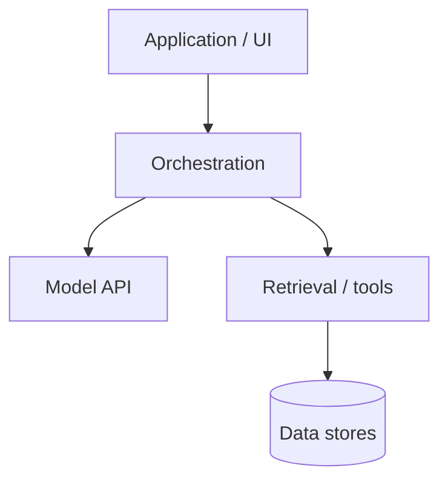
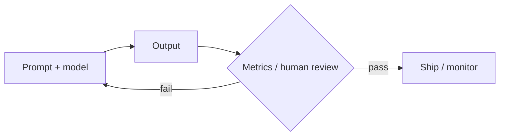

# From Prompts to Systems

*Intermediate practice with large language models — Volume II*

*Sharif Uddin*

## Audience

**Developers, analysts, product managers, and technical writers** who already use LLMs in daily work and want **clearer mental models**, **repeatable workflows**, and **enough depth to ship** features—not just one-off prompts—without yet diving into research-scale training or frontier theory (that is Volume III). You should be comfortable with *From Tokens to Understanding* (Volume I) or equivalent: tokens, context windows, basic prompting, and honest limits of the technology.

---

## Introduction

### What this book is for

Volume I answers **what** language models are and **how to begin** using them responsibly. *From Prompts to Systems* answers **how to turn that familiarity into practice you can defend**: choosing approaches (prompt vs. retrieval vs. fine-tuning), **iterating with data**, **measuring quality**, **wiring models into software**, and **operating** them with costs, failures, and teams in mind.

The emphasis is **applied**: fewer proofs, more **decision patterns**—when a longer prompt beats a pipeline change, when evaluation should block a release, how to structure an API layer so you can swap models later. The goal is that after this volume you can own an LLM-powered feature from prototype to something your team can maintain—and know what Volume III will unpack if you need to go deeper on training, safety science, or scale.

### How this volume is organized

The outline groups material into **pillars** that mirror real projects: **understanding what you are shipping**, **designing prompts and interactions**, **adapting behavior** (data, retrieval, light fine-tuning), **evaluating and monitoring**, **building integrations**, and **shipping responsibly**. Themes like **evaluation** and **safety** appear in more than one part because they are both design-time and runtime concerns.

Chapters are written to support **hands-on progression**: you can draft exercises (small apps, eval sets, prompt libraries) per part even before the prose is final.

### Prerequisites and suggested use

You should be comfortable using at least one **chat or API** interface, reading **JSON**-shaped API responses, and thinking in terms of **inputs, outputs, and failure cases**. Light scripting (e.g. Python or JavaScript) will help for later chapters; where code is essential, the book can stay pseudocode-first.

Use the outline as a **manuscript contract**: merge or split chapters as your teaching style evolves. Keep implementation notes, vendor-specific quirks, and bibliography in **Notes** or sidecar files so the main text stays durable.

---

## Full text — Parts I through VI

# Part I — Mental models and the model lifecycle

*Sharif Uddin*

*[From Prompts to Systems](from-prompts-to-systems.md) · Volume II*

---

Volume I explained **what** LLMs are and how they behave in the abstract. This part is about **shipping**: the difference between a **demo** and a **product**, how **training stages** show up in model cards, how to **choose** a model, and how **context, memory, and retrieval** fit together before you dive into prompts and RAG in later parts.

---

## Contents of this part

*In the full volume table of contents, these correspond to sections 1–4.*

| | Chapter | What you will take away |
|---|--------|-------------------------|
| **1** | From playground to product | Latency, cost, ownership, and the stack around the model |
| **2** | Training stages in one picture | Pretraining, instruction tuning, preferences—“smart” vs “aligned” |
| **3** | Choosing a model and reading model cards | Context, license, deployment; open vs closed weights |
| **4** | Context, memory, and state | Truncation, summarization, retrieval vs fine-tune (preview) |

**Contents (plain list — same as table):**

1. From playground to product — stack and product concerns.  
2. Training stages in one picture — base vs chat, axes of capability.  
3. Choosing a model and reading model cards — constraints and cards.  
4. Context, memory, and state — what fits, what to design for.

---

## Chapter 1 — From playground to product

A **playground** proves the model can do something cool once. A **product** does it **reliably**, under **load**, with **clear ownership** when things break.

### What changes at launch

**Latency** budgets appear: users tolerate seconds for some tasks, milliseconds for others. **Cost** becomes continuous—tokens, seats, or inference hours—not a one-off experiment. **Versioning** matters: which **model ID**, which **prompt template version**, which **retrieval index** went into this answer? **Ownership** means an on-call path: who rolls back a bad prompt change?

### The stack around the model

Think in layers: **client** (web, mobile, internal tool) → **application** (your business logic) → **orchestration** (prompt assembly, retrieval, tool routing) → **model provider** (API or self-hosted weights) → **data** (vector store, caches, feature flags). The LLM is one box; **reliability** is a system property.

> **In this chapter.** Shipping adds latency, cost, versioning, and ownership; map the stack before you optimize the model alone.

---

## Chapter 2 — Training stages in one picture

You do not need to train models to **read** how they were produced. Model cards and blog posts refer to **pretraining**, **instruction tuning**, **preference tuning**—different pressures on the same weights.

### Pretraining

The model learns broad **language and world patterns** from large text (and often code). That stage sets rough **knowledge cutoff**, fluency, and “raw” behavior—sometimes ill-suited to chat without later steps.

### Instruction and preference tuning

Later stages teach **dialogue format**, **refusal** boundaries, and **helpfulness** as judged by raters or automated preference models. **Capability** (reasoning, knowledge) and **alignment** (policy, tone) are related but **not identical**: a base model can be strong yet unsafe for direct users; a chat model can be polite yet shallow.

> **In this chapter.** “Smarter” and “more aligned” are different axes; cards that describe pipeline stages help you predict behavior changes.

---

## Chapter 3 — Choosing a model and reading model cards

**Model cards** (and API docs) are your **contract** for what to expect: **context length**, **modalities** (text-only vs vision), **languages**, **license** (can you fine-tune? deploy how?), and **known limitations**.

### Deployment constraints

Will you run **hosted APIs** only, or **on-prem** / **VPC** with certain certifications? Do you need **structured outputs** or **tool calling** as first-class features? Match **requirements** before you benchmark accuracy.

### Open vs closed weights

**Open-weight** models can be inspected, fine-tuned, and run locally—at the cost of **your** ops burden. **Closed APIs** shift **scaling and safety** to the vendor; you get less control over internals. Neither is universally “better”; fit to **risk**, **budget**, and **latency**.

> **In this chapter.** Read the card for context, license, modalities, and limits before A/B testing clever prompts.

---

## Chapter 4 — Context, memory, and state

Everything the model “remembers” in-session is what you put in the **prompt** (plus optional **retrieved** chunks). There is no hidden long-term memory unless **you** build storage and re-injection.

### Truncation and summarization

Long chats and documents exceed **context**. Strategies: **truncate** old turns, **summarize** history, or **start fresh** threads. Each trades **fidelity** for **space**.

### Session state vs retrieval vs fine-tuning

- **Session state**: your database of user facts, re-injected when relevant.  
- **Retrieval**: fetch **documents** per query (Part III).  
- **Fine-tuning**: adjust weights with **curated** examples—use when behavior must be **consistent** and **prompting + RAG** are insufficient (details in Volume III).

> **In this chapter.** Context is designed, not magical; retrieval and adaptation are separate tools with separate costs.

---

## Try it

1. **Playground vs product.** List **five** concerns that appear when moving an internal chat demo to a customer-facing feature (e.g. latency, logging). Which are **not** about the raw model quality?

2. **Model card.** Open a **model card** or API doc for a model you might use. Note: **context length**, **license**, **one** limitation, and **one** training stage mentioned.

---

*End of Part I. Previous: [From Tokens to Understanding — Volume I](../from-tokens-to-understanding/from-tokens-to-understanding.md) · Next: [Part II — Prompting as engineering](from-prompts-to-systems-part-ii-prompting-as-engineering.md) · Or [main volume](from-prompts-to-systems.md).*

---

# Part II — Prompting as engineering

*Sharif Uddin*

*[From Prompts to Systems](from-prompts-to-systems.md) · Volume II*

---

Prompts are not vibes—they are **interfaces**. This part treats them like **versioned artifacts**: structure, iteration, debugging, and **UX** for features that stream, fail, and get reviewed by humans.

---

## Contents of this part

*In the full volume table of contents, these correspond to sections 5–8.*

| | Chapter | What you will take away |
|---|--------|-------------------------|
| **1** | Prompt structure and patterns | System / user / tools; few-shot and chain-of-thought tradeoffs |
| **2** | Iteration and prompt libraries | Versioning, A/B, templates and guardrails |
| **3** | Failure modes and debugging | Hallucination, format drift, tool misuse—fixes |
| **4** | Interaction and UX for LLM features | Streaming, undo, expectations, team norms |

**Contents (plain list — same as table):**

1. Prompt structure and patterns — roles, patterns, CoT when to use.  
2. Iteration and prompt libraries — version control for prompts.  
3. Failure modes and debugging — diagnose and constrain.  
4. Interaction and UX — streaming, expectations, collaboration.

---

## Chapter 1 — Prompt structure and patterns

**System** messages set global rules; **user** messages carry the task; **assistant** history is prior output; **tool** messages carry **results** from your code. APIs differ in naming—map them mentally to those roles.

### Few-shot and chain-of-thought

**Few-shot** examples teach **format** faster than prose. **Chain-of-thought** (“think step by step”) can improve **reasoning-heavy** tasks—and can **hurt** when you need **speed**, **brevity**, or when the model **leaks** reasoning you do not want users to see. **Hide** chain-of-thought in internal prompts when appropriate.

> **In this chapter.** Roles are contracts; few-shot locks format; CoT is a tool with tradeoffs.

---

## Chapter 2 — Iteration and prompt libraries

Treat prompts like **code**: **branch**, **review**, and **tag** versions (e.g. `prompt-v1.3`, `holiday-tone`). Store them in **git** or a **CMS**—not only in a chat box.

### A/B and offline comparison

For changes that affect **metrics**, run **offline** evals on a **golden set** (Part IV) before live A/B. **Online** experiments need **traffic** and **guardrails**—do not ship prompt changes without a rollback path.

### Templates and guardrails

**Variables** (user name, locale) belong in templates, not copy-paste. **Guardrails** (“never output raw JSON to end users”) belong in **system** or **post-processing**, not hope.

> **In this chapter.** Version prompts, measure before wide rollout, separate data from policy.

---

## Chapter 3 — Failure modes and debugging

**Hallucination** and **format errors** are not rare bugs—they are **baseline risks**. **Sycophancy** (agreeing with the user) can break **safety** or **accuracy**.

### Techniques

**Decompose** tasks into steps; **self-check** (“list assumptions before answering”); **constrain** output (**JSON schema**, **regex** validation). For **tools**, validate arguments in **code** before execution.

> **In this chapter.** Debug with structure: smaller steps, validation, and explicit uncertainty.

---

## Chapter 4 — Interaction and UX for LLM features

**Streaming** tokens improves perceived speed; pair with **cancel** and **retry**. **Undo** or **edit** last turn reduces frustration when the model drifts.

### Expectations

Tell users **what the feature does not do** (no legal advice, no real-time data unless wired). **Loading** and **error** states should be honest—masking failures erodes trust.

### Team norms

Decide how **engineering** and **design** review **tone**, **disclosure** of AI, and **fallbacks** when the model is down. Document **prompts** and **model IDs** in **runbooks**.

> **In this chapter.** UX and ops are part of the feature—not polish after the fact.

---

## Try it

1. **Template.** Write a **system** prompt + one **user** template with `{variable}` slots for a task you care about. Version it (`v0.1`) in a file.

2. **Debug.** Reproduce **one** failure (wrong format or hallucination). Change **only** the prompt: add a constraint or a single-shot example. Did behavior improve?

---

*End of Part II. Previous: [Part I — Mental models and the model lifecycle](from-prompts-to-systems-part-i-mental-models-and-the-model-lifecycle.md) · Next: [Part III — Data, retrieval, and adaptation](from-prompts-to-systems-part-iii-data-retrieval-and-adaptation.md) · Or [main volume](from-prompts-to-systems.md).*

---

# Part III — Data, retrieval, and adaptation

*Sharif Uddin*

*[From Prompts to Systems](from-prompts-to-systems.md) · Volume II*

---

Not every problem is a **prompt** problem. This part is about **when to fetch facts**, **how RAG fits together** at a practical level, **data for adaptation**, and **tools** that connect models to your systems **safely**.

---

## Contents of this part

*In the full volume table of contents, these correspond to sections 9–12.*

| | Chapter | What you will take away |
|---|--------|-------------------------|
| **1** | When to retrieve vs. prompt vs. fine-tune | Decision flow: freshness, privacy, cost |
| **2** | Retrieval-augmented generation (RAG) | Chunking, embeddings, grounding, citations |
| **3** | Curating and labeling data for adaptation | Quality, formats, synthetic data risks |
| **4** | Tools and function calling | Safe tools, retries, orchestration patterns |

**Contents (plain list — same as table):**

1. When to retrieve vs. prompt vs. fine-tune — decision flow.  
2. RAG — chunk, embed, retrieve, generate.  
3. Curating data — labels, quality, synthetic caveats.  
4. Tools and function calling — contracts and orchestration.

---

## Chapter 1 — When to retrieve vs. prompt vs. fine-tune

**Prompting** alone works when **knowledge** is in the model or **not critical**. **Retrieval** when facts are **fresh**, **private**, or **too large** to memorize in weights. **Fine-tuning** when you need **stable style or behavior** across many inputs and prompts are brittle—subject to data cost and Volume III depth.

### Decision flow (simplified)

- Need **latest** docs or **internal** wiki? → **RAG** (or live API tools).  
- Need **consistent brand voice** on millions of requests? → consider **fine-tuning** + eval.  
- One-off **format** or **tone**? → **prompt** + few-shot first.

> **In this chapter.** Match mechanism to constraint: freshness, privacy, cost, and behavior stability.

---

## Chapter 2 — Retrieval-augmented generation (RAG)

**RAG** = **retrieve** relevant chunks, **inject** into context, **generate**. Quality hinges on **chunking** (size, overlap), **embedding** model choice, and **index** freshness.

### Grounding and “not in corpus”

Instruct the model to **cite** or **quote** retrieved text; **refuse** when chunks do not support an answer. **Hallucination** on top of bad retrieval is **worse** than admitting ignorance—design **fallback** UX.

> **In this chapter.** RAG is a pipeline: bad chunks in → fluent garbage out; invest in retrieval quality.

---

## Chapter 3 — Curating and labeling data for adaptation

Whether you **fine-tune** or **build eval sets**, **data quality** beats raw size. **Duplicates** and **biased** raters distort behavior. **Synthetic** data can bootstrap—but may **amplify** model biases; **human** spot checks matter.

> **In this chapter.** Label carefully; watch for feedback loops; synthetic data is a lever, not a cure-all.

---

## Chapter 4 — Tools and function calling

**Tools** are **your** functions: query DB, create ticket, fetch URL—with **schemas** the model fills. **Never** give the model **open shell** or **arbitrary** network unless you **sandbox**.

### Orchestration

Patterns: **single** model with tools; **router** model picks a skill; **small pipeline** (classify → retrieve → answer). Pick **complexity** to match **failure modes** you can test.

> **In this chapter.** Tools need schemas, validation, retries, and least privilege—same as any integration.

---

## Try it

1. **Decision.** Pick one real task (e.g. “answer from our handbook”). Write **two sentences**: why **RAG** vs **prompt-only** for that task.

2. **Tool contract.** Sketch a **JSON schema** for one function (name + two parameters). What could go wrong if the model **hallucinates** an argument?

---

*End of Part III. Previous: [Part II — Prompting as engineering](from-prompts-to-systems-part-ii-prompting-as-engineering.md) · Next: [Part IV — Evaluation, quality, and safety in practice](from-prompts-to-systems-part-iv-evaluation-quality-and-safety-in-practice.md) · Or [main volume](from-prompts-to-systems.md).*

---

# Part IV — Evaluation, quality, and safety in practice

*Sharif Uddin*

*[From Prompts to Systems](from-prompts-to-systems.md) · Volume II*

---

**You ship what you measure.** This part covers **metrics**, **golden sets** and **regression** discipline, and **product safety** layers—so improvements do not become accidents at scale.

---

## Contents of this part

*In the full volume table of contents, these correspond to sections 13–15.*

| | Chapter | What you will take away |
|---|--------|-------------------------|
| **1** | What to measure | Task quality, latency, cost, human vs automatic judgment |
| **2** | Test sets, regression testing, and CI | Golden sets, model upgrades, breaking changes |
| **3** | Safety and abuse in product context | Policies, classifiers, PII, escalation |

**Contents (plain list — same as table):**

1. What to measure — metrics that match the job.  
2. Test sets and regression — golden sets, CI mindset.  
3. Safety and abuse — layers and data handling.

---

## Chapter 1 — What to measure

**Accuracy** on a task is not one number: **correctness** of facts, **helpfulness**, **format** adherence, **latency**, **cost per success**, and **harm** rate. Pick **few** primary metrics aligned with **user value**—not every leaderboard score.

### Human vs model-as-judge vs automation

**Human** labels are gold but expensive. **Model-as-judge** scales but inherits **biases**. **Automatic** checks (JSON valid, regex, unit tests on tool args) are **cheap**—combine layers.

> **In this chapter.** Define success in user terms; mix human spot checks with scalable signals.

---

## Chapter 2 — Test sets, regression testing, and CI for LLM features

A **golden set** is a **fixed** batch of inputs (and often expected properties) you run on **every** prompt or model change. **Snapshot** outputs or **scores**—watch for **drift** when providers **silent-upgrade** models.

### CI mindset

**Block releases** when golden metrics fall below threshold—same as unit tests. **Pin** model versions in config until you **re-validate**.

> **In this chapter.** Treat prompt and model changes like code changes: test before merge.

---

## Chapter 3 — Safety and abuse in product context

**Policy layers** (blocklists, classifiers, moderation APIs) sit **beside** the model—not as a substitute for **good prompts**, but as **defense in depth**. **PII**: **minimize** what you log; **retention** policies are part of **security**.

### Escalation

Define **when** a human reviews **edge cases**—legal, self-harm, targeted harassment. **Automation** should not be the last word on every abuse report.

> **In this chapter.** Safety is product design: layers, logging discipline, and human escalation paths.

---

## Try it

1. **One metric.** Pick a feature you know. Name **one** measurable outcome (e.g. “% answers with valid JSON”) and **one** human-judged aspect.

2. **Golden test.** Write **three** input prompts you would put in a **regression** suite for that feature and **what** you would check automatically vs manually.

---

*End of Part IV. Previous: [Part III — Data, retrieval, and adaptation](from-prompts-to-systems-part-iii-data-retrieval-and-adaptation.md) · Next: [Part V — Systems: APIs, deployment, and operations](from-prompts-to-systems-part-v-systems-apis-deployment-and-operations.md) · Or [main volume](from-prompts-to-systems.md).*

---

# Part V — Systems: APIs, deployment, and operations

*Sharif Uddin*

*[From Prompts to Systems](from-prompts-to-systems.md) · Volume II*

---

Models live behind **APIs**. This part covers **wrappers**, **observability**, **cost and rate limits**, and **security** basics—so production incidents are **boring**, not mysterious.

---

## Contents of this part

*In the full volume table of contents, these correspond to sections 16–19.*

| | Chapter | What you will take away |
|---|--------|-------------------------|
| **1** | API design and abstraction layers | Retries, streaming, structured outputs |
| **2** | Observability and logging | Traces, redaction, dashboards |
| **3** | Cost, capacity, and rate limits | Tokens, caching, right-sizing |
| **4** | Security basics for LLM applications | Prompt injection, trust boundaries, sandboxing |

**Contents (plain list — same as table):**

1. API design — abstraction, timeouts, streaming.  
2. Observability — logs, traces, what not to log.  
3. Cost and capacity — tokens, caching, limits.  
4. Security — injection, tools, least privilege.

---

## Chapter 1 — API design and abstraction layers

Wrap vendor APIs behind **your** interface: **model name**, **temperature**, **max tokens** as **config**, not scattered strings. **Timeouts** and **retries** with **idempotency** keys for **side-effecting** tool calls.

### Structured outputs

Parse **JSON** defensively—models **stray**. **Schema validation** before downstream use. **Streaming** partial tokens: buffer until **valid** chunk if needed.

> **In this chapter.** One abstraction layer makes swaps and tests easier; validate all structured output.

---

## Chapter 2 — Observability and logging

Log **request IDs**, **latency**, **token counts**, **model ID**, **error codes**—not **raw** user PII unless required. **Trace** multi-step flows (retrieve → generate → tool).

### Dashboards

Track **error rate**, **p95 latency**, **cost per request**, and **quality** proxies from **offline** evals. **Alert** on spikes—often the first sign of a **bad deploy** or **provider** issue.

> **In this chapter.** Observability enables blameless postmortems; redact before you aggregate.

---

## Chapter 3 — Cost, capacity, and rate limits

**Token** accounting per **route** and **customer**. **Cache** repeated **context** where safe. **Batch** where latency allows. **Right-size** models: small model for **classification**, large for **generation**—if routing is worth the complexity.

> **In this chapter.** Cost is a feature; measure before you optimize the wrong layer.

---

## Chapter 4 — Security basics for LLM applications

**Prompt injection**: untrusted text **in** the prompt **directs** the model to ignore instructions or **exfiltrate** data. **Mitigations**: **separate** trusted vs untrusted blocks, **downgrade** privileges for tool calls, **human** approval for **irreversible** actions.

### Sandboxing

Run tools in **minimal** environments; **no** raw SQL from model output without **validation**. **Trust boundaries** mirror classic **web security**—with new angles.

> **In this chapter.** Treat the model as an untrusted client; tools are the real power.

---

## Try it

1. **Envelope.** Sketch a **pseudo-request** object your API would send upstream: fields for **model**, **messages**, **tools**, **timeout**. What is **one** field you would **not** expose to the browser?

2. **Log policy.** List **three** things worth logging for a single LLM request and **one** thing you would **strip** or **hash** by default.

---

*End of Part V. Previous: [Part IV — Evaluation, quality, and safety in practice](from-prompts-to-systems-part-iv-evaluation-quality-and-safety-in-practice.md) · Next: [Part VI — Teams, ethics, and the path forward](from-prompts-to-systems-part-vi-teams-ethics-and-the-path-forward.md) · Or [main volume](from-prompts-to-systems.md).*

---

# Part VI — Teams, ethics, and the path forward

*Sharif Uddin*

*[From Prompts to Systems](from-prompts-to-systems.md) · Volume II*

---

Shipping LLM features is **cross-functional**. This part covers **roles**, **documentation**, **responsible deployment** at an intermediate level, and the **bridge to Volume III** when you need research depth.

---

## Contents of this part

*In the full volume table of contents, these correspond to sections 20–22.*

| | Chapter | What you will take away |
|---|--------|-------------------------|
| **1** | Working in cross-functional teams | ML, backend, design, legal; handoffs |
| **2** | Responsible deployment (intermediate stance) | Transparency, escalation, proportionality |
| **3** | Bridge to *From Models to Frontiers* | What Volume III adds; skills to sharpen |

**Contents (plain list — same as table):**

1. Working in cross-functional teams — roles and checkpoints.  
2. Responsible deployment — transparency without Volume III depth.  
3. Bridge to Volume III — frontier topics and reading path.

---

## Chapter 1 — Working in cross-functional teams

**Product** defines success; **design** shapes trust and disclosure; **backend** owns latency and **API** contracts; **ML** (if present) owns **eval** and **model** choice; **legal** reviews **data** and **claims**. **No** single role “owns” safety—**checkpoints** (design review, legal sign-off for risky domains) prevent late surprises.

### Documentation

**Runbooks**: which **model**, which **prompt version**, how to **rollback**. **Playbooks** for **incidents** (spike in abuse, provider outage). Handoff should not depend on **one** engineer’s head.

> **In this chapter.** Clarity of ownership beats heroics; document what you ship.

---

## Chapter 2 — Responsible deployment (intermediate stance)

**Transparency**: users should know **when** AI is involved and **how to** escalate or opt out where feasible. **User control** over **data** and **settings** reduces harm and **trust** erosion. **Proportionality**: not every feature needs the **largest** model—**cost** and **risk** scale together.

### When to escalate

Bring **safety specialists** or **policy** for **high-stakes** domains, **jurisdictional** questions, or **public** commitments. Volume III goes deeper on **alignment science** and **governance**; here, know **when** to ask for help.

> **In this chapter.** Ship with clear disclosure, controls, and escalation paths—not only metrics.

---

## Chapter 3 — Bridge to *From Models to Frontiers*

Volume III, *From Models to Frontiers*, is for **depth**: **scaling laws**, **training** stacks, **alignment** research, **efficiency**, **multimodal** and **agentic** systems, and **open problems**. Read it when you **build** or **evaluate** at the frontier—not when you only **consume** APIs.

### Skills to sharpen

- **Reading papers** and **model cards** critically.  
- **Basic** distributed training / inference vocabulary (even if you do not train).  
- **Structured** thinking about **failure modes** and **societal** impact.

> **In this chapter.** Volume II gets you to **ship**; Volume III helps you **reason** about what is coming next.

---

## Try it

1. **RACI-style.** For one LLM feature, name **who** is accountable for: **model choice**, **prompt changes**, **customer comms** if something goes wrong.

2. **Volume III preview.** Open [From Models to Frontiers](../from-models-to-frontiers/from-models-to-frontiers.md); read the **introduction** outline. **One** topic you want to learn next—write it down.

---

*End of Part VI — Volume II. Previous: [Part V — Systems: APIs, deployment, and operations](from-prompts-to-systems-part-v-systems-apis-deployment-and-operations.md) · Next: [From Models to Frontiers — Volume III](../from-models-to-frontiers/from-models-to-frontiers.md) · Or [main volume](from-prompts-to-systems.md).*

---

## Notes

This section collects **optional material** for Volume II: sample prompts, a reading list, a **glossary export**, an **exercise index**, optional **figures**, and accessibility notes. It does not replace the parts.

### Accessibility

Part files use **tables** for “Contents of this part.” Each part also includes a **plain list** mirroring the table for readers or tools that do not render tables well.

### Exercise index (*Try it* sections)

| Part | File | Rough focus |
|------|------|-------------|
| I | [part-i](from-prompts-to-systems-part-i-mental-models-and-the-model-lifecycle.md) | Playground vs product; read a model card |
| II | [part-ii](from-prompts-to-systems-part-ii-prompting-as-engineering.md) | Prompt template; debug one failure |
| III | [part-iii](from-prompts-to-systems-part-iii-data-retrieval-and-adaptation.md) | RAG vs prompt decision; tool contract |
| IV | [part-iv](from-prompts-to-systems-part-iv-evaluation-quality-and-safety-in-practice.md) | Define one metric; golden test idea |
| V | [part-v](from-prompts-to-systems-part-v-systems-apis-deployment-and-operations.md) | Sketch an API envelope; what to log |
| VI | [part-vi](from-prompts-to-systems-part-vi-teams-ethics-and-the-path-forward.md) | RACI snippet; Volume III preview |

**Exercise index (plain list):** Part I — product vs demo, model card · Part II — template + debug · Part III — RAG vs prompt, tools · Part IV — metric, golden tests · Part V — API, observability · Part VI — team handoff, frontier preview.

### Sample prompts (for APIs and eval)

1. **System prompt skeleton.** “You are [role]. Reply in [format]. If unsure, say what is missing. Never invent [constraint].”

2. **Eval rubric.** “Score the assistant answer 1–5 on correctness, helpfulness, and safety. Give one sentence of justification each.”

3. **RAG grounding.** “Using only the provided CONTEXT blocks, answer the question. If CONTEXT is insufficient, say so.”

4. **Regression check.** “Given INPUT and EXPECTED_SHAPE, does OUTPUT parse as valid JSON with keys […]?”

### Glossary export (Volume II core)

- **RAG (retrieval-augmented generation)** — Fetching relevant documents (or chunks) into **context** before generation, so answers can **ground** in supplied text.  
- **Golden set** — A fixed **evaluation** set of inputs (and often reference outputs) used to detect **regressions** when models or prompts change.  
- **Model card** — A structured description of a model’s **intent**, **data**, **limitations**, and **evaluation**—read before you commit.  
- **Tool / function calling** — The model emits **structured calls** (e.g. JSON) to bounded functions your app implements; not arbitrary code execution.  
- **Prompt injection** — User or untrusted content that **manipulates** the model into bypassing instructions or **misusing** tools—**trust boundaries** matter.

### Reading list (short)

- Provider **API documentation** and **safety** guides for the stack you ship.  
- Papers or posts on **RAG** architecture and **eval harnesses** once you need depth—*From Models to Frontiers* points to research-scale material.  
- *From Tokens to Understanding* (Volume I) for vocabulary; [*From Models to Frontiers*](../from-models-to-frontiers/from-models-to-frontiers.md) (Volume III) for training, scale, and frontier topics.

### Optional figures (Mermaid — for HTML/PDF)

**Stack: app → orchestration → model**

**Eval loop**

### Chapter notes

_Add your own manuscript notes, ticket links, and per-environment quirks below._
