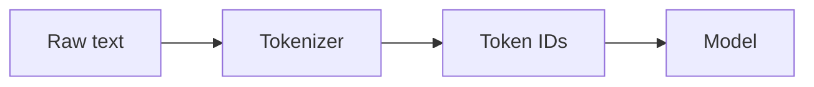
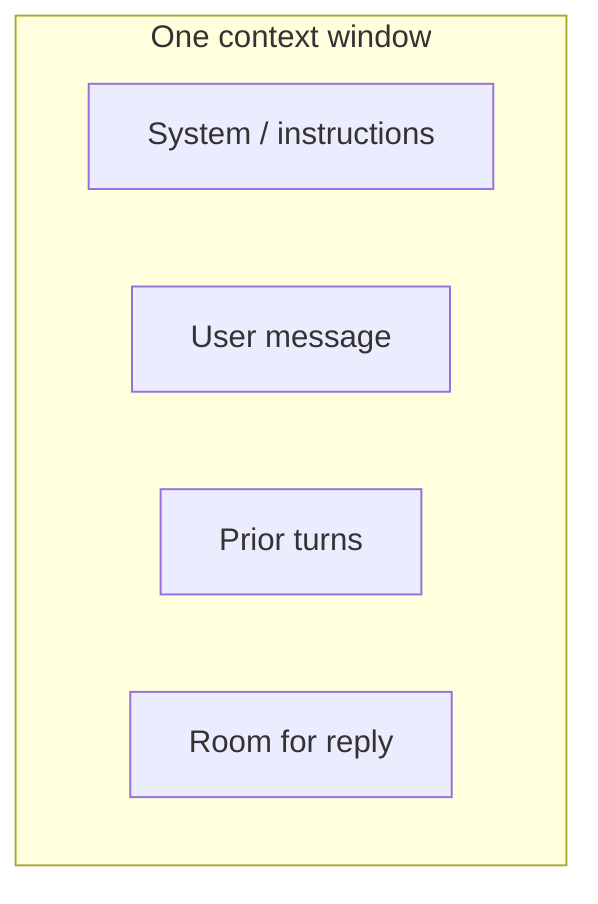
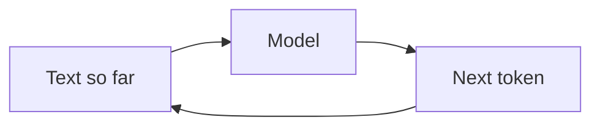

# From Tokens to Understanding

*An introduction to large language models — Volume I (Basic)*

*Sharif Uddin*

## Audience

**Curious readers, students, and professionals** who want **plain-language explanations**, **minimal math**, and enough orientation to use LLMs **confidently and responsibly**—without assuming prior machine-learning coursework. If you can read a short article online and follow step-by-step examples in a chat interface, you have enough background to start here. This volume prepares you for *From Prompts to Systems* (Volume II), which assumes the vocabulary and habits you build in these pages.

---

## Introduction

### What this book is for

Large language models arrived in everyday tools—search, writing aids, coding helpers—faster than many curricula could absorb. *From Tokens to Understanding* gives you a **stable mental picture**: what these systems are doing under the hood (at a **conceptual** level), **what they are not**, and **how to interact with them** so you get useful results without mistaking fluency for truth.

The goal is **understanding and safe first steps**, not job-ready ML engineering. You will learn to read **tokens** and **context limits**, write **clear prompts**, spot **common failure modes**, and think about **privacy, bias, and misuse** before you rely on an LLM for anything important. When you are ready to wire models into products, measure quality, and choose RAG versus fine-tuning, **Volume II** picks up from there.

### How this volume is organized

The outline moves from **orientation** (what LLMs are in the landscape of AI) to **mechanics** (tokens, prediction, context—still without equations) to **capabilities and limits**, then to **practical prompting** and **responsibility**. A short **bridge** chapter points to intermediate topics so you know how the trilogy fits together.

Examples stay **tool-agnostic** where possible: any major chat assistant can illustrate the ideas. Optional “go deeper” notes can live in **Notes** or appendices so the main line stays welcoming.

### Prerequisites and suggested use

No calculus or programming is required. **Curiosity** and willingness to **try prompts yourself** are enough. If you later learn a little Python or JavaScript, it will help when you move to Volume II—but this book does not depend on it.

Use the outline as a **manuscript contract**: you can merge chapters for a shorter course or expand “mechanics” if your readers want more diagrams. Keep jargon tables and reading lists in **Notes** so chapters stay readable on first pass.

---

## Full text — Parts I through VI

# Part I — Finding your bearings

*Sharif Uddin*

*[From Tokens to Understanding](from-tokens-to-understanding.md) · Volume I*

---

Before you touch a chat window or an API, it helps to know **what you are looking at**. This part sets expectations: how the trilogy is meant to be read, how “AI” and “machine learning” relate to language models, what an LLM actually *is* (and what it only resembles), and how we got from simple word counts to the large models people talk about today. None of that requires equations—only patience and a willingness to separate **fluency** from **truth**.

---

## Contents of this part

*In the full volume table of contents, these correspond to sections 1–4.*

| | Chapter | What you will take away |
|---|--------|-------------------------|
| **1** | How to use this book | Scope of this volume, pace, and study habits |
| **2** | AI, machine learning, and language models | Vocabulary for the landscape; why language modeling is different |
| **3** | What an LLM is—and what it is not | Mechanics in one picture; common misconceptions |
| **4** | A short history to the present | N-grams → neural nets → transformers → scale, intuitively |

**Contents (plain list — same as table, for readers or tools that do not render tables well):**

1. How to use this book — scope, pace, study habits.  
2. AI, machine learning, and language models — vocabulary; why language is a different prediction problem.  
3. What an LLM is—and what it is not — statistical model; not a DB, person, or web search by default.  
4. A short history to the present — n-grams through scale, intuitively.

---

## Chapter 1 — How to use this book

This volume is a **map**, not a sprint. It exists to give you a stable picture of what large language models are, what they are good for, and where they fail—so you can use them without treating polished prose as proof.

### What you will find here

You get short explanations in plain language; mental models you can reuse when reading the news or a product page; prompts you can try in any major chat assistant; and steady reminders about privacy, bias, and verification. Where a topic really needs a full course—calculus, distributed training, alignment theory—this book **points forward** to *From Prompts to Systems* and *From Models to Frontiers* instead of cramming everything into a single chapter.

### What you will not find here

Do not expect step-by-step **training** of a model from scratch; formal **derivations** of loss functions or attention; a **complete architecture survey**; or **vendor-specific** walkthroughs that go stale when a settings screen moves. Those belong in courses, documentation, or the later volumes, depending on depth.

### How to read and practice

Work in **short sessions**: read a section, pause, then try **one** thing—a single prompt, or checking a claim against another source. When the book suggests an exercise, treat it as optional but **useful**; “muscle memory” for how models behave beats skimming.

Keep a **scratch file** (paper or digital) for prompts that worked, terms you looked up, and questions to carry into Volume II. When you pick the book up after a break, skim the **contents** at the start of each part so you remember where you are in the arc: orientation, then mechanics, then responsibility.

> **In this chapter.** You now know what this volume promises, what it deliberately omits, and a sustainable way to read it.

---

## Chapter 2 — AI, machine learning, and language models in plain language

Headlines use “AI” to mean many different things. Sorting the vocabulary early saves confusion later.

### Artificial intelligence and machine learning

**Artificial intelligence** is a broad label: systems that do tasks we associate with human judgment—classifying, ranking, generating, planning—often under uncertainty. Not every AI system **learns from data**. A chess engine built from hand-written rules (“if the opponent does X, play Y”) counts as AI in a loose sense, but it does not *learn* from examples the way modern models do.

**Machine learning** means adjusting a system using **data** so that its performance on a task improves without someone coding every special case. You supply inputs (and usually desired outputs); the system finds **patterns** that generalize to new inputs. That process is **statistical**: it works when training data resembles what you will see in deployment, and it can fail when the world shifts or the data is skewed or biased.

### Why language is a different kind of problem

Many tasks attach **one label** to **one object**—for example, an image gets “cat” or “dog.” Language does not work that way. Text unfolds **one piece at a time** in a huge space of possible continuations, and meaning depends on **context**: earlier words in the sentence, the document, or the conversation.

A language model is therefore not merely classifying; it is **modeling a distribution** over sequences—what word or fragment is plausible next, given what came before. That is why **local** coherence can be so strong: the model is very good at continuing in a way that *sounds* right.

It does **not** follow that the model has **beliefs**, a **memory of facts**, or **direct access to the world** the way a person does. Those are separate questions, taken up in the next chapter.

### Where LLMs sit among other tools

The same broad ML ideas show up across domains:

- **Vision** models map images or video to labels, boxes, or captions.  
- **Speech** systems map audio to text, or text to speech.  
- **Robotics** often combines perception, planning, and control.

A **large language model** focuses on **text** (and in multimodal systems, text *together with* other inputs—but this volume starts from the text core). When headlines say “AI” in **recent years**, they often mean an LLM, or a product that **wraps** an LLM with search, tools, or other components. Keeping those layers distinct saves you from expecting one stack to solve every problem.

> **In this chapter.** AI is a wide umbrella; machine learning learns patterns from data; language modeling is sequential and contextual; LLMs are one powerful species in a larger zoo.

---

## Chapter 3 — What an LLM is—and what it is not

Once the vocabulary is in place, you can state plainly what “LLM” names—and what it does **not** name.

### What the acronym names

In the usual technical sense, a **large language model** is a **learned function** that assigns probabilities to possible next pieces of text (**tokens**), given everything you have fed it so far. **Large** refers to scale—billions of parameters is unremarkable now—which affects capability and cost, but the core idea remains **conditional probability over sequences**.

### What it is

An LLM is a **statistical model of language**. It absorbs regularities in how people write—grammar, tone, genre, argument shape, code formatting—because it was trained on enormous amounts of text. When you “ask a question,” you supply a **prefix**; the model continues in ways that *look* like plausible answers in that situation. That behavior is useful for drafting, brainstorming, rephrasing, and exploring ideas—when you treat it as assistance, not oracles.

### What it is not

**Not a database of facts.** The model does not “look up” your answer in a table of truths. If something *like* lookup happens, it is because a **separate** system—retrieval, tools, browser integration—was added on purpose. Even then, the LLM can misread or blend what it receives.

**Not a person.** It has no life history, no conscience, and no human accountability. Calling it “she,” “he,” or “they” is a metaphor for conversation design, not a claim about inner life.

**Not the open web by default.** A standard chat model’s factual picture is **frozen** at training time (with a stated knowledge cutoff) unless the product adds **live** retrieval. Treat “searching the web” as a **feature**, not a property of “being an LLM.”

Mixing up these roles—oracle, friend, search engine—invites **over-trust**.

### Why fluent text can still be wrong

The model is trained to produce answers that *look like* good answers: clear structure, confident tone, plausible detail. None of that requires the content to be **true**. A false statement can be dressed in the same statistical clothing as a true one.

There is no internal guarantee that output matches reality—only that it resembles answers common in training. Later parts of Volume I return to **hallucination**, **verification**, and **when not to use** a model at all.

> **Remember.** Fluency is a style; truth is a separate question. **Fluency ≠ truth.**

---

## Chapter 4 — A short history to the present

You do not need to be a historian to use a model today. You *do* need a rough sense of why the last decade felt like a step change—which this chapter supplies in broad strokes, without architecture deep dives.

### N-grams: statistics over short spans

Before modern deep learning, the simplest language models were **n-grams**: counts of short word sequences in a corpus. If “the cat sat on the” appears constantly, “mat” gets a higher score than “theorem.” That works for spell-checking and crude autocomplete and is easy to reason about.

N-grams **do not generalize** well. They struggle with rare phrases, with long-distance dependencies (“the scientist … later … proved the conjecture”), and with anything that depends on **meaning** beyond nearby word habits.

### Neural language models: learned context

**Neural** models replaced giant tables of counts with **learned representations**. Words become vectors in a high-dimensional space; the network learns which contexts cluster together. Similar words **share** statistical support, which helps fluency and rare words.

For a long time, though, models were **small** by current standards, and capturing very long structure remained difficult.

### Transformers, attention, and depth

**Transformers** with **attention** made it practical to stack many layers and train on parallel hardware. A usable mental image of attention: when predicting the next token, the model learns **which earlier tokens to weight heavily**. That supports **much longer context**—thousands of tokens in mature systems.

The exact wiring matters for specialists. For this book, the important part is the **consequence**: researchers could add **data**, **compute**, and **parameters** and often see **smooth gains** in capability—until they hit data, compute, or fundamental limits.

### Scale and what changed in practice

As models moved from millions toward **billions** of parameters and trained on large slices of public text, they began to **imitate** not only grammar but **genres**: explanations, code, dialogue, translation. Behaviors that look like “following instructions” or “sketching a proof” emerged **without** hand-written rules for each trick.

That does **not** mean the system **understands** in a human sense. It means that the training objective, at sufficient scale, encourages **broad statistical mimicry** of human text—including text that *looks* expert.

The next parts of Volume I leave history behind and turn to **mechanics**: tokens, prediction step-by-step, and context windows—so you can use that mimicry without mistaking it for magic, or for a promise of correctness.

> **In this chapter.** Local word statistics gave way to neural sequences, then to deep attention-based models at scale. Scale unlocked surprising mimicry; it did not quietly solve truth or meaning.

---

## Try it

1. **Book vs oracle.** In any chat tool, ask: *Explain in three bullets what this book says an LLM is not (database, person, web search).* Compare the answer to Chapter 3 of this part. Note anything the model **added** that the book did not claim.

2. **Fluency check.** Ask the model for a **specific fact** you can verify in two minutes (e.g. a date, a citation, a number). Verify it elsewhere. If it was wrong, rewrite one sentence you will remember: what went wrong?

---

*End of Part I. Previous: [main volume — introduction](from-tokens-to-understanding.md) · Next: [Part II — How it works (without equations)](from-tokens-to-understanding-part-ii-how-it-works-without-equations.md).*

---

# Part II — How it works (without equations)

*Sharif Uddin*

*[From Tokens to Understanding](from-tokens-to-understanding.md) · Volume I*

---

Part I gave you **orientation**: vocabulary, history, and a clear line between fluency and truth. This part turns to **mechanics**—still without equations, but concrete enough that invoices, error messages, and model announcements make sense. You will see how raw text becomes **tokens**, how the model turns a prefix into **probabilities over the next token**, how **training and later tuning** shape behavior, and why **context length** is both a superpower and a hard ceiling.

---

## Contents of this part

*In the full volume table of contents, these correspond to sections 5–8.*

| | Chapter | What you will take away |
|---|--------|-------------------------|
| **1** | Text as tokens | Why “token” is the unit of cost and memory, not always “word” |
| **2** | Prediction: the next piece of text | Next-token prediction, randomness, and misplaced confidence |
| **3** | Training and adaptation in one picture | From web-scale pretraining to chatty assistants—in one arc |
| **4** | Context windows and memory | What fits “in view,” and what to do when it does not |

**Contents (plain list — same as table):**

1. Text as tokens — cost and limits in tokens, not always words.  
2. Prediction: the next piece of text — sampling, temperature, confidence.  
3. Training and adaptation in one picture — pretraining to chatty assistants.  
4. Context windows and memory — finite “view,” forgetting in long chats.

---

## Chapter 1 — Text as tokens

Models do not read text the way humans do. They read **tokens**: pieces produced by a fixed procedure called a **tokenizer**. Getting comfortable with tokens saves you from surprises on your bill and from misunderstanding limits in the UI.

### Words, subwords, and strange splits

In English, a token is sometimes a whole word (`"hello"`), sometimes a fragment (`"ing"`, `"un"`). Rare or long words are often cut into several tokens. Punctuation and spaces usually cost tokens too; a newline may be its own token. Different products may use different tokenizers, so the **same sentence** can tokenize slightly differently across systems.

That matters because **price and limits are counted in tokens**, not in words or characters.

### Why the unit is “token,” not “word”

The tokenizer’s job is to turn any allowed text into a sequence of **integer IDs** from a finite vocabulary (often tens or hundreds of thousands of entries). The model’s first layers map those IDs to vectors the rest of the network can process. Using **subwords** keeps the vocabulary manageable: the model can represent rare words by **combining** pieces it has seen often.

You do not need to memorize how byte-pair encoding or SentencePiece work. You need the habit: **paste important text into a token counter** (many providers offer one) when length or cost matters.

### Tokens as the currency of limits

- **Context window** (Part II, Chapter 4) is measured in tokens: how much *input* the model can attend to at once.  
- **Output** is also generated token by token; long answers use more tokens than short ones.  
- **API pricing** is often per million input and output tokens.

So “one prompt” is not one fixed price. A verbose system prompt, a huge pasted PDF, and a chain of earlier messages all **eat the same budget**.

### A helpful analogy

Think of the tokenizer as a **reversible encoding** of text into a standard alphabet the model knows. It is not compression in the file-size sense, but it is **structured**: the model never sees raw bytes the way your editor does; it sees **IDs** that stand for learned pieces of text.

> **In this chapter.** Tokens are the model’s atoms of text; counts drive cost and limits; rare words may split into many tokens.

---

## Chapter 2 — Prediction: the next piece of text

At the core of autoregressive language modeling is a simple loop: given everything so far, assign a **probability** to each possible next token, **pick** one (or take the most likely), append it, and repeat. Everything else—chat tone, “reasoning,” code—is built on top of that loop.

### One step at a time

The model does not emit a full answer in a single gulp. It proposes **one** next token, then conditions the following step on the longer prefix—including the token it just wrote. That is why edits to **early** tokens can change **later** ones: the chain is causal.

### Creativity versus determinism

If the model always picked the single most likely next token, many answers would look repetitive and brittle. Real systems **sample**: they roll the dice using the probability distribution, with knobs—often called **temperature**—that make the distribution sharper (more deterministic) or flatter (more random).

- **Lower temperature**: safer, more “on distribution,” sometimes dull or overconfident in a narrow style.  
- **Higher temperature**: more variety—and more risk of nonsense or drift.

You do not need the formula. You need the idea: **randomness is a design choice**, not a sign of “thinking harder.”

### “Sounds sure” is cheap

The model is trained on mountains of text where confident explanations are common. Its objective rewards **plausible continuation**, not **verified fact**. So it can produce crisp, authoritative prose about things that are false or unknown—without a separate “I am guessing” module unless the system prompt or fine-tuning encourages that habit.

This is the same **fluency ≠ truth** lesson from Part I, now tied to **mechanics**: there is no step labeled “check against reality” inside the next-token loop.

> **In this chapter.** Generation is repeated next-token prediction with sampling; randomness is controlled, not magical; confidence in tone does not imply correctness.

---

## Chapter 3 — Training and adaptation in one picture

Commercial assistants are not only “big neural nets trained on the web.” They are usually **pipelines**: one or more stages after the first round of training teach the model to **follow instructions**, **refuse** some requests, and **match** a house style. You only need a **cartoon** of that pipeline to read announcements and model cards.

### Pretraining: learning language from data

**Pretraining** means training the model to predict tokens on a very large mix of text (and sometimes code). From that pressure alone, the system picks up grammar, facts that appear often in the data, style, and shallow reasoning patterns that show up in written explanations.

Pretraining is expensive and defines much of the model’s **raw capability** and **rough knowledge cutoff** (whatever the training snapshot contained).

### Teaching helpfulness and format

Raw pretrained models are often poor chat partners: they continue text like a book, not like an assistant. Later stages **narrow behavior**:

- **Instruction tuning** (supervised fine-tuning on demonstrations of questions and good answers) teaches format: answer the user, stay on topic, follow simple constraints.  
- **Preference tuning** (learning from human or AI preferences over pairs of answers) nudges the model toward answers people rate as better: clearer, safer, more helpful—by the raters’ lights.

You will see names like **RLHF**, **DPO**, **constitutional AI** in blog posts. For this book, they are all **post-pretraining alignment and style layers**—important, but not something you must implement to use an API well.

### Vocabulary: base, instruct, chat

- **Base** (or “foundation”) often means: after pretraining, **before** heavy chat-oriented tuning—powerful but awkward for dialogue.  
- **Instruction-tuned** / **chat** / **assistant** usually means: further training so the model **behaves** like a product you talk to.

When a provider “updates the model,” behavior can shift because **any** stage changed—not only pretraining.

> **In this chapter.** Pretraining builds broad language skill; later tuning shapes assistant behavior; “base” vs “chat” names real differences in the pipeline.

---

## Chapter 4 — Context windows and memory

The model has no invisible notebook. Everything it “knows” during a reply is whatever sits in the **context**: the tokens you send this turn (system prompt, prior turns, retrieved snippets—if the product adds them). That set is **bounded**.

### A fixed window

A **context window** (or **context length**) is a hard limit on how many tokens can be considered at once—input plus, in many setups, room reserved for the reply. If you exceed it, something must give: the oldest material may be **dropped**, or the request may be **rejected**.

Long documents, long chats, and fat system prompts compete for the same space. **Summarization**, **chunking**, and **retrieval** (choosing only relevant pieces to put in context) are not optional luxuries for serious work—they are strategies for staying inside the window. *From Prompts to Systems* develops those patterns; here, you only need the **constraint**.

### Conversations and “forgetting”

In a chat UI, earlier messages are often concatenated into the prompt each time. When the running total approaches the limit, the product may **truncate** from the top, **summarize** old turns, or ask you to start a new thread. None of that is human memory—it is **bookkeeping** in the prompt builder.

If something important happened twenty turns ago and fell out of the window, the model has **no access** to it unless you paste it back in or the system stores and re-injects it by design.

### Why this connects to cost

Longer context is not “free” for providers either: attention over many tokens costs compute. That is why **long-context** features may be priced differently or rolled out gradually.

> **In this chapter.** Context is finite; everything the model sees must fit in the window; long chats and long docs need deliberate strategies, not hope.

---

## Try it

1. **Token awareness.** Paste a paragraph you wrote (about 100–150 words) into your provider’s **tokenizer** or token counter, if available. Note approximate token count and one word that split into **multiple** tokens.

2. **Same prompt, two temperatures.** Ask a short creative question twice; if the UI exposes **temperature** or “more/less creative,” use low vs high. Compare: which answer would you **trust** for a fact, and which for brainstorming?

---

*End of Part II. Previous: [Part I — Finding your bearings](from-tokens-to-understanding-part-i-finding-your-bearings.md) · Next: [Part III — Capabilities and limits](from-tokens-to-understanding-part-iii-capabilities-and-limits.md) · Or [main volume](from-tokens-to-understanding.md).*

---

# Part III — Capabilities and limits

*Sharif Uddin*

*[From Tokens to Understanding](from-tokens-to-understanding.md) · Volume I*

---

You now have a workable picture of **how** a model generates text. This part turns outward: **what these systems are genuinely useful for**, where they **fail or mislead**, how **social bias** shows up in outputs, and what **speed, money, and access** mean in practice. The aim is proportion: neither hype (“it can do anything”) nor blanket dismissal (“it is only autocomplete”). You leave ready for Part IV’s hands-on prompting—and for Volume II’s deeper treatment of evaluation and deployment.

---

## Contents of this part

*In the full volume table of contents, these correspond to sections 9–12.*

| | Chapter | What you will take away |
|---|--------|-------------------------|
| **1** | What LLMs tend to do well | Real strengths—without mistaking fluency for reliability |
| **2** | Hallucinations, mistakes, and calibration | Why errors look credible; how to probe and verify |
| **3** | Bias, stereotypes, and fairness | Where skew comes from; why “fixing” it is hard |
| **4** | Speed, cost, access, and the environment | Who can use what, why price varies, a sober footprint note |

**Contents (plain list — same as table):**

1. What LLMs tend to do well — strengths without mistaking fluency for reliability.  
2. Hallucinations, mistakes, and calibration — credible errors; verification.  
3. Bias, stereotypes, and fairness — skew; why fixes are hard.  
4. Speed, cost, access, and the environment — pricing, access, energy in proportion.

---

## Chapter 1 — What LLMs tend to do well

Large language models are not equally good at every task. Their strengths line up with **pattern-rich text**: language, format, and shallow structure that appears often in training data. Knowing the sweet spots helps you **delegate** the right work to the model—and reserve human judgment for the rest.

### Drafting, brainstorming, and rephrasing

When you need **many candidate wordings**—email tones, headlines, outlines, alternate explanations—a model can accelerate iteration. It is often strong at **following format**: bullet lists, tables (as text), simple templates, “make this shorter,” “make this more formal.” That is **stylistic and structural** help, not a guarantee that the *content* is accurate for your domain.

### Format-following and light structure

Models that have seen huge amounts of code and markup often produce **plausible-looking** snippets: JSON-shaped objects, small functions, configuration examples. Treat these as **sketches** to be checked in a compiler, linter, or runtime. The same goes for legal or medical *style*: the format may look right while the substance is wrong.

### Simple coding and shell sketches

For **boilerplate**, common APIs, and debugging hints (“what might this error mean?”), LLMs can save time—especially when you already know enough to **spot** mistakes. They are weaker when the problem is **novel**, requires **exact library versions**, or depends on **unstated constraints** in your codebase.

### Multilingual exposure (with caveats)

Training data includes many languages, so models can **translate**, **summarize**, or **chat** in languages beyond English—unevenly. High-resource languages often work better; low-resource or dialectal settings may see more errors or **cultural blind spots**. Do not assume parity with a professional translator or a fluent human editor.

### The recurring theme

These strengths are **assistive**. They are most valuable when a human—or a separate verification step—can catch errors before they matter.

> **In this chapter.** LLMs shine at language-heavy, pattern-rich tasks: drafting, reformatting, brainstorming, and rough code—always subject to review when stakes rise.

---

## Chapter 2 — Hallucinations, mistakes, and calibration

A **hallucination** in common usage means: the model asserted something **specific** (a fact, a citation, a number) that is **false or unsupported**—often while sounding confident. Understanding *why* this happens keeps you from “prompt engineering” your way to perfect truth.

### Confident errors

The training objective rewards **plausible** continuation. Explanations in the training data often sound sure. So the model can produce **well-phrased nonsense**: fake studies, wrong dates, made-up URLs, or subtle numerical slips. This is not a occasional bug; it is a **structural** risk of unconstrained generation.

### When to verify from another source

Verify **whenever** mistakes would hurt someone: health, money, law, reputation, safety. Verify **before** you repeat a claim in public or in code you ship. Primary sources, official documentation, and subject-matter experts still matter. The model is a **starting point**, not an authority.

### Asking for uncertainty (and its limits)

You can ask the model to **flag uncertainty**, **list assumptions**, or **avoid inventing citations**. That sometimes helps; it is not reliable. The model can say “I might be wrong” and still be wrong, or sound tentative while fabricating. **Prompting** cannot replace **checks** on high-stakes facts.

### Citations and “look it up”

If you ask for references, you may get **plausible-looking** titles and authors that do not exist or do not say what the model claims. Unless the system is **wired to retrieval** (search, databases) and you trust that pipeline, treat citations as **suggestions to verify**, not proof.

### A useful habit

Separate **form** from **substance**. The model may produce beautiful structure around empty or false content. Your job is to supply **substance**—or to validate it elsewhere.

> **In this chapter.** Hallucination is confident-sounding error; prompts alone do not fix it; verify when it matters, and never trust ungrounded citations.

---

## Chapter 3 — Bias, stereotypes, and fairness (introduction)

Language models learn from **human-generated** text—books, forums, code, social media. That corpus encodes **biases** of many kinds: stereotypes about groups, uneven representation, historical prejudice, and gaps in whose voices were written down. The model can **reproduce** or **amplify** those patterns, even when later tuning tries to suppress the worst outputs.

### What “bias” means here

In this chapter, **bias** means **systematic skew**: answers that favor one demographic, language variety, or worldview over others without justification; or that **erase** or **caricature** people. It is not the same as having an opinion in a debate—it is about **unfair or harmful regularities** in behavior.

### Harmful or skewed outputs

You may see **stereotyping**, **denigration**, or **overconfidence** about groups the training data treated badly. Safety layers in products **reduce** but do not **eliminate** these failures; adversarial prompts, edge cases, and multilingual settings still surface problems.

### Why “fixing” this is an open challenge

**Technical** fixes—filtering data, fine-tuning on “good” answers, classifiers—help but trade off with other goals (accuracy, nuance, free expression) and can **shift** bias rather than remove it. **Social** questions—who decides what is fair, in which culture—do not have single engineering answers.

Later volumes return to **evaluation**, **alignment**, and **governance**. For now: **notice** when outputs feel off; **do not** treat the model as a neutral arbiter of people or history.

> **In this chapter.** Training data carries society’s biases; models can echo them; mitigation is partial; fairness is partly technical, partly social—and unfinished.

---

## Chapter 4 — Speed, cost, access, and the environment

Capability is not the only axis. **Latency** shapes user experience; **price** shapes who can build what; **access** shapes who benefits from the technology. A short, honest look avoids both **mystery** and **moral theater**.

### Free tiers, APIs, and “bigger costs more”

Many vendors offer **free** or **cheap** tiers for small usage. Serious volume usually means **paid APIs** or **enterprise** contracts. Pricing is often **per token** (Part II): longer prompts and longer answers cost more. **Larger** models generally cost more per token than **smaller** ones; **long-context** or **premium** features may carry a surcharge.

Rough intuition: you pay for **compute** the provider spends to serve you—plus their margin, support, and compliance overhead.

### Who can access what

Access varies by **region**, **payment method**, **organization type**, and **policy** (e.g. age limits, acceptable-use rules). Open-weight models and local inference change the picture: more **control** and **privacy** for those with the **hardware** and skills to run them—still not equally distributed.

Do not assume everyone has the same chatbot, the same model version, or the same legal context.

### Environment and energy (in proportion)

Training large models from scratch uses **a lot** of energy; **inference** (each query) uses less per request but adds up at scale. Exact numbers depend on **hardware**, **utilization**, and **electricity mix**; beware headlines that compare “one chat” to exotic units without context.

The balanced stance for this book: **awareness**, not performative guilt or greenwashing. Efficiency matters; so do **useful** applications and **who** gets to define tradeoffs.

> **In this chapter.** Cost tracks tokens and model size; access is uneven; environmental impact is real and context-dependent—worth knowing, not obsessing over without numbers.

---

## Try it

1. **Hallucination probe.** Ask the model for a **very specific** fact (invent a constraint: “the exact founding year of a small organization you can look up”). Verify online. If wrong, note the **tone** of the wrong answer—confident or hedged?

2. **Strengths vs limits.** Pick one task the model does **well** (e.g. rewrite a paragraph) and one it does **poorly** for you (e.g. exact arithmetic). Write one sentence each: *why* the difference, in terms of this part.

---

*End of Part III. Previous: [Part II — How it works (without equations)](from-tokens-to-understanding-part-ii-how-it-works-without-equations.md) · Next: [Part IV — First steps with prompts](from-tokens-to-understanding-part-iv-first-steps-with-prompts.md) · Or [main volume](from-tokens-to-understanding.md).*

---

# Part IV — First steps with prompts

*Sharif Uddin*

*[From Tokens to Understanding](from-tokens-to-understanding.md) · Volume I*

---

You understand what models are, how they tick at a high level, and where they shine or stumble. This part is **hands-on**: how **chat interfaces** are structured, how to **write prompts** that get closer to what you want, how to **recover** when the model drifts, and—just as important—**when to stop** and use another tool or a human expert. Part V then widens the lens to privacy, misinformation, and daily norms; Volume II goes deeper on shipping real systems.

---

## Contents of this part

*In the full volume table of contents, these correspond to sections 13–16.*

| | Chapter | What you will take away |
|---|--------|-------------------------|
| **1** | Chat interfaces and roles | System vs user, scope, and keeping a prompt library |
| **2** | Writing prompts that work | Goals, audience, format—and few-shot patterns |
| **3** | Common failure modes | Diagnosing vagueness, length, format slips, ignored rules |
| **4** | When not to use an LLM | High stakes, secrets, correctness guarantees—and better fits |

**Contents (plain list — same as table):**

1. Chat interfaces and roles — system vs user; prompt library.  
2. Writing prompts that work — goal, audience, format; few-shot.  
3. Common failure modes — vagueness, length, format, ignored rules.  
4. When not to use an LLM — stakes, privacy, proof.

---

## Chapter 1 — Chat interfaces and roles

Most people meet LLMs through a **chat** UI or an **API** that imitates one. A little structure—who speaks first, what the “system” is allowed to say—goes a long way toward **stable** behavior.

### System, user, and assistant turns

In many products, messages are labeled by **role**:

- **System** (or “developer” in some APIs): high-level rules—tone, safety boundaries, format expectations. Not every app shows this field to end users, but it is often there under the hood.  
- **User**: what *you* ask for this turn.  
- **Assistant**: what the model already said; the interface usually fills this in as the conversation grows.

When you **can** edit the system message, treat it as the **contract** for the whole thread: voice, taboo topics, output shape. When you cannot, you may approximate some of that by starting your first user message with “For this conversation, please …”—less reliable, but common.

### Staying in scope

Models **drift**: they pick up style from the last few turns, chase tangents, or “helpfully” answer a different question than you asked. **Narrow** the task in one place (system or first user message): audience, length, what *not* to do. If the thread has gone wrong, **open a new chat** rather than fighting ten rounds of repair—often cheaper in time and tokens.

### Saving and revisiting useful prompts

Good prompts are **assets**. Keep a **personal library**: a note file, a doc, or snippets in a password manager for non-secret templates. Label them by **intent** (“polite decline,” “summarize for executives,” “extract action items”). Revise when a provider **changes models**; behavior shifts with updates.

Version one line of **metadata**: which product, which model name, and the date—future you will thank present you.

> **In this chapter.** Roles structure behavior; system-level instructions matter when exposed; scope and fresh threads beat endless correction; save prompts like reusable tools.

---

## Chapter 2 — Writing prompts that work

A prompt is not magic wording—it is **specification**. You get better results when you make the **goal**, **audience**, **format**, and **constraints** explicit. You can also **show** the pattern you want instead of only describing it.

### Goal and audience first

Before stylistic flourishes, state **what success looks like**:

- *Goal:* “List three pros and two cons,” not “think about this topic.”  
- *Audience:* “For a reader who knows Python but not Rust,” not “make it clear.”

Ambiguous goals invite **plausible** but useless answers.

### Format and constraints

Ask for a **shape**: bullet list, numbered steps, a table (as text), JSON-like fields, maximum words per section. **Constraints** reduce rambling: “At most 200 words,” “No preamble—start with the answer,” “If you are unsure, say what is unknown.”

Constraints also **surface** when the model is guessing—if it cannot obey, you may be asking for something it cannot know.

### Few-shot: show the pattern

**Few-shot** prompting means including **short examples** of input → output you like. The model locks onto **form** quickly: “Questions should be answered like this example.” Two or three mini-examples often beat a long paragraph of verbal description—especially for classification, extraction, or rigid formats.

Keep examples **honest**: do not embed false facts as exemplars unless you are illustrating error handling.

### Iterate, do not litigate

If the first answer is wrong in a **fixable** way, edit the prompt: add one constraint, one example, or one negative (“Do not …”). If the task is inherently **open-ended**, expect to **refine** in a few steps—that is normal, not failure.

> **In this chapter.** Specify goal, audience, format, and limits; use short examples when shape matters; improve prompts iteratively like any spec.

---

## Chapter 3 — Common failure modes—and simple responses

Even clear prompts fail. Recognizing **patterns** of failure speeds recovery: you change the setup instead of arguing with the model in plain anger.

### Too vague

**Symptom:** generic platitudes, hedging everywhere, or answers that could apply to anything.  
**Response:** narrow the task, add a **concrete scenario**, request **structure**, or ask for **assumptions** explicitly listed so you can correct them.

### Too long

**Symptom:** walls of text, repeated points, buried answer.  
**Response:** cap length (“max 150 words”), ask for **answer first then detail**, or request an **outline** before a full draft.

### Wrong format

**Symptom:** prose when you wanted a list; markdown when you needed plain text for a pipeline.  
**Response:** repeat the format **in the example**; use clear delimiters (e.g. lines that say `BEGIN JSON` / `END JSON`, or fenced code blocks in your own workflow); split **format** instruction into its own short paragraph.

### Ignored instructions

**Symptom:** the model does the opposite of a clear rule, or “forgets” earlier in long threads.  
**Response:** move critical rules to **system** or the **start** of the user message; **shorten** context (new thread); **break** the task into steps (“Step 1: outline only. Wait for my OK.”).

### Breaking tasks into steps

For complex work, **sequencing** beats one giant prompt: summarize, then critique, then revise. Ask for an **outline** first when structure matters. *From Prompts to Systems* expands this into workflows and tooling; here, the habit is enough: **decompose**.

> **In this chapter.** Match the fix to the failure—vagueness, length, format, or context limits—and prefer structure and fresh threads over endless repair in one conversation.

---

## Chapter 4 — When not to use an LLM

Competence includes **restraint**. Some tasks are **wrong** for probabilistic text generators: not because the model is “bad,” but because the **error profile** or **privacy** or **accountability** requirements do not fit.

### High-stakes decisions without human review

**Medical, legal, financial, and safety-critical** choices need qualified people and authoritative sources. An LLM might **brainstorm** or **explain concepts**, but it should not be the **sole** basis for diagnosis, filing a lawsuit, or signing a contract. Use it to **prepare questions** for a professional, not to replace one.

### Private or regulated data you should not paste

If putting text into a chat would **violate policy**, **breach contract**, or **harm** someone if leaked—**do not paste it**. Assume cloud chats may be **logged** or used under terms you have not read. For secrets, use **approved** tools: offline models, enterprise contracts with clear data handling, or no AI at all.

### Tasks that need guaranteed correctness

**Formal verification**, **exact accounting** without independent checks, **cryptography**, or **safety-critical control code** need **deterministic** tools and review processes. LLMs **guess** from statistics; they do not **prove** theorems or **certify** systems.

### Matching the tool to the job

Sometimes search, spreadsheets, databases, calculators, or a colleague’s judgment are **strictly better**. The model is strong where **language and rough structure** help; it is weak where **truth, privacy, or proof** is non-negotiable.

> **In this chapter.** Saying no is part of skill: skip or constrain LLM use when stakes, secrecy, or correctness demand something other than fluent text.

---

## Try it

1. **Structured prompt.** Ask for the same small task twice: (A) a vague one-liner, (B) a prompt with **goal, audience, format, and a word limit**. Which output is easier to **use** as-is?

2. **One failure mode.** Deliberately use a vague prompt; when the answer is fluffy, **rewrite the prompt once** using one technique from Chapter 3 (narrow goal, outline first, or split steps). Compare.

---

*End of Part IV. Previous: [Part III — Capabilities and limits](from-tokens-to-understanding-part-iii-capabilities-and-limits.md) · Next: [Part V — Responsibility in everyday use](from-tokens-to-understanding-part-v-responsibility-in-everyday-use.md) · Or [main volume](from-tokens-to-understanding.md).*

---

# Part V — Responsibility in everyday use

*Sharif Uddin*

*[From Tokens to Understanding](from-tokens-to-understanding.md) · Volume I*

---

Parts I–IV built skill and judgment **inside** the interaction: what models are, how they behave, and how to prompt with care. This part steps into **daily life**—privacy, **trust in what you read**, and **norms** for learning and work. The tone stays practical: not a law textbook or ethics manifesto, but **habits** that reduce harm to yourself and others while you still get value from the tools.

---

## Contents of this part

*In the full volume table of contents, these correspond to sections 17–19.*

| | Chapter | What you will take away |
|---|--------|-------------------------|
| **1** | Privacy and confidentiality | What happens to your text; policies; minimal sharing |
| **2** | Misinformation, scams, and manipulation | Synthetic media, skepticism, vulnerable users |
| **3** | Learning, writing, and working alongside LLMs | Integrity, disclosure, collaboration without outsourcing judgment |

**Contents (plain list — same as table):**

1. Privacy and confidentiality — data handling; minimal sharing.  
2. Misinformation, scams, and manipulation — skepticism; vulnerable users.  
3. Learning, writing, and working alongside LLMs — integrity, disclosure, collaboration.

---

## Chapter 1 — Privacy and confidentiality

Every chat is a **data action**: you may be sending text to a company’s servers, under **terms of service** you have not read. Privacy is not paranoia—it is **matching your sharing** to your risk.

### What may happen to what you paste

Providers differ, but common possibilities include: **storage** of conversation logs, **human review** of flagged content, **training** use of interactions (sometimes opt-out or opt-in), and **retention** for a fixed period or until you delete. Features change; **read the current policy** before you put sensitive material in a box labeled “chat.”

Assume **defaults** are not tuned for your secrets unless a contract says otherwise.

### Workplace, school, and client data

Employers and schools often have **acceptable-use** and **data-classification** rules: customer lists, patient notes, unpublished research, exam questions, or unreleased code may be **off-limits** for public tools. When in doubt, **ask** IT or compliance—or use **approved** enterprise offerings with clear data-handling terms.

**Minimal necessary sharing:** if you need help with a bug, paste a **redacted** snippet; if you need writing help, describe the situation without real names or account numbers.

### Secrets and credentials

Never paste **passwords**, **API keys**, **tokens**, or **recovery codes** into any chat, even if the UI promises not to train on them—mistakes and breaches happen elsewhere too. Rotate credentials if you already slipped.

### A simple habit

Before you hit send, ask: **Would I put this on a postcard with my return address?** If not, **edit** or **use another channel**.

> **In this chapter.** Treat chats as potentially logged; follow org rules; share the minimum; never paste secrets.

---

## Chapter 2 — Misinformation, scams, and manipulation

Fluent text and synthetic **images**, **audio**, and **video** lower the cost of **convincing fakes**—not because every output is malicious, but because **trust signals** (tone, detail, apparent authority) are easier to forge. **Skepticism** is a skill, not cynicism.

### Synthetic text at scale

LLMs can produce **news-like** prose, **fake quotes**, or **plausible** technical explanations that are wrong. That amplifies older problems: rumor, propaganda, and **SEO spam**. The defense is **provenance**: who published this, **when**, with what **evidence**, and can **independent** sources confirm it?

### Scams and social engineering

Scammers use AI to **draft** phishing emails, **clone** voices in some setups, or **personalize** fraud at scale. Urgent requests for money, credentials, or secrecy should trigger **offline verification**—call a known number, use an official app, not the link in the message.

### Deepfakes and media literacy

Video and audio **fakes** improve over time. **Slow down** before sharing emotionally charged clips. Look for **corroboration** from outlets with a track record, **original** context, and **forensic** notes when experts weigh in—not only a gut feeling that “it looks real.”

### Children and vulnerable users

Young people may **trust** chat personas or **over-share** with friendly-sounding systems. Older adults or stressed individuals may fall for **authority** cues in text or voice. **Guardrails** in products help but do not replace **guidance**: age-appropriate rules, family conversations, and **human** support when someone is in crisis—not a chatbot.

> **In this chapter.** Fluency enables deception at scale; verify through independent channels; protect vulnerable users with norms and care—not only software.

---

## Chapter 3 — Learning, writing, and working alongside LLMs

Used well, LLMs can **clarify concepts**, **surface drafts**, and **speed revision**. Used poorly, they **substitute** for thinking, **hide** the absence of understanding, or **violate** rules you agreed to. The balance is **disclosure**, **authorship**, and **keeping humans in the loop** where judgment matters.

### Academic integrity

Schools and universities define **what counts as your work**. Rules differ: some courses **allow** AI for brainstorming with citation; others **prohibit** it entirely. **Assume** you must disclose unless told otherwise. Submitting **model text** as your own analysis—without permission and attribution where required—is **misrepresentation**.

A practical split: use AI to **quiz yourself**, **explain** a step you missed, or **compare** drafts **you** wrote first—not to **ghostwrite** the final submission without clearance.

### Writing and authorship

In **journalism**, **law**, **medicine**, and other fields, **accountability** attaches to named authors. If AI assisted with language or structure, your field may require **stating** that—and **you** remain responsible for errors. **Fact-check** anything that will be published or filed.

### Tutor, not substitute

A good mental model: the model is a **patient explainer** and **sparring partner**, not a **certificate** that you mastered the material. If you cannot **reproduce** the reasoning without it, you may not **understand** yet—that matters for exams, interviews, and real-world tasks.

### Collaboration at work

Teams benefit from **shared norms**: when AI is OK for **first drafts**, when **reviewers** must be human, how **customer** data is handled, and how **credit** is assigned on projects. **Respect colleagues** who opt out of certain tools for ethical or contractual reasons.

### Human judgment endures

Models **compress** patterns from the past; they do not **carry** accountability. Decisions that affect **people’s lives** still need **people** who can explain **why**—not only what the model output was.

> **In this chapter.** Follow your institution’s and profession’s rules; disclose where required; use AI to learn and draft, not to fake competence; keep humans responsible for outcomes.

---

## Try it

1. **Terms check.** Open your chat product’s **terms of service** or privacy page. Skim for: training use of conversations, retention, human review. Note **one** setting or policy you did not know about.

2. **Redaction drill.** Take a real paragraph that contains something you would **not** paste into a public chat (name, ID, secret). **Rewrite** it so the model could still help (e.g. “Person A,” “Company X”) without leaking the sensitive bit.

---

*End of Part V. Previous: [Part IV — First steps with prompts](from-tokens-to-understanding-part-iv-first-steps-with-prompts.md) · Next: [Part VI — What’s next](from-tokens-to-understanding-part-vi-whats-next.md) · Or [main volume](from-tokens-to-understanding.md).*

---

# Part VI — What’s next

*Sharif Uddin*

*[From Tokens to Understanding](from-tokens-to-understanding.md) · Volume I*

---

Volume I ends where serious **practice** begins to need **tools and teams**: APIs, retrieval, measurement, and shipping. This short part **collects** what you should carry in your head—**terms** and **habits**—and points to **Volume II**, *From Prompts to Systems*, so you know what comes next if you want to build rather than only chat.

---

## Contents of this part

*In the full volume table of contents, these correspond to sections 20–21.*

| | Chapter | What you will take away |
|---|--------|-------------------------|
| **1** | Glossary path and habits | A checklist of ideas; repeatable behaviors |
| **2** | Bridge to *From Prompts to Systems* | What Volume II covers; how to prepare |

**Contents (plain list — same as table):**

1. Glossary path and habits — core terms; repeatable behaviors.  
2. Bridge to *From Prompts to Systems* — what Volume II adds; how to prepare.

---

## Chapter 1 — Glossary path and habits

You do not need to memorize a dictionary. You **do** need a **small, firm** set of meanings—enough to read documentation without relearning from scratch—and **habits** that survive when models and products change.

### Core terms (working definitions)

Use these as **anchors**; glossaries in products may word them differently.

- **Token** — The model’s atomic piece of text (often a subword). **Cost** and **context limits** are counted in tokens.  
- **Context (window)** — How much text the model can **consider** at once for a single request; older material may drop off in long chats.  
- **Prompt** — Everything you send as **input** for a turn: instructions, examples, and prior dialogue the system includes.  
- **Hallucination** — Confident **false** or **ungrounded** specific claims—not mere disagreement, but **presented-as-fact** errors.  
- **Fine-tuning** — **Further training** on a smaller, task-specific dataset to steer behavior; distinct from **prompting** alone and from **retrieval** (Volume II goes deeper).

If one term still feels fuzzy, **return** to the part of Volume I where it was motivated—definitions stick better with **story**.

### Habits that compound

- **Verify** claims that could hurt someone or spread if wrong: health, money, law, reputation, safety.  
- **Iterate** prompts when output is wrong in a **pattern**: add one constraint, one example, or split the task.  
- **Note** what worked: a line in a notebook, a dated snippet in a doc—**future you** will not remember the magic wording.  
- **Re-read** terms of service when you **change** products or turn on **new** features (training opt-in, retention).  
- **Say no** when the task needs **proof**, **secrecy**, or **human accountability** (Part IV, Chapter 4).

### Keeping the glossary alive

Language drifts: “**alignment**,” “**reasoning**,” “**agent**” mean different things in marketing than in research. When you see a bold claim, ask: **which system**, under **which test**, with **which** limits?

> **In this chapter.** Own a small vocabulary; rehearse habits—verify, iterate, document, re-check policies, refuse bad fits—not just clever prompts.

---

## Chapter 2 — Bridge to *From Prompts to Systems*

*From Prompts to Systems* (Volume II) is the **next book** in this trilogy. Where Volume I stays at the level of **concepts and first prompts**, Volume II is for **people who ship**: features, workflows, and **defensible** choices in the real world.

### What Volume II adds

Expect **deeper** treatment of topics Volume I only **named**:

- **Evaluation** — Metrics, human review, regression when models update, “good enough” for release.  
- **APIs and integration** — Structured outputs, retries, abstraction layers, swapping providers.  
- **Retrieval (RAG)** — When to fetch documents instead of stuffing everything into context; chunking and grounding at a practical level.  
- **Fine-tuning and adaptation** — When it beats prompting, what it costs, what can go wrong.  
- **Tools and orchestration** — Function calling, simple pipelines, **operational** concerns: cost, latency, observability.  
- **Teams and responsibility** — Norms Volume V began; Volume II connects them to **product** decisions.

You do **not** need Volume II to **use** chat responsibly—but you need it to **own** an LLM-backed feature with clarity.

### Skills that help (optional but useful)

- **Light scripting** — Enough Python or JavaScript to call an API and parse **JSON** responses.  
- **Reading JSON** — Objects, arrays, strings; most HTTP APIs speak it.  
- **Basic git** — So experiments with prompts and small apps stay **reproducible**.

None of this requires a computer science degree; it requires **deliberate** practice alongside the book.

### How the trilogy continues

- **Volume III**, *From Models to Frontiers*, steps back to **research and scale**: training stacks, alignment science, efficiency, multimodal and agentic systems—when you need **depth**, not only **shipping**.

### Closing Volume I

If you have worked through Parts I–VI, you have a **grounded** picture: what LLMs are, how they behave, how to **prompt** and **when to stop**, and how to **live** with these tools without surrendering **judgment**. That is enough to be a **thoughtful** user—and a **prepared** reader for everything that follows.

> **In this chapter.** Volume II is the bridge to building; optional skills are learnable; Volume III awaits when you need the frontier.

---

## Try it

1. **Glossary flashcards.** On paper or in a note file, write the five terms from Chapter 1 (**token**, **context**, **prompt**, **hallucination**, **fine-tuning**) **without** peeking—then open the chapter and fix any gaps.

2. **Volume II preview.** Skim the **introduction** of [From Prompts to Systems](from-prompts-to-systems.md). Write **one** topic from Volume II you want next (e.g. evaluation, APIs, RAG) and **one** skill you might practice (e.g. read a JSON example).

---

*End of Volume I — From Tokens to Understanding. Previous: [Part V — Responsibility in everyday use](from-tokens-to-understanding-part-v-responsibility-in-everyday-use.md) · Next: [From Prompts to Systems](from-prompts-to-systems.md) (Volume II) · Or [main volume](from-tokens-to-understanding.md).*

---

## Notes

This section collects **optional material**: prompts to adapt, a short reading list, a **glossary export**, an **exercise index**, **optional figures** (e.g. for HTML/PDF), and accessibility notes. It does not replace the parts—those stay the canonical draft.

### Accessibility

Part files use **tables** for “Contents of this part.” Each part also includes a **plain list** under the heading **Contents (plain list — same as table)** so the same structure is available when tables are hard to use (some ebook pipelines, screen-reader setups, or plain-text export).

### Exercise index (*Try it* sections)

| Part | File | Rough focus |
|------|------|-------------|
| I | [part-i](from-tokens-to-understanding-part-i-finding-your-bearings.md) | Book vs oracle; verify a fact |
| II | [part-ii](from-tokens-to-understanding-part-ii-how-it-works-without-equations.md) | Token count; temperature |
| III | [part-iii](from-tokens-to-understanding-part-iii-capabilities-and-limits.md) | Hallucination probe; strengths vs limits |
| IV | [part-iv](from-tokens-to-understanding-part-iv-first-steps-with-prompts.md) | Structured vs vague prompt; fix one failure |
| V | [part-v](from-tokens-to-understanding-part-v-responsibility-in-everyday-use.md) | Terms of service skim; redaction |
| VI | [part-vi](from-tokens-to-understanding-part-vi-whats-next.md) | Glossary recall; Volume II preview |

**Exercise index (plain list):** Part I — book vs oracle, fact check · Part II — tokens, temperature · Part III — hallucination probe, strengths vs limits · Part IV — structured prompt, fix failure mode · Part V — terms of service, redaction · Part VI — glossary recall, Volume II preview.

### Sample prompts (adapt freely)

These are **templates**, not magic strings. Swap domain and constraints.

1. **Explain like I’m new.** “Explain [concept] in three short paragraphs for someone who has never studied machine learning. End with one thing that is still misunderstood.”

2. **Constrained rewrite.** “Rewrite the following text for [audience]. Keep under [N] words. Do not add new factual claims.”

3. **Uncertainty probe.** “Answer [question]. After your answer, list two things you are least sure about and how I could verify them.”

4. **Format drill.** “Given [input], return only: (1) three bullet takeaways, (2) one risk, (3) one question I should ask an expert.”

5. **Red-team (carefully).** Only in safe contexts: “What mistakes might someone make when interpreting LLM outputs?” Use output as discussion, not as authority.

### Glossary export (Volume I core)

Short definitions aligned with [Part VI — Chapter 1](from-tokens-to-understanding-part-vi-whats-next.md). For full context, read the part where each term is motivated.

- **Token** — A model’s atomic piece of text (often a subword); **cost** and **context limits** are counted in tokens.  
- **Context (window)** — How much text the model can consider at once for a request; long chats may **drop** older turns.  
- **Prompt** — All **input** you supply for a turn (instructions, examples, included history).  
- **Hallucination** — Confident **false** or **ungrounded** specific claims; not mere disagreement.  
- **Fine-tuning** — Further **training** on a smaller dataset to steer behavior; distinct from prompting alone and from retrieval.

### Reading list (short, non-exhaustive)

- Russell & Norvig, *Artificial Intelligence: A Modern Approach* — broad context for “AI” vs narrow tools.  
- Jurafsky & Martin, *Speech and Language Processing* (relevant chapters) — deeper NLP for readers who want textbooks after Volume I.  
- Your model provider’s **documentation** and **system card / model card** for the product you actually use—primary for behavior and limits.  
- Follow-up in this series: [*From Prompts to Systems*](from-prompts-to-systems.md), then [*From Models to Frontiers*](from-models-to-frontiers.md).

### Optional figures (for PDF / HTML builds)

Mermaid diagrams render on many Markdown hosts (e.g. GitHub). You can paste these into slides or export via tooling.

**Tokenization (conceptual flow)**

**Context window (what fits in one request)**

**Autoregressive step (simplified)**

### Chapter notes

_Add your own manuscript notes, citations, and per-chapter todos below._

