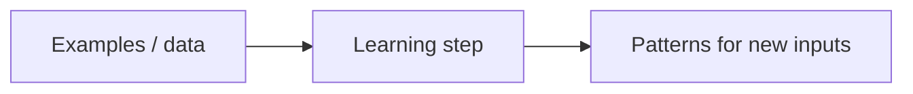
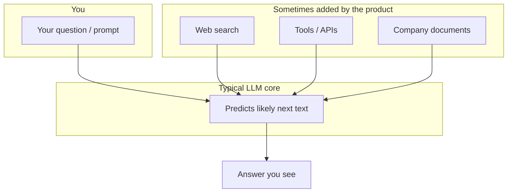
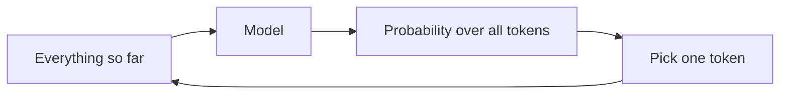
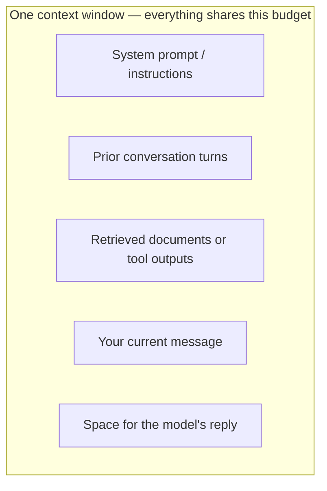
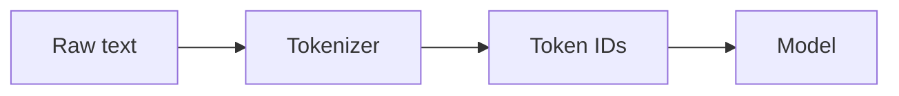
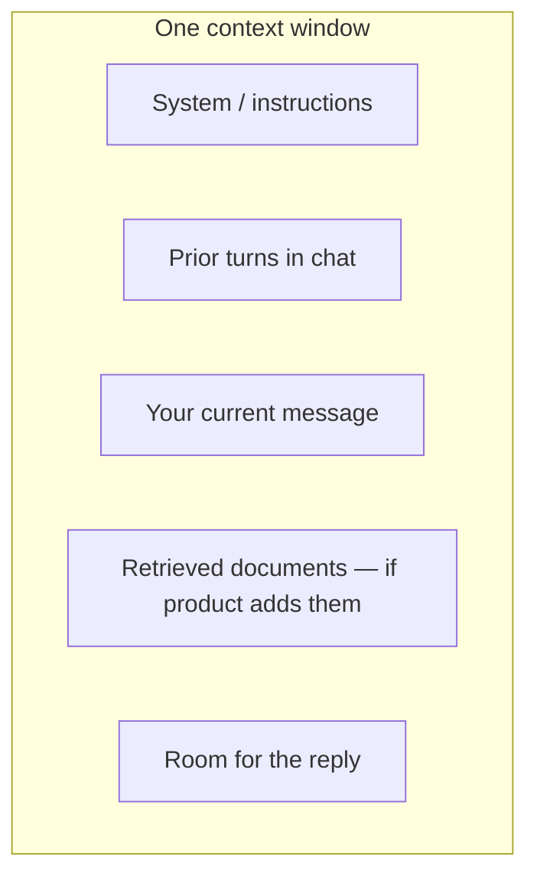
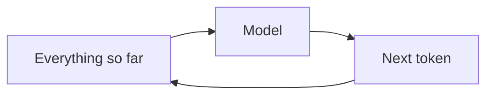

<div class="cover-page">
<p class="cover-series">The LLM Trilogy</p>
<hr class="cover-rule">
<h1 class="cover-title">From Tokens to Understanding</h1>
<p class="cover-subtitle">An introduction to large language models</p>
<p class="cover-vol">Volume I · Beginner</p>
<p class="cover-author">Sharif Uddin</p>
</div>

# From Tokens to Understanding

*An introduction to large language models — Volume I*

*Sharif Uddin*

---

## Who this book is for

This book is for anyone who has used a chat assistant — or knows they should — and wants to understand what is actually happening beneath the surface. No calculus. No programming experience. No prior AI coursework.

If you can follow a well-written article about technology and you are willing to try a few short exercises in a chat window, you have everything you need to read this book.

More specifically, this book is for:

- **Curious readers** who have tried ChatGPT or a similar tool and felt both impressed and faintly suspicious, and want to know which instinct to trust.
- **Students and early-career professionals** who want a grounded introduction to a technology that is reshaping their field.
- **Experienced professionals** in non-technical roles — managers, writers, lawyers, doctors, teachers — who use or evaluate AI tools and need a clear picture of what they can and cannot rely on.
- **Developers and engineers** who are comfortable with code but want a plain-language foundation before diving into APIs and systems work (Volume II covers that).

What this book is *not* for: people who want to train models, study the math, or build ML systems from scratch. Those are worthy goals, but they belong to a different book with different prerequisites.

---

## What you will walk away with

By the end of this volume, you will be able to:

- Explain in plain language what a large language model is, how it generates text, and why it sounds confident even when it is wrong.
- Read model documentation and provider announcements without getting lost in jargon.
- Write prompts that actually work — not magic incantations, but clear specifications.
- Recognize the most common failure modes: hallucination, ignored instructions, format drift.
- Know when *not* to use an LLM, which matters as much as knowing when to use one.
- Handle the responsibility questions: privacy, misinformation, academic integrity, and professional disclosure.
- Prepare yourself for Volume II if you want to build features and systems.

---

## Introduction

### Why this book exists

Large language models arrived in everyday tools — search, writing aids, coding helpers — faster than most curricula could absorb. If you have ever pasted a paragraph into a chat box and felt both impressed and a little suspicious, you are already in the right mood for this book. That tension is healthy and worth maintaining. These tools are genuinely useful. They are also genuinely unreliable in ways that are easy to miss because the failures sound exactly like the successes.

*From Tokens to Understanding* exists to close the gap between using these tools and understanding them. The goal is not to make you an ML engineer. It is to give you a **stable mental picture**: what these systems are doing under the hood at a conceptual level, what they are not, and how to interact with them so you get useful results without mistaking fluency for truth.

That last phrase is the thread that runs through every chapter: **fluency is not truth**. A language model is trained to produce plausible text. Plausible is not the same as accurate, and the gap between those two things is where most real-world problems with these tools originate.

### The arc of this book

The volume is divided into six parts, each building on the previous one:

**Part I — Finding your bearings.** Before anything else, you need the right vocabulary and a clear picture of what kind of thing you are dealing with. These chapters cover the AI/ML/LLM distinction, the one-sentence definition of what a language model actually does, and a short history of how we got here.

**Part II — How it works (without equations).** This is the mechanics layer: tokens (the unit of cost and limits), the next-token prediction loop (the heartbeat of every response), training stages (how a model goes from raw text-predictor to chat assistant), and context windows (the hard constraint on what the model can "see" at once).

**Part III — Capabilities and limits.** What are these systems genuinely good at, and where do they predictably fail? This part covers hallucination in detail (why it happens, not just that it happens), bias and fairness, and the practical realities of cost, speed, and access.

**Part IV — First steps with prompts.** The hands-on part. How chat interfaces are structured, how to write prompts that get closer to what you want, how to recover when the model drifts, and — critically — when to stop and use a different tool or a human expert.

**Part V — Responsibility in everyday use.** Privacy, misinformation, academic integrity, workplace norms. Not a manifesto, but practical habits for using these tools without causing harm to yourself or others.

**Part VI — What's next.** A consolidated glossary of core terms, a set of habits that will compound over time, and a clear pointer to Volume II (*From Prompts to Systems*) for when you are ready to build.

### How to read it

Read in short sessions and do the *Try it* exercises. The exercises are not optional decoration — they are how the abstract concepts become habits you can actually use. An idea you have tested once is worth five you have only read about.

If you get stuck or confused, that is normal and often useful. Write down what confused you. A named confusion is a confusion you can resolve; a vague sense that "I don't quite get it" is one that stays.

You do not need to read this cover to cover before using any of it. Parts III and IV in particular are useful as standalone references once you have read Parts I and II.

---

## How this volume is organized

Each link below opens a full part — with introduction, chapter prose, exercises, and navigation.

### Part I — Finding your bearings

→ [from-tokens-to-understanding-part-i-finding-your-bearings.md](from-tokens-to-understanding-part-i-finding-your-bearings.md)

*What kind of thing is an LLM? Where did it come from? Why does fluent language not imply correct information?*

### Part II — How it works (without equations)

→ [from-tokens-to-understanding-part-ii-how-it-works-without-equations.md](from-tokens-to-understanding-part-ii-how-it-works-without-equations.md)

*Tokens, prediction, training, context windows — the mechanics that explain why the model behaves the way it does.*

### Part III — Capabilities and limits

→ [from-tokens-to-understanding-part-iii-capabilities-and-limits.md](from-tokens-to-understanding-part-iii-capabilities-and-limits.md)

*What LLMs reliably do well, where they fail, and what bias and cost look like in practice.*

### Part IV — First steps with prompts

→ [from-tokens-to-understanding-part-iv-first-steps-with-prompts.md](from-tokens-to-understanding-part-iv-first-steps-with-prompts.md)

*Writing prompts that work, diagnosing failures, knowing when to stop.*

### Part V — Responsibility in everyday use

→ [from-tokens-to-understanding-part-v-responsibility-in-everyday-use.md](from-tokens-to-understanding-part-v-responsibility-in-everyday-use.md)

*Privacy, misinformation, academic integrity, and the habits that protect you and others.*

### Part VI — What's next

→ [from-tokens-to-understanding-part-vi-whats-next.md](from-tokens-to-understanding-part-vi-whats-next.md)

*Core glossary, compounding habits, and the bridge to Volume II.*

---


## Full text — Parts I through VI

# Part I — Finding your bearings

*Sharif Uddin*

*[From Tokens to Understanding](from-tokens-to-understanding.md) · Volume I*

---

## Welcome

Before you open a chat window or an API panel, it helps to know **what kind of thing** you are talking to.

This first part gives you that grounding in plain language—no equations, no assumed background. Four short chapters, one clear goal: you leave with a stable mental picture of what an LLM actually is, where it came from, and why smooth language does not guarantee correct information.

> **The thread running through Part I:** fluent language is not the same as correct information. The chapters ahead show you how to enjoy the first without mistaking it for the second.

---

## Contents of this part

*In the full volume table of contents, these correspond to sections 1–4.*

| # | Chapter | What you will take away |
|---|---------|-------------------------|
| **1** | How to use this book | Scope, pace, and study habits |
| **2** | AI, machine learning, and language models | Vocabulary for the landscape; why language modeling is different |
| **3** | What an LLM is—and what it is not | Mechanics in one picture; three common misconceptions |
| **4** | A short history to the present | N-grams → neural nets → transformers → scale, intuitively |

**Plain list** (same content, for readers or tools that do not render tables):

1. **How to use this book** — scope, pace, study habits.
2. **AI, machine learning, and language models** — vocabulary; why language is a different kind of prediction problem.
3. **What an LLM is—and what it is not** — statistical model; not a database, person, or live web search by default.
4. **A short history to the present** — n-grams through scale, intuitively.

---

## Chapter 1 — How to use this book

### Pace and rhythm

You do not owe this book a single uninterrupted sprint. Most readers do better with **short visits**: read a section or two, pause, then take **one** concrete action before moving on. The *Try it* sections at the end of each part are built for that rhythm. They are optional in theory, but in practice they are how abstract ideas become habits.

What does "one concrete action" mean? It could be:

- Typing the exercise prompt into a chat tool and looking at what comes back.
- Writing a single sentence in your notes: "This chapter claimed X; I tried it and saw Y."
- Looking up one term you were not sure about and writing the definition in your own words.

Small moves. Do not wait until the whole book is finished before you test anything.

If you step away for days or weeks, start back by skimming the **contents** at the top of whichever part you are in. A thirty-second skim will remind you where you are in the arc from orientation to mechanics to responsibility.

### What is in scope—and what is not

This book is deliberately bounded. Knowing what is *not* here helps you set the right expectations.

| In scope | Out of scope |
|----------|--------------|
| Plain-language explanations and mental models | Training a model from scratch |
| Prompts you can try in any mainstream assistant | Mathematical derivations |
| Reminders about privacy, bias, and claim-checking | Every architecture name in the research literature |
| Habits and vocabulary built to last | Screenshots and menu labels (those go out of date) |

The exclusions are not oversights. Training from scratch and mathematical detail are genuinely important—but they belong in a different book, aimed at a different reader and a different goal. This book's goal is a **usable mental model**: one you can carry into real work, return to under pressure, and update as the technology changes.

Where a topic truly needs more room—deployment, retrieval, evaluation at scale—the later volumes pick up the story.

### Pointers to later volumes

When this book points forward to *From Prompts to Systems* (Volume II) or *From Models to Frontiers* (Volume III), treat the pointer as an open door, not a test you must pass today. Come back to it when you are ready.

For now, keep a scratch space—a note on your phone, a paper notebook, anything—for:

- **Prompts that worked** (or failed unexpectedly).
- **Words you looked up**, with your own definition alongside the official one.
- **Open questions**: things that confused you, or things you want to test later.

That scratch space will become more valuable than you expect. Many readers find, at the end of Part I, that their question list has grown—not shrunk. That is a good sign. Confusion that has been named is confusion that can be resolved.

**The book is a map and a set of habits**, not a race to the last page.

### Quick takeaway

- Read in short sessions; act on one idea before moving on.
- Use *Try it* sections to turn reading into practice.
- Keep notes on prompts, new terms, and open questions.
- Later volumes expand on deployment, retrieval, and evaluation—treat those pointers as invitations, not requirements.

---

## Chapter 2 — AI, machine learning, and language models

### Why the vocabulary matters

Open any news site and you will see **AI** attached to wildly different stories: self-driving car experiments, spam filters, fraud detection, image generators, and the chat assistant that has become hard to ignore. All are "about AI" in the loose sense journalists use, yet they describe **different engineering problems** with different failure modes.

Getting the vocabulary straight early saves you from arguing at cross-purposes—where one person is frustrated with a spam filter while the other is excited about a chat tool, and neither realises they are talking about different things. It also stops you from blaming the wrong system when something goes wrong, which is surprisingly common.

### Artificial intelligence — the broad label

**Artificial intelligence** covers machines or programs that do tasks we normally associate with human judgment: sorting, ranking, generating text, planning. The label does not, by itself, say anything about *how* the system works.

A chess program built from hand-written rules—"if the opponent does this, respond with that"—can still be called AI in casual conversation. But it is not **machine learning** in the modern sense, because its behaviour was fixed by people, not shaped by data. The programmer wrote every rule; the program never updates itself based on experience.

Think of **AI** as a job description: "does things people thought only humans could do." Machine learning is one way to hire for that job. There are others.

### Machine learning — the narrower sense

**Machine learning** is more specific: the system **adjusts using data** so it improves without a human writing a new rule for every case. You provide examples—inputs and the outputs you want—and the system searches for **patterns** that hold for new inputs it has never seen.

Consider a spam filter. No engineer writes rules like "flag messages with the phrase 'click here to claim your prize.'" Instead, the system sees millions of emails already labelled *spam* or *not spam* by humans, and it extracts statistical patterns that generalise to new messages. When conditions change—spammers evolve their phrasing—the model can be retrained on new data.

That process is deeply **statistical**. It tends to work well when tomorrow's world resembles yesterday's training data. It can fail—sometimes badly—when conditions shift or when the training data silently favours one group over another. A hiring tool trained on past decisions inherits the biases baked into those decisions. A medical model trained on one population may perform poorly on another. These are not edge-case concerns; they are a direct consequence of how machine learning works.

The following diagram marks the direction of travel. Keep in mind it omits almost everything—it is intentionally crude:



```text
  examples  --->  learning step  --->  patterns for new inputs
```

### Why language is harder than a single label

A classic image-recognition system picks **one label** from one image—cat or dog. Language does not work that way. Its challenge is fundamentally different.

Consider the sentence "I went to the bank." Whether "bank" means a riverbank or a financial institution depends entirely on **what came before**—and perhaps on what comes after. Text unfolds **one fragment at a time**, and each fragment's meaning is anchored to everything that preceded it.

Or consider the word "it" in: "The trophy didn't fit in the bag because it was too big." What is "it"? The trophy? The bag? A human reading that sentence resolves the ambiguity almost instantly using world knowledge—trophies and bags both have sizes, one must be bigger than the other. A system with no model of the world has to learn this disambiguation *statistically* from countless examples in training data.

A language model must therefore do something richer than label-picking: it has to work out **what is plausible next**, given all the text so far. That is why the output can sound so convincing—smooth grammar, confident tone—while a specific fact underneath is simply wrong. Chapter 3 explains the mechanism; for now, hold this in mind: **language modeling is a sequential, contextual game**, not a single snap decision.

### Where LLMs sit in the landscape

Across machine learning you will find systems tuned for **images**, **audio**, **robotics**, **tabular data**, and more. A **large language model** is built around **text** as its foundation—though many products now layer in other signals like images or audio.

This volume stays with the text core. Once you understand that core, understanding the added layers becomes straightforward.

When recent headlines say "AI," they often mean an LLM, or a **product** that wraps an LLM with search, tools, or company data. Those extra layers solve different problems. Keeping the layers distinct in your mind will save you from expecting one thing to do another thing's job—for example, expecting a base model to know today's news, or expecting a retrieval system to exercise judgment.

### Quick takeaway

- **AI** is a broad label—it says nothing about how the system works.
- **Machine learning** means the system improves by finding patterns in data, without a human writing rules for every case.
- Machine learning inherits biases from training data and can fail when conditions shift.
- **Language modeling** predicts plausible next text, not a single label—context across the whole sequence matters.
- Many products add layers (search, tools, documents) on top of the core model; keep those layers distinct in your mind.

---

## Chapter 3 — What an LLM is—and what it is not

### The one-sentence definition

A **large language model** is software trained to **continue text** in a way that **looks reasonable** in context. It is trained to sound like a good answer—not certified to **be** one. Everything else in this chapter follows from that single distinction.

**Large** refers to scale: billions of internal parameters compared with older models, which affects quality, speed, and cost. **Language model** means the system assigns **probabilities** to possible next **tokens** (small pieces of text—roughly words, or parts of words), given the text it has received so far.

At heart the model is answering one statistical question: **what might plausibly come next?** It is not consulting a database. It is not reasoning about truth. When you type a question, you are giving the model a **prefix**; it continues the prefix in the style of an answer, because that is the pattern its training rewarded.

Seen from that angle, an LLM is a **statistical portrait of language**, drawn from enormous amounts of writing—articles, books, code, forum discussions, documentation, and more. It absorbs grammar, register, genre—even the *shape* of expert arguments and code—because those regularities appear over and over in the data. That makes it genuinely useful for drafting, brainstorming, rephrasing, and exploring ideas, **as long as** you treat it as assistance rather than as an oracle.

### Tokens: the unit of prediction

The model does not read word-by-word. It reads **token-by-token**. A token is a fragment that might be a full word, part of a word, a punctuation mark, or a space. The exact breakdown depends on the tokeniser used during training.

A rough illustration (actual tokenisation varies by model):

| Text | Possible tokenisation |
|------|-----------------------|
| `playing` | `play` + `ing` |
| `ChatGPT` | `Chat` + `G` + `PT` |
| `2024` | `2024` (single token in many models) |
| `Hello, world!` | `Hello` + `,` + ` world` + `!` |

Why does this matter? Because the model's statistical view of text is built at this granular level. Unusual words may be split into fragments the model has to reassemble. Very long numbers or rare proper nouns may behave unexpectedly. Knowing that the model sees tokens, not words, helps you understand some of its stranger outputs—especially with names, numbers, and niche vocabulary.

### Three misconceptions that come up constantly

| What people sometimes assume | What is closer to the truth |
|------------------------------|-----------------------------|
| It looks answers up in a table of facts. | It does **not** work like a curated database. If something that looks like a lookup appears, a **separate** system—search, tools, retrieval—was deliberately added around it. |
| It is "someone inside the machine." | It has no biography, no feelings, no legal standing. Friendly pronouns in its replies are a **design choice** for dialogue, not evidence of a mind. |
| It always sees the live web. | By default, a model's knowledge is **frozen** at training time. Live browsing or tools must be added on purpose by the product. |

Each misconception leads to a different kind of mistake in practice. Believing the model is a fact database leads you to skip verification. Believing it is a person leads you to anthropomorphise errors as "lying" or "trying to deceive." Believing it has live web access leads you to trust outdated claims as if they were current. Knowing the truth does not make the model less useful—it makes it more useful, because you use it correctly.

### Core versus product

Your message does not go into a single magic box. Think of it in two layers: a **core** that only predicts likely text, and an optional outer layer that the product may add:



```text
  Your prompt  -->  LLM core (predicts next text)  -->  Answer you see
                           ^
                           |
               Optional: web search · tools · documents
               (added by the product, not the core model)
```

When a product advertises "real-time information" or "access to your documents," those features are built in the *extras* layer, not baked into the model itself. The core still works the same way—predicting likely continuations—but it is now predicting continuations that incorporate retrieved text. Understanding this distinction helps you debug surprising behaviour: if a product fails to find a recent event, the failure is often in the search layer, not the model's "intelligence."

### Why fluent prose can still be wrong

The training signal rewards **plausible continuation**, not verified fact. A confident tone, clear structure, and specific-sounding detail can wrap around a false claim just as easily as a true one. There is no internal alarm that fires when the paragraph does not match reality—only a signal that the paragraph resembles patterns the model saw during training.

A worked example helps. Suppose you ask the model for the population of a city. Its training data contained hundreds of sentences structured like "The population of [city] is [number]." When it fills in the blank, it picks a number that *fits that slot plausibly*—perhaps a real number it saw often, perhaps a blend of numbers, perhaps a confident-sounding guess. You cannot tell from the tone of the answer whether it got the number right or not.

This property has a name in the research literature: **hallucination**. The term is borrowed loosely from psychology—an experience that feels real but has no external basis. The word can be misleading (the model is not "experiencing" anything), but the practical meaning is useful: **a hallucination is a fluent, confident output that is factually false.** Hallucinations are not rare edge cases. They occur across all current models with varying frequency, particularly for:

- Specific numbers, dates, and statistics.
- Citations and references to papers, laws, or rulings.
- Details about people, companies, and organisations.
- Events close to or after the training cutoff.

Later parts of Volume I return to verification habits and situations where an LLM is simply the wrong tool. For now, keep this inequality in mind: **smooth writing does not imply guaranteed truth.**

### Quick takeaway

- An LLM continues text in a plausible way—it is not looking up facts.
- The unit of prediction is a **token**, not a word.
- It is not a person, not a database, and does not see the live web by default.
- Products add layers (search, tools, documents) around the core—know which layer you are relying on.
- Fluent, confident output can still contain factual errors; this is called hallucination and is a structural property of how the model works, not a bug to be fixed by a new version.

---

## Chapter 4 — A short history to the present

### Four beats in one melody

You do not need a full historian's timeline to use a chat assistant. You **do** need a story you can retell—how we moved from **counting short phrases** to **large neural models** that can mimic whole genres. Think of it as four beats in one melody, not four disconnected machines.

Each beat solved the main problem of the previous one—and introduced a new problem that the next beat had to address. Understanding that chain of problems and solutions gives you a durable mental model that will survive the next wave of headlines.

### Beat 1 — N-grams: counting what comes next

The oldest approach is the **n-gram**: count how often short sequences of words appear in a large corpus, then use those counts to guess the next word.

If the phrase "the cat sat on the" appears thousands of times followed by "mat," then "mat" scores higher than "theorem." This trick is easy to explain and was once enough for spell-checking, keyboard autocomplete, and simple text suggestions on mobile phones.

Concretely: an n-gram model of order 3 ("trigram") looks at the last two words and asks, "given these two words, what word comes next most often in my training data?" It does not look further back than two words. It has no representation of *meaning*—only of co-occurrence statistics.

Its weakness is equally clear. N-gram models struggle with:

- **Rare phrasing**: if the exact sequence has not appeared in the training data, the model has nothing to go on.
- **Long-range meaning**: the constraint of only looking back a few words means context from earlier in the sentence is simply lost.
- **Nonsense that sounds local**: a sentence can be built from locally plausible trigrams and still be globally incoherent.

A sentence like "colourless green ideas sleep furiously" (Noam Chomsky's famous example) is grammatically well-formed and locally plausible at the bigram level, yet semantically absurd. N-grams had no mechanism to notice.

### Beat 2 — Neural language models: learned representations

**Neural** language models replaced the giant lookup tables of n-gram counts with **learned representations**—compact, dense patterns the network discovers from the data itself.

The key idea is the **word embedding**: each word is mapped to a point in a high-dimensional numerical space, and words that behave similarly across many contexts end up near each other in that space. "Dog" and "cat" both appear near "pet," "vet," and "leash"; they end up close together even though their spellings share nothing. This structure is learned entirely from statistics, without any human labelling what "animal" means.

Neural models could look further back than n-grams—dozens of words rather than two or three—and they generalised better to rare vocabulary by sharing statistical support across similar words.

For years, though, these models were small by today's standards, and very long-range structure—the kind that spans paragraphs or whole documents—remained difficult to capture reliably. The network's "memory" of what it had read earlier faded as the sequence got longer.

### Beat 3 — Transformers and attention: looking back selectively

**Transformers**, introduced in a 2017 paper ("Attention Is All You Need"), changed the engineering path with a mechanism called **attention**. The intuition is worth sitting with for a moment.

Suppose you are trying to predict the next word in: "The trophy didn't fit in the bag because **it** was too big." What should the model pay attention to when it reaches "big"? It needs to connect "big" to "trophy" (or "bag"), not just to the word immediately before. Earlier architectures struggled with this; they processed text sequentially, and distant context faded.

**Attention** lets the model, at each prediction step, look back over the entire preceding sequence and learn **which earlier tokens are most relevant** for this specific prediction—not just the nearby ones. It is a form of dynamic, learned relevance scoring.

That selective attention, combined with greater depth and the ability to train on many examples in parallel, made it practical to condition on **much longer stretches of text**. Researchers could then scale up—more data, more compute, more parameters—and often see **steady quality gains**, until they ran into limits of hardware or data availability.

Transformers also enabled a critical training efficiency: unlike previous architectures, they could be parallelised across many processors simultaneously. This meant that adding more compute translated into better models in a predictable way—which set the stage for Beat 4.

### Beat 4 — Scale: mimicry at breadth

At **scale**—billions of parameters trained on broad slices of public text—something qualitatively different became visible in everyday life. The same training objective that once produced better spelling suggestions started producing passages that **imitated** explanations, code, translation, dialogue, formal argument, and the *shape* of expertise—without anyone writing a rule for each skill.

This emergence of broad competence from a single training objective was surprising even to many researchers. A model trained to predict the next token on internet text turns out to have implicitly learned to perform arithmetic, follow step-by-step instructions, write in the style of a legal document, and debug code—not perfectly, and not always reliably, but recognisably.

The explanation is structural. The training data contains examples of all these things. To predict text well across all those genres, the model must learn enough internal structure to imitate each genre. **Scale is the mechanism that makes that breadth of imitation feasible**—more parameters to store finer distinctions, more training data to cover more domains, more compute to let those patterns interact.

This is an observation about **imitation**, not a claim of human-like understanding. The model does not know it is imitating. It does not have a concept of expertise. But at sufficient scale, the training pressure produces outputs that are, in many domains and for many purposes, useful.

The following parts of Volume I leave history behind and turn to **mechanics**: tokens, the prediction step, and the limits of what fits in one request.

**Carry this moral forward:** scale can unlock startling mimicry; it does not, by itself, guarantee truth or meaning. Each beat of this history solved a problem and introduced a new one. The current beat is no different.

### A note on the timeline

Placing these beats on a rough timeline helps calibrate how fast the field has moved:

| Era | Dominant technique | Rough period |
|-----|-------------------|--------------|
| Statistical NLP | N-grams, rule-based methods | 1980s–2000s |
| Early neural NLP | Word embeddings, recurrent networks | 2013–2017 |
| Transformer era | Attention-based architectures | 2017–present |
| Scale era | Large pre-trained models | 2020–present |

These eras overlap; researchers did not discard earlier techniques overnight. N-grams still appear in production systems where speed matters more than fluency. The point of the table is not precise dates but a sense of the direction and pace.

### Quick takeaway

- **N-grams** count short phrases to guess what comes next—simple, interpretable, but limited by context length.
- **Neural models** learn compact representations that generalise better and handle rare vocabulary.
- **Transformers** add selective attention over long text, enabling much larger and more capable models.
- **Scale** unlocked broad mimicry of human writing; it did not solve truth or understanding.
- Each beat solved the main problem of the previous one—and introduced a new challenge for the next.

---

## Try it

Three short exercises. Use any mainstream chat tool you already have. Nothing is graded. The goal is to connect what you just read to what the model **actually does** in the moment.

### Exercise 1 — Test the "what it is not"

Type this prompt, or something close to it:

> *List three things a large language model is NOT—such as: not a database of verified facts, not a person, and not live web access by default. Use bullet points.*

Read the response alongside Chapter 3. If the model adds a fourth "not" that this chapter never claimed, note it down. If the model's explanation of any item differs from this chapter's, write down which account you find more convincing and why. That small friction is the lesson: the model continues plausibly, not accurately. The goal is to develop the habit of comparing what the model says against what you know to be true.

### Exercise 2 — Verify one claim

Ask the model for **one specific fact** you can check in a couple of minutes—a date, a count, a title, a name.

Then verify it using a second source (a search engine, an encyclopaedia, an official site). If the model was wrong, write a single sentence about **how it sounded**—confident, hedged, detailed. You are training your ear to notice confidence without accuracy.

If the model was right, that is fine—but do not conclude from one data point that it is always reliable. Try again with a more obscure fact.

### Exercise 3 — Watch the continuation instinct

Give the model an **incomplete sentence** with a deliberately absurd gap:

> *"The moon is made of [blank], which is why astronauts always bring [blank] on missions."*

Ask it to fill in the blanks seriously.

What did it do? It almost certainly produced a grammatically smooth, plausible-sounding response—either playing along, or gently correcting you. Either way, it did not refuse to continue. This is the continuation instinct in action: the model's job is to produce a plausible next piece of text, and it will find *some* way to do that even when the prompt is nonsensical. That instinct is useful (it makes the model fluent and responsive) and risky (it means the model will complete false premises with false conclusions). Remembering both sides of that trade-off is worth more than most prompt tricks.

---

*End of Part I. Previous: [main volume — introduction](from-tokens-to-understanding.md) · Next: [Part II — How it works (without equations)](from-tokens-to-understanding-part-ii-how-it-works-without-equations.md).*

---

# Part II — How it works (without equations)

*Sharif Uddin*

*[From Tokens to Understanding](from-tokens-to-understanding.md) · Volume I*

---

Part I gave you **orientation**: vocabulary, history, and a clear line between fluency and truth. This part turns to **mechanics** — still without equations, but concrete enough that invoices, error messages, and model announcements start making sense. You will see how raw text becomes **tokens**, how the model turns a prefix into a **next token**, how **training and tuning** shape the model's behavior, and why **context length** is both a superpower and a hard ceiling.

Everything in this part connects back to one idea: the model is an extraordinarily sophisticated pattern-completion engine. Understanding *how* that engine runs explains why it does the things that surprise you — good and bad.

---

## Contents of this part

*In the full volume table of contents, these correspond to sections 5–8.*

| | Chapter | What you will take away |
|---|--------|-------------------------|
| **1** | Text as tokens | Why "token" is the unit of cost and memory, not always "word" |
| **2** | Prediction: the next piece of text | Next-token prediction, randomness, and misplaced confidence |
| **3** | Training and adaptation in one picture | From web-scale pretraining to chatty assistants — in one arc |
| **4** | Context windows and memory | What fits "in view," and what to do when it does not |

**Contents (plain list — same as table):**

1. Text as tokens — cost and limits in tokens, not always words.
2. Prediction: the next piece of text — sampling, temperature, confidence.
3. Training and adaptation in one picture — pretraining to chat assistants.
4. Context windows and memory — finite "view," forgetting in long chats.

---

## Chapter 1 — Text as tokens

**Have you ever paid for something and not known what the unit of measurement was?** Buying data by the "megabyte" used to confuse everyone. Buying LLM capacity by the "token" is doing the same thing to a new generation of users. If you do not know what a token is, you will misread your bill, misunderstand context limits, and occasionally get strange behavior from the model when it encounters text you would not expect to be unusual.

A **token** is the model's atomic unit of text. Not a character, not a word — a token. It is a fragment produced by a specific procedure called a **tokenizer**, and the exact fragments depend on the tokenizer used during training.

### How tokenization works

The tokenizer's job is to convert any text into a sequence of integer IDs from a fixed vocabulary — often 50,000 to 100,000 entries. Each ID points to a piece of text that the model has learned to recognize. The model never sees your raw text; it sees a sequence of numbers representing those pieces.

In English, many common words map to a single token. "the," "is," "of," "and" are all one token each. But the rules get stranger quickly:

| Your text | Likely tokenization |
|-----------|---------------------|
| `playing` | `play` + `ing` (2 tokens) |
| `unbelievable` | `un` + `believ` + `able` (3 tokens) |
| `2024` | `2024` (1 token in most models) |
| `getUserSessionConfig` | `get` + `User` + `Session` + `Config` (4 tokens) |
| `Hello, world!` | `Hello` + `,` + ` world` + `!` (4 tokens — note the space is part of the word token) |
| `…` (ellipsis) | may be 1 or 3 tokens depending on the tokenizer |

The general rule: **common sequences cost fewer tokens; rare sequences cost more**. A camelCase identifier your codebase invented will be chopped into pieces. A phrase that appears constantly in English text will often survive as one or two tokens.

### Why subwords? The vocabulary problem

Why not just tokenize by word? Two reasons.

First, vocabulary size. If every word form is its own token, you need a massive vocabulary — and you still cannot handle rare words, technical terms, names, or words in other languages. A subword approach keeps the vocabulary manageable: "un-" and "able" each appear in hundreds of thousands of words, so the model gets mileage from both pieces.

Second, morphology. Languages like Finnish, Turkish, or German form long compound words that are trivially split into meaningful subparts. A word-level tokenizer sees one unknown word; a subword tokenizer sees a sequence of recognizable components.

The tradeoff: the model must learn to reconstruct meaning from pieces. It handles this surprisingly well for common patterns, but it means that rare words and non-English text often require more tokens than you would intuitively expect.

### Why this matters in practice

**Cost.** API pricing is per token, not per word or character. A 750-word document is roughly 1,000 tokens in English — but that ratio shifts dramatically for code (often more tokens per character), for some languages (often more tokens per word), and for structured formats like JSON.

**Context limits.** The model's context window is measured in tokens. If the limit is 128,000 tokens, that sounds enormous — until your system prompt is 2,000 tokens, your chat history is 10,000 tokens, and you try to paste in a long document.

**Strange model behavior.** If you have ever seen a model behave oddly on a specific word — mispronounce a rare name, trip on a technical term, or make arithmetic errors on multi-digit numbers — tokenization is often the explanation. The model is not reading "3.14159"; it is reading a sequence of tokens that may split across the decimal point in ways that make arithmetic harder.

*Friction:* The most common budgeting mistake is accounting for the user's question and forgetting everything else — system prompt, tool outputs, retrieved documents, prior chat history. All of it eats tokens from the same fixed budget.

*Memorable detail:* A short camelCase method name like `calculateMonthlyCompoundInterestRate` can cost more tokens than the sentence "What is compound interest?" They are the same semantic load, but one is rare text and the other is common.

### A practical habit

Before working with a tool that has a context limit or charges per token, **paste your text into the provider's tokenizer** (most provide one) and look at the actual count. It takes thirty seconds and will save you from unpleasant surprises.

### Quick takeaway

- Tokens are subword fragments, not words. Common text is cheaper; rare text costs more.
- Cost and context limits are both measured in tokens.
- System prompts, history, and retrieved documents all share the same token budget as your question.

---

## Chapter 2 — Prediction: the next piece of text

**Imagine autocomplete — but instead of suggesting the next word on your phone keyboard, it writes the next 500 words, then 500 more, and keeps going until you tell it to stop.** That is, very roughly, what a language model does. Understanding the loop that makes this possible explains almost every behavior you will observe.

### The autoregressive loop

At the core of a large language model is one repeated operation, called **autoregressive generation**:

1. Given all the text so far (your prompt, plus any tokens the model has already generated), compute a probability distribution over every possible next token in the vocabulary.
2. Sample one token from that distribution.
3. Append the chosen token to the sequence.
4. Repeat from step 1.



```text
  Everything so far  →  Model  →  Probability over all tokens
                                          ↓
                                   Pick one token
                                          ↓
                           Append to sequence, repeat
```

The model does not generate the full answer in one step. It generates one token, then conditions the next step on everything including that token. This is why edits to early parts of the text can change what comes later — the chain is strictly causal.

### A walk-through

Suppose your prompt is: "The capital of France is"

Step 1: The model looks at this prefix and computes probabilities for every token in its vocabulary. "Paris" might score 0.92. "the" might score 0.02. "a" might score 0.01. Thousands of other tokens share the remaining 0.05.

Step 2: The model samples from this distribution. With high probability it picks "Paris."

Step 3: The new sequence is: "The capital of France is Paris"

Step 4: Repeat. Now it might pick "," with high probability, then "which," then "is," then "the," then "capital," then "city" — and so on, one token at a time, until it generates a stop token or reaches the maximum output length.

Notice that at no point does the model look up "capital of France" in a database. It produces "Paris" because, across billions of examples in its training data, "Paris" appeared after "The capital of France is" far more often than anything else. That is the mechanism — and it is why the model can be wrong while sounding completely certain.

### Temperature: the creativity dial

If the model always picked the single most likely next token, most outputs would be repetitive, predictable, and stilted. Real systems **sample** from the probability distribution instead of always taking the top pick.

**Temperature** is the parameter that controls how the sampling works. Think of it like this: the probability distribution is a weighted bag of marbles — each marble is a token, and the weight of each marble is how likely the model thinks it is. Temperature controls whether you use the weights exactly, or whether you flatten or sharpen them:

- **Low temperature (e.g. 0.1):** The distribution is sharpened. The most probable tokens get even more weight; the unlikely ones become even less likely. Outputs are more predictable, repetitive, and confident-sounding.
- **High temperature (e.g. 1.5):** The distribution is flattened. Unlikely tokens get a meaningful chance. Outputs are more varied and surprising — sometimes creative, sometimes incoherent.
- **Temperature 0 (or near 0):** The model nearly always picks the top token. Fully deterministic. Good for tasks where you want the same answer every time.
- **Temperature 1:** Uses the raw probability distribution from the model, unchanged.

*One-line analogy:* Low temperature is a quiz show contestant who only says the first thing that comes to mind. High temperature is that contestant after two coffees — more creative, occasionally wrong.

You do not need to set temperature yourself in most chat products — the provider picks a default. But understanding it explains why the same prompt gives different answers in separate conversations, and why creative writing tasks benefit from different settings than factual Q&A.

### "Sounds sure" is a structural property, not a quality signal

Here is the critical lesson from this chapter: **there is no step in the loop that checks whether the output is true.**

The model is trained on text that includes confident explanations, textbooks, encyclopedia entries, and expert writing. Confident, authoritative prose appears constantly in training data. So the model has learned, at a statistical level, that confident prose follows questions. It produces confident prose — regardless of whether the underlying facts are correct.

When you ask "What year was the Golden Gate Bridge completed?" and the model says "The Golden Gate Bridge was completed in 1937," it is not reporting from a database. It is continuing a prefix in the style of an answer. The year 1937 appears most often following that question pattern in the training data, so 1937 is what it produces. (In this case, it happens to be correct. In other cases, the most common-sounding answer is wrong.)

*Friction:* A common mistake is turning temperature down to make the model "more rigorous." Lower temperature produces more predictable, more confidently stated outputs — it does not produce more accurate ones. Statistical flatness is not the same as epistemic humility.

*Direct address:* If the model sounds certain, that tells you something about how common the style of a certain answer is in text. It tells you nothing reliable about whether that answer is correct. Keep these two things separate, and you will never be seriously misled.

### Quick takeaway

- The model generates text one token at a time, each step conditioned on everything before.
- Temperature controls the randomness of sampling — lower is more predictable, not more accurate.
- There is no truth-checking step in the generation loop. Confident-sounding output is a statistical artifact of training data, not a verification signal.

---

## Chapter 3 — Training and adaptation in one picture

**If you handed someone every book, article, and web page ever written and told them to absorb it all, they would know a great deal — and be terrible at answering your specific questions.** That is roughly the situation with a base language model. The training process has two phases: one that builds broad capability, and one that shapes it into something you can use. Understanding both helps you read model announcements, understand why behavior shifts between versions, and calibrate your expectations.

### Pretraining: learning from the internet

**Pretraining** is the large-scale first phase. The model is trained on an enormous text corpus — crawls of the web, digitized books, code repositories, scientific papers, forums, news archives — and asked to predict the next token, over and over, across hundreds of billions of examples.

From this single, simple objective, the model picks up an enormous amount of structure: grammar, register, genre conventions, factual associations that appear repeatedly in text, code syntax, mathematical reasoning patterns that show up in worked examples, and the rough shape of expert arguments in dozens of domains.

Think of it as reading everything ever written — not to memorize it, but to absorb its patterns deeply enough to continue any piece of it plausibly. A model after pretraining can write in the style of a legal brief, continue a Python function, translate between languages, and explain how photosynthesis works — all from the same base process.

*Anchor:* A pretrained model is like someone who has read every library in the world but has never had a conversation. Extraordinarily knowledgeable about patterns of text; not at all shaped to be a helpful assistant.

Pretraining is extremely expensive — tens of millions to hundreds of millions of dollars for frontier models, spread across weeks or months of computation on thousands of specialized processors. It also defines the model's **knowledge cutoff**: anything that happened after the training data was collected is unknown to the model by default.

### Instruction tuning: learning to answer, not just continue

A raw pretrained model, given the prompt "What is the capital of France?", might respond by generating more questions in the same style, or continuing in the voice of a quiz book, or producing a Wikipedia-style paragraph about geography. It is continuing text, not answering a question.

**Instruction tuning** (also called supervised fine-tuning or SFT) changes this. The model is trained on a curated dataset of examples showing: here is a question or instruction, here is a good answer. The model learns the format of being an assistant — answer the question, stay on topic, respond to follow-up, follow instructions like "be brief" or "use bullet points."

This stage is far cheaper than pretraining — it uses a small, carefully constructed dataset, not the entire internet. But it fundamentally changes the model's behavior from "continue this text" to "respond to this request."

### Preference tuning: learning what "better" means

Instruction tuning teaches format. **Preference tuning** (the most common form is called RLHF — reinforcement learning from human feedback, though related methods exist) teaches quality.

Human raters — or in some newer methods, an AI acting as judge — compare pairs of responses to the same prompt and indicate which is better: more helpful, more honest, safer, better-formatted. The model is then trained to produce responses that match the pattern of preferred outputs.

This is where the model's particular personality comes from: its tendency to hedge certain claims, its refusal patterns, its preferred response lengths, its level of formality. Those are not features the model discovered from pretraining — they are shaped by who did the rating and what they considered "better."

*Tiny vignette:* "One more epoch" of instruction tuning does not fix a problem introduced during preference training — they are different stages with different failure modes and different data. This distinction matters when debugging behavior changes after a model update.

### Base vs. chat: what the labels actually mean

When you see a model described as "base" or "foundation," it typically means a pretrained model without heavy chat-oriented tuning — powerful, but awkward for dialogue. When you see "chat," "instruct," or "assistant," it means the model has gone through at least instruction tuning, and often preference tuning too.

A behavior change after a provider updates their model may have come from any of these stages: a new pretraining data source, adjusted instruction tuning examples, or changed preference ratings. The word "smarter" in a release announcement does not tell you which. Sometimes "smarter" means better reasoning capability (pretraining improvement). Sometimes it means "follows instructions more reliably" (instruction tuning improvement). Sometimes it means "refuses fewer harmless requests" or "refuses more harmful ones" (preference tuning adjustment).

*Friction:* Teams upgrade to a new model version and are surprised when behavior changes in ways unrelated to the announced capability improvements. Understand that capability (reasoning, knowledge) and alignment (style, refusals, format) are different axes, and any of them can shift between versions.

### Quick takeaway

- **Pretraining** builds broad language and world-knowledge capability from enormous text corpora. Expensive. Defines knowledge cutoff.
- **Instruction tuning** teaches the model to behave like an assistant. Shapes format and basic dialogue.
- **Preference tuning** (RLHF and related methods) nudges behavior toward what humans (or AI judges) rate as better. Shapes personality, refusals, and style.
- "Base" and "chat" are meaningful distinctions. Model updates can change any stage, not just the one announced.

---

## Chapter 4 — Context windows and memory

**Imagine you are working at a desk, but the desk only holds one sheet of paper — and every time you write a new line, the line at the top disappears.** That is closer to how a language model handles memory than any human analogy involving a brain or a filing cabinet.

The model has no invisible notebook. There is no long-term memory being maintained between sessions by default. Everything the model "knows" during a reply is whatever sits in the **context window** — the tokens you send this turn, including system instructions, prior messages, retrieved documents, and any other text the product injects before your message arrives.

### What a context window is

A **context window** (also called **context length**) is a hard limit on how many tokens the model can consider at once for a single request. This includes:

- The **system prompt** (instructions the product places before your message)
- Any **prior conversation** the product includes (chat history)
- **Retrieved documents** or tool outputs the system injects
- Your **current message**
- Space reserved for the model's **reply**

All of these share the same fixed budget. Context windows have grown dramatically in recent years — from 4,000 tokens to 128,000 or even 1 million tokens in some models. But even a million-token context has a ceiling, and the pricing for very large contexts can be significant.



```text
  ┌─────────────────────────────────────────────┐
  │  Context window (all tokens share this)      │
  │  • System prompt                             │
  │  • Prior conversation turns                  │
  │  • Retrieved documents / tool outputs        │
  │  • Your current message                      │
  │  • Space for the model's reply               │
  └─────────────────────────────────────────────┘
```

### Forgetting and what to do about it

In a chat interface, earlier messages are typically concatenated into the prompt each time. When the running total approaches the context limit, the product must do something: truncate from the top (oldest messages disappear), summarize old turns (lossy compression), or ask you to start a new thread.

The model has no access to anything that fell outside the window. If you mentioned an important constraint in message one and the chat has grown long enough that message one dropped out, the model will simply not know about it. It is not being forgetful in a human sense — it never had access in the first place.

*Tiny vignette:* Summarization is a lossy compression of your conversation. Fine for "remind me what we were discussing." Catastrophic if the dropped line was "the patient is allergic to penicillin."

### Three strategies for working within limits

**Measure your baseline first.** Before building any workflow that involves long documents or long conversations, find out how much of your context budget your system prompt and typical history consume. The surprises almost always come from things other than the user's actual question.

**Summarize old conversation history.** When a chat thread is getting long, ask the model to produce a compact summary of the key decisions and facts from earlier in the conversation, then paste that summary into the start of a new thread. You lose nuance but preserve the load-bearing information.

**Retrieve instead of paste.** If you have a large document, do not paste all of it into the context. Instead, identify the specific sections relevant to your current question and include only those. This is the manual version of what retrieval-augmented generation (RAG) systems do automatically — and it is often more effective than hoping the model can find what it needs in a haystack of text.

*Friction:* "The AI should just remember our whole conversation" is the context window fighting human intuition about memory. The product interface may look like a persistent conversation; the underlying model only sees what fits in the current window. Those two things are different, and the product controls how the gap is managed.

*Direct address:* If something important happened twenty turns ago and the behavior changed inexplicably, check whether those turns are still in the window. The answer is often no.

### Why context costs money

Longer contexts are not free for providers either — processing attention over many tokens requires more compute. This is why long-context features are sometimes priced at a premium, why some providers charge different rates for input and output tokens, and why very large context windows are often offered at higher tiers. Context is a resource. Treating it as unlimited, even when the limit is technically large, leads to unexpected costs.

### Quick takeaway

- The context window is a hard limit on everything the model can see in one request — system prompt, history, documents, and your message combined.
- Material outside the context window is invisible to the model. "Forgetting" in long chats is real and architectural, not a personality quirk.
- Practical strategies: measure your baseline, summarize old history, retrieve instead of paste.
- Long context costs more compute. Treat it as a resource.

---

## Try it

Four short exercises. Use any mainstream chat tool you have access to. Nothing is graded — the goal is to turn the abstractions above into something you have directly observed.

### Exercise 1 — Count your tokens

Find a paragraph you have written recently — an email, a document section, anything around 100–150 words. If your provider has a public tokenizer tool, paste the text in and look at the token count. Note:

- The rough ratio of words to tokens (typically 1.3–1.5 for English prose)
- One word or punctuation mark that split in a way you did not expect

If you have access to two different text types, compare English prose with a code snippet of similar word count. Which is more expensive per word? Why?

### Exercise 2 — Same prompt, two temperatures

Ask a short creative question — something like "Write an opening sentence for a story set in an unusual location" — twice, in two separate chats. If your product exposes a temperature or creativity slider, try low and high settings. If it does not, the natural variation between fresh chat sessions is enough.

Compare the two responses. Which would you trust more for a factual question? Which would you prefer for brainstorming? What does this tell you about what temperature controls?

### Exercise 3 — Find the context limit in a long document

Take a long document — something over 2,000 words — and try asking the model questions about different parts of it: the beginning, the middle, and the end. Does the model answer with equal accuracy for all three parts?

Try pasting a much longer document if you have one. Does the model start missing things toward the end? This exercise is a direct observation of what happens at or near context limits — the model's answers degrade even when it appears to be considering the whole document.

### Exercise 4 — Base vs. chat behavior

Most providers allow you to access a base (pretrained, minimally tuned) model alongside their chat model. If yours does, give both the same prompt that sounds like the beginning of an article — something like: "Large language models were first introduced in"

The base model will probably continue the sentence as if writing an article. The chat model will probably treat it as a question and answer it. This single observation captures the difference between pretraining and instruction tuning more concretely than any explanation can.

---

*End of Part II. Previous: [Part I — Finding your bearings](from-tokens-to-understanding-part-i-finding-your-bearings.md) · Next: [Part III — Capabilities and limits](from-tokens-to-understanding-part-iii-capabilities-and-limits.md) · Or [main volume](from-tokens-to-understanding.md).*

---

# Part III — Capabilities and limits

*Sharif Uddin*

*[From Tokens to Understanding](from-tokens-to-understanding.md) · Volume I*

---

You now have a workable picture of **how** a model generates text. This part turns outward: **what these systems are genuinely useful for**, where they **fail or mislead**, how **bias** shows up in outputs, and what **cost, speed, and access** mean in practice.

The aim is proportion. Neither hype ("it can do anything") nor blanket dismissal ("it is only autocomplete") serves you well. You leave this part ready for the hands-on work in Part IV — and with the calibrated skepticism that makes the tools genuinely useful rather than naively trusted.

---

## Contents of this part

*In the full volume table of contents, these correspond to sections 9–12.*

| | Chapter | What you will take away |
|---|--------|-------------------------|
| **1** | What LLMs tend to do well | Real strengths — with an honest account of why they hold |
| **2** | Hallucinations, mistakes, and calibration | Why errors look credible; how to probe and verify |
| **3** | Bias, stereotypes, and fairness | Where skew comes from; why "fixing" it is hard |
| **4** | Speed, cost, access, and the environment | Who can use what, why price varies, a sober footprint note |

**Contents (plain list — same as table):**

1. What LLMs tend to do well — strengths tied to training data patterns.
2. Hallucinations, mistakes, and calibration — credible errors; verification habits.
3. Bias, stereotypes, and fairness — skew; why fixes are incomplete.
4. Speed, cost, access, and the environment — pricing, access gaps, energy in proportion.

---

## Chapter 1 — What LLMs tend to do well

**Which task would you give a tireless colleague who reads fast, writes fluently, and sometimes confidently states something completely wrong?** Not your final legal brief. But your first draft, your brainstorm list, your rephrased email — those are fine. The key to using language models effectively is matching the task to the capability, which requires actually understanding what the capability is.

Large language models are not equally good at everything. Their strengths cluster around tasks that are **pattern-rich in text**: language, format, shallow structure, and information that appears frequently in the training corpus. Knowing the shape of these strengths lets you delegate the right work and reserve human judgment for the rest.

### Drafting, rephrasing, and brainstorming

The single most reliable use of a language model is generating candidate text — not finished text, but starting points that you then edit, select from, or discard.

Ask for three different tones for the same email, and you get three; pick the one that fits and edit from there. Ask for ten headline options for a blog post and you get ten; two of them will be genuinely useful. Ask for an outline before writing and you get a skeleton to rearrange.

**Why this works:** Patterns of tone, structure, and phrasing appear constantly in training data. The model has seen thousands of formal-to-informal transformations, thousands of bullet lists derived from paragraphs, thousands of headlines for thousands of topics. It can generate plausible variations at a speed no human can match.

**The limits:** Faster drafts are not more accurate drafts. "The model wrote it" is not a claim about truth or fitness for purpose — it is a claim about text generation. You remain responsible for the substance.

### Explaining and teaching

Language models are often useful for getting a plain-language explanation of something you do not understand. "Explain how a neural network learns" in ten different ways, at ten different levels of assumed knowledge — the model can do all of them.

**Why this works:** Training data includes enormous amounts of pedagogical text: textbooks, tutorials, explainer articles, Stack Overflow answers, forum threads where experts answer novice questions. The model has learned the shape of "here is a concept explained simply" from millions of examples.

**The limits:** The explanation may be fluent, clear, and subtly wrong. It may omit the crucial caveat that changes the whole picture. It may use an analogy that breaks down in exactly the case you care about. Always check explanations against primary sources when the stakes matter.

### Editing and format transformation

Converting prose to bullet points, bullet points to prose, tables to descriptions, code to documentation — these structural transformations are reliably useful tasks. The model handles format with high consistency.

**Why this works:** Format patterns — markdown, structured lists, JSON shapes, table structures — appear so frequently in training data that the model has a very firm statistical grip on them.

**The limits:** It transforms form, not substance. A factually confused paragraph reformatted into bullet points produces clearly labeled confusion.

### Writing code sketches and debugging hints

For common programming tasks — boilerplate, standard library usage, common API patterns, explaining what an error message might mean — language models are genuinely useful, especially for developers who already know enough to evaluate the output.

**Why this works:** Code represents a large fraction of training data for modern models. The patterns of "here is an error message, here is what it likely means" are well-represented.

**The limits:** The model does not run your code. It does not know your specific library versions, your environment, or your constraints. Treat code suggestions as sketches that require testing, not as solutions that require only copying. For novel problems or tight correctness requirements, the model is much less reliable.

### Multilingual assistance (with significant caveats)

Translation, summarization, and basic conversation in many languages are within reach. High-resource languages (English, Spanish, French, German, Chinese, Japanese) generally work better than low-resource ones.

**Why this works:** The internet, and therefore the training data, includes text in many languages, creating multilingual competence as a side effect.

**The limits:** Performance degrades sharply for low-resource languages, regional dialects, and minority languages. "Works in Spanish" does not imply "works in Nahuatl" or even in every Spanish-speaking regional register. Cultural nuance is harder than linguistic translation. Do not rely on the model for languages you cannot evaluate the output in.

### The recurring theme

All of these strengths are **assistive and draft-quality**. They accelerate iteration. They generate options. They handle the mechanical work of formatting and phrasing so you can focus on substance and judgment. They become most valuable when a human — or a deliberate verification step — can catch errors before they matter.

*Friction:* The organizational risk is not that the model fails obviously. It is that the model succeeds fastwhere you expected it to fail — so teams skip the review step because the output arrived quickly and looked polished. Fast and polished is not the same as accurate and safe.

---

## Chapter 2 — Hallucinations, mistakes, and calibration

**Picture a bibliography in a perfectly formatted academic paper where half the cited studies do not exist.** The author names are plausible. The journal names are almost right. The titles are exactly the kind of titles those journals would publish. But the actual papers — the ones with those exact titles, by those exact authors, in those exact journals — are not real. This is the hallucination problem, and it is not a rare edge case.

### What hallucination actually means

In everyday use, a **hallucination** is a specific, confident, fluent output that is factually false or unsupported. The word comes loosely from psychology — an experience that feels real but has no external basis — but in the LLM context it just means: **the model stated a specific thing as if it were true, and it was not.**

This is distinct from vagueness, uncertainty, or disagreement. A model saying "I'm not certain, but I believe…" is hedging. A model saying "The study by Kovacs et al. (2019) found that…" and inventing the study is hallucinating.

Hallucinations are not rare. They are a **structural property** of how these models work. The training objective rewards plausible continuation, not verified fact. There is no internal fact-checker.

### Four categories where hallucination is most common

**1. Specific numbers and statistics.** Populations, percentages, dates, measurements. The model knows that questions about numbers should be answered with numbers, and it will produce a number — even when it does not have reliable data.

**2. Citations and references.** Ask for academic citations and you are likely to get plausible-looking but nonexistent papers, articles, or rulings. The model knows what citations look like, and it will produce the right shape — with wrong content.

**3. Details about people and organizations.** Job titles, publication histories, biographical facts about real people, details about companies. The model knows that articles about people include these details, so it fills them in.

**4. Events near or after the training cutoff.** The model may generate plausible-sounding details about recent events it has no actual data on.

### Why this happens

Walk through the mechanism. You ask: "What was the population of Lagos in 2022?"

The model has seen thousands of sentences of the form "The population of [city] in [year] was [number]." It knows the shape of this answer. It picks a number that fits that pattern — possibly a real number it saw, possibly a blend of numbers from different years, possibly a confident extrapolation. It has no flag that fires to say "I don't have reliable data for this specific fact." It just produces the most plausible continuation of the question-answer pattern.

The confident tone is not evidence of accuracy. It is evidence of how many confident-sounding answers appear in the training data.

### The verification habit

For any output where factual accuracy matters:

1. **Separate form from substance.** The model may produce beautiful structure around empty or false content. A well-formatted argument is not a correct argument.
2. **Check specific claims.** Numbers, names, dates, citations — any specific claim that would be embarrassing if wrong should be verified from a primary source.
3. **Never treat model citations as real.** If you want citations, find them yourself through a library database or search engine. Use the model to identify *what to look for*, not to provide the reference itself.
4. **Ask for uncertainty signals, but do not rely on them.** Prompting the model to flag things it is unsure about sometimes helps. But the model can also say "I'm fairly confident" about something it is wrong about, and can hedge about things it actually knows. Prompting helps at the margins; it does not solve the structural problem.

*Memorable detail:* A model that is wrong 5% of the time on factual claims sounds reliable until you realize that a 1,000-word document contains dozens of factual claims — and some of them may be wrong in ways that look completely convincing.

*Direct address:* If you are using a language model for anything involving health, legal advice, financial decisions, or any domain where being wrong hurts someone — treat every specific claim as a hypothesis to verify, not a fact to cite.

---

## Chapter 3 — Bias, stereotypes, and fairness

Language models learn from human-generated text. That corpus encodes centuries of human bias: stereotypes about demographic groups, uneven representation of different communities' voices, historical prejudice baked into what was written down and what was not, and gaps in whose knowledge and perspective was digitized. The model does not learn to *understand* bias — it learns to *reproduce the patterns in text*, including the biased ones.

### What "bias" means in this context

In this chapter, **bias** means **systematic skew**: outputs that favor one demographic group, language variety, or worldview over others in ways that are unjustified and often harmful. This is not the same as having a point of view on a contested issue. It is about unfair regularities: consistent under-representation, caricature, or degradation of specific groups.

### Three concrete examples

**Demographic defaults in generated scenarios.** If you ask a model to write a story about a doctor, it may default to a male doctor. If you ask for a story about a nurse, it may default to a female nurse. These defaults reflect the statistical distribution of how doctors and nurses are described in text — and reinforcing those defaults in AI outputs compounds the representational problem.

**Dialect quality judgments.** Language models trained primarily on edited, formal, standard English prose may evaluate or continue African American Vernacular English (AAVE) or other dialects as lower quality, produce corrections when none were requested, or treat non-standard grammar as errors rather than as valid linguistic variation. This is not a deliberate design decision — it is the model reflecting patterns in what "good writing" looks like in its training data.

**Western-centric cultural defaults.** Concepts of family structure, political systems, professional norms, food, clothing, and historical events will skew toward Western European and American perspectives in models trained on English-dominant internet text. A question about "traditional marriage" will produce an answer shaped by that corpus. A question about historical events may center perspectives that dominated the text sources.

### How bias enters the system

The pipeline has three stages where bias can compound:

**Training data.** If the data over-represents certain groups, perspectives, and time periods, the model learns those patterns more deeply. What is not well-represented is learned less reliably.

**Training objective.** The next-token prediction objective does not distinguish between "the text accurately represents group X" and "this is how X is most commonly described in text." Both generate the same training signal.

**Post-training tuning.** Preference tuning and safety filtering reduce some harmful outputs — but they can also shift bias rather than eliminate it, introduce new inconsistencies (over-refusing for some groups, under-refusing for others), or suppress surface expressions of bias while leaving deeper patterns intact.

### Why "fixing" this is an open challenge

Technical mitigations help at the margins: filtering training data for known harmful content, fine-tuning on more representative examples, using classifiers to catch problematic outputs. But these approaches involve difficult tradeoffs — between accuracy and fairness, between free expression and harm reduction — and they can shift bias without removing it.

The deeper problem is that "fair" is not a single, technically specified standard. It requires answering questions like: whose representation counts, by what measure, according to whose cultural standards? Those are social and political questions that engineering alone cannot resolve.

*Direct address:* Do not treat the model as a neutral arbiter of anything involving people, history, or culture. It is not neutral. Nothing trained on human text can be.

For high-stakes outputs — decisions that affect hiring, lending, medical triage, content moderation — bias testing against specific demographic groups should be a requirement, not an afterthought.

---

## Chapter 4 — Speed, cost, access, and the environment

These are not secondary concerns. They are the constraints that shape **who gets to use these tools**, **what they can do with them**, and what real-world resources their use consumes. A short, honest account is more useful than either mystery or moral theater.

### Free tiers, paid APIs, and what "bigger" costs

Most providers offer a free or low-cost tier for casual use. Serious volume — building a feature, running evaluations, processing large documents — usually means paid API access or an enterprise contract.

**Pricing is almost always per token**, for both input and output. The rough intuition:

- A 1,000-word document is approximately 1,300 tokens.
- A mid-tier model API might charge $0.003–$0.015 per 1,000 input tokens.
- A frontier model might cost 5–10x more.
- Output tokens are often priced higher than input tokens.

So a single 500-word answer to a 200-word question, on a mid-range model, costs roughly a fraction of a cent. One million such exchanges costs thousands of dollars. That arithmetic matters quickly when you are building a product.

**Larger models cost more per token** because they require more compute to run. The tradeoff is not always worth it — for many tasks, a smaller, cheaper model is adequate, and the cost difference allows 10x more queries for the same budget.

*Memorable detail:* A simple-looking product can become unexpectedly expensive if the system prompt is 2,000 tokens, retrieval injects another 3,000 tokens of documents per request, and you have 100,000 users per day. You pay for every token the model reads — not just the clever sentence at the end of the prompt.

### Who can access what

Access to frontier AI tools is not uniform. Several axes constrain it:

**Geography and payment infrastructure.** Many frontier model providers are based in the United States and Europe. Payment via credit card or certain banking systems is required. Users in countries with limited credit card access or under payment-system restrictions face barriers that are invisible from within those markets.

**Language coverage.** High-resource languages work better. Users working in lower-resource languages — even in languages spoken by hundreds of millions of people — may see significantly worse quality, more hallucinations, and poorer cultural fit.

**Hardware requirements.** Open-weight models that run locally require capable hardware. A laptop with a current GPU is sufficient for smaller models; larger ones require dedicated workstations or cloud compute, which costs money and technical expertise.

**Organizational access.** Enterprise agreements with privacy guarantees, dedicated capacity, and regulatory compliance (like HIPAA in healthcare or GDPR compliance in Europe) are available — at prices that favor large organizations over individuals and small nonprofits.

None of this is a reason to avoid these tools. It is a reason to be honest about who "we" includes when people say "we all have access to this."

### Energy and environment: a proportionate view

Training a frontier model from scratch uses significant energy — comparable in some estimates to the annual electricity consumption of dozens of homes, or hundreds of round-trip transatlantic flights. This is a legitimate environmental concern.

Inference — each individual query — is much cheaper per request, but adds up at scale. A billion daily queries across a major consumer product is a non-trivial compute load.

The honest environmental stance for this book is: **awareness and proportionality, not performative guilt or greenwashing**. Use these tools where they provide genuine value. Support providers who are transparent about their energy use and working toward lower-carbon infrastructure. Avoid treating a one-time training cost as if it is incurred per query, and avoid treating per-query costs as negligible when running at scale.

### Quick takeaway

- Pricing is per token; larger models cost more; system prompts and retrieved documents contribute to cost.
- Access is uneven by geography, language, hardware, and organizational capacity — this matters for equity.
- Energy use from training is real; per-query use adds up at scale; proportionality beats theater in both directions.

---

## Try it

### Exercise 1 — Hallucination probe

Ask the model a question that has a specific, checkable answer — something like "Who won the [obscure award] in [specific year]?" or "What is the exact founding date of [small organization]?"

Find the actual answer through a search engine or official source. Compare:
- Was the model right or wrong?
- How did it sound? Confident or hedged?
- If it was wrong, was the wrong answer *plausible*? Would you have caught it without checking?

Bonus: ask the model to "cite sources" for its answer and check whether the citations are real.

### Exercise 2 — Strengths vs. limits

Pick one task the model does well for you and one it does poorly. Write one sentence for each explaining *why* the difference exists in terms of what you learned in Chapter 1 (pattern richness in training data). Avoid generic explanations like "AI is not perfect" — connect it specifically to the mechanism.

### Exercise 3 — Observe a bias default

Ask the model to write a short paragraph about a professional — a doctor, a lawyer, an engineer, a nurse, a teacher — without specifying any demographic details.

What defaults did it choose? Now ask again, explicitly specifying a demographic that goes against the common pattern (a female engineer, a male nurse, a young retiree). Does the model handle it naturally or introduce awkwardness?

You are not grading the model here. You are observing what the statistical defaults in training data look like.

### Exercise 4 — Cost intuition

Find the pricing page for a model API you might use. Calculate the approximate token cost for a workflow you actually do or are considering:

- How many input tokens per request (system prompt + context + question)?
- How many output tokens per response?
- How many requests would you run per day or month?

What is the estimated cost? Does that change which model you would pick?

---

*End of Part III. Previous: [Part II — How it works (without equations)](from-tokens-to-understanding-part-ii-how-it-works-without-equations.md) · Next: [Part IV — First steps with prompts](from-tokens-to-understanding-part-iv-first-steps-with-prompts.md) · Or [main volume](from-tokens-to-understanding.md).*

---

# Part IV — First steps with prompts

*Sharif Uddin*

*[From Tokens to Understanding](from-tokens-to-understanding.md) · Volume I*

---

You understand what models are, how they generate text, and where they shine or stumble. This part is **hands-on**: how chat interfaces are structured, how to write prompts that actually work, how to recover when the model drifts, and — just as important — **when to stop** and reach for a different tool entirely.

Prompts are not magic spells. They are specifications. A clear specification produces better output than a vague wish, for the same reason that a clear brief produces better work from any collaborator.

---

## Contents of this part

*In the full volume table of contents, these correspond to sections 13–16.*

| | Chapter | What you will take away |
|---|--------|-------------------------|
| **1** | Chat interfaces and roles | System vs user, scope, and keeping a prompt library |
| **2** | Writing prompts that work | Goals, audience, format — and few-shot patterns |
| **3** | Common failure modes | Diagnosing vagueness, length, format slips, ignored rules |
| **4** | When not to use an LLM | High stakes, secrets, correctness guarantees — and better fits |

**Contents (plain list — same as table):**

1. Chat interfaces and roles — system vs user; prompt library.
2. Writing prompts that work — goal, audience, format; few-shot.
3. Common failure modes — vagueness, length, format, ignored rules.
4. When not to use an LLM — stakes, privacy, proof.

---

## Chapter 1 — Chat interfaces and roles

**Who is speaking, and to whom?** Most people encounter language models through a simple text box — you type, it responds. But underneath, every conversation has structure that shapes the model's behavior. Understanding that structure is the first step toward using it deliberately rather than hoping for the best.

### Three roles in a chat

In most systems, messages carry one of three roles:

**System**: Instructions that set the rules for the entire conversation. What the model should act as, how it should respond, what it must never do, what format to use. Users typically do not see the system prompt — it is placed before the conversation begins by whoever built or configured the product. When you use a company's internal AI tool, the rules baked into that tool live here.

**User**: What you say. Your questions, instructions, and follow-ups.

**Assistant**: What the model said previously. In a multi-turn conversation, prior model responses are included in the context as assistant turns, so the model can respond coherently to what it already said.

Here is the underlying structure of a simple two-turn conversation:

    System:    You are a plain-language explainer of legal documents.
               Never give legal advice. Always recommend consulting
               a qualified attorney for important decisions.

    User:      What does "indemnification" mean in a contract?

    Assistant: Indemnification means one party agrees to cover
               the costs or losses of another if something goes wrong...

    User:      Can you give me a simple example?

The system message persists for the whole thread. The user and assistant turns accumulate. Everything is text in a sequence — the model sees all of it as one long prompt and generates a continuation.

### What the system message gives you

When you can edit the system message — in a developer context or a configurable tool — treat it as the **contract for the whole thread**. Put things here that you want enforced consistently:

- **Voice and tone**: "Respond in plain language suitable for a non-technical audience."
- **Format rules**: "Use bullet points for lists. Never use more than three levels of nesting."
- **Scope boundaries**: "Only answer questions about our product. If asked about competitors, decline politely."
- **What not to do**: "Do not invent statistics. If you are unsure of a number, say so explicitly."

When you cannot see or edit the system message, you can approximate some of its function by starting your first user message with "For this conversation, please..." — less reliable, but often effective for simple constraints.

### Keeping a prompt library

Good prompts are assets. If you write a system prompt that produces consistently useful results — a tone, a format, a set of rules — save it. Keep a personal library: a plain text file, a note, a document, anything you can search later.

Label entries by **intent**, not by content: "professional email decliner," "extract action items from meeting notes," "explain code to a non-programmer." Add one line of metadata: which product or model you tested it on, and the approximate date. Model updates can change behavior; dated notes tell you when to re-test.

*Friction:* The most common prompting anti-pattern is rebuilding the same system prompt from scratch every session because you never saved the version that worked. The second most common is saving it but not labeling it, so you cannot find it six weeks later.

### Managing drift in long conversations

Models drift during long conversations: they pick up the style of recent turns, chase tangents, or gradually forget instructions given early in the thread. If the thread has gone off course, the fastest fix is usually a **new chat** with a fresh system prompt — not another ten messages trying to redirect the existing one.

*Direct address:* Opening a new chat is not an admission of failure. It is recognizing that the context window has been contaminated with unhelpful patterns and starting from a clean state. This is professional, not impatient.

### Quick takeaway

- Conversations have three roles: system (rules), user (you), assistant (prior model output).
- System messages persist for the whole thread — use them for consistent rules and format.
- Save useful prompts with intent labels and dates.
- When a thread goes wrong, a fresh chat is often faster than repair.

---

## Chapter 2 — Writing prompts that work

**What does "better prompt" mean if you never said what "better" looks like?** The most common prompting mistake is treating prompt quality as a mystery to be intuited rather than a specification to be written. Prompts work better when you make four things explicit: the goal, the audience, the format, and the constraints.

### Goal: what success looks like

Before everything else, state what a successful response actually looks like.

Compare:

**Vague**: "Can you help me with this document?"

**Specific**: "Identify the three most important action items in this document and list them in order of urgency, with one sentence explaining why each matters."

The vague prompt invites the model to define success for you. That is exactly the wrong way around. The model will produce a plausible response to the vague prompt — but plausible and useful are not the same thing.

### Audience: who is reading

Adding an audience constraint changes the response significantly:

- "Explain transformer architecture to a software engineer who has never studied ML."
- "Explain transformer architecture to a business executive who needs to make a budget decision."
- "Explain transformer architecture to a high school student."

The model adjusts vocabulary, analogy choices, depth, and assumed knowledge. "Make it clear" is not an audience. A specific reader with specific background knowledge is.

### Format: what shape the output should take

Specify the **shape** of what you want:

- "Bullet list of no more than five items."
- "A table with columns: Risk, Likelihood, Mitigation."
- "Two paragraphs: first the pros, then the cons. No more than 150 words total."
- "JSON with fields: summary, key_points (array), confidence_level (low/medium/high)."

Leaving format unspecified means the model chooses — and it will choose what appears most common in its training data for that type of question, which may not be what you need.

### Constraints: the guardrails

Constraints tell the model what to avoid and set limits:

- "Do not repeat information from earlier in the document."
- "If you are unsure about a specific number, say so — do not invent it."
- "No preamble. Start your response directly with the answer."
- "At most 200 words."

Constraints also **surface uncertainty**: if the model cannot comply with a constraint (e.g., "cite only peer-reviewed sources" when it has none), that failure is informative — it tells you what the model actually knows.

### Before and after: a worked example

**Before (vague):**
"Summarize this meeting transcript."

**After (specific):**
"From this meeting transcript, extract: (1) the three decisions made, each in one sentence; (2) the action items, each with an owner and deadline where stated; (3) any unresolved questions. If something is ambiguous, flag it rather than guessing."

The second prompt will produce a result you can hand directly to stakeholders. The first will produce a paragraph summary that is readable but may miss the specific structure you needed.

### Few-shot: showing the pattern

**Few-shot prompting** means including short examples of input → desired output in the prompt. The model picks up on format from examples very quickly — often faster than from a paragraph of verbal description.

    Example 1:
    Input: "The meeting was productive and we covered several topics."
    Classification: Vague — no specific outcome stated.

    Example 2:
    Input: "We agreed to delay the launch by two weeks to allow QA time."
    Classification: Specific — clear decision with rationale.

    Now classify this:
    Input: "Leadership discussed the roadmap for next quarter."

Two or three examples usually outperform a long written description for tasks involving classification, extraction, or rigid formatting. Keep examples honest — do not embed false information as demonstrations.

### Chain-of-thought: asking for reasoning steps

For problems that involve reasoning — math, comparisons, multi-step decisions — asking the model to "think through this step by step" or "explain your reasoning before giving your final answer" can improve accuracy.

This works because it makes intermediate steps visible in the token stream, and the model's generation of those steps provides a kind of working memory for the task. It is not magic — it works best for reasoning tasks where the steps are meaningful, and it adds tokens (and therefore cost and latency) to every response.

Use it deliberately, not by default. For simple lookups or direct questions, chain-of-thought adds overhead without benefit.

*Anchor:* Prompting is less like issuing a command and more like briefing a capable contractor. A vague brief produces vague work. A specific brief — goal, audience, format, constraints, examples — produces work you can use.

### Quick takeaway

- State the goal explicitly: what does a successful response look like?
- Name the audience: who is reading this, with what background?
- Specify the format: shape, length, structure.
- Add constraints: what to avoid, what to flag when uncertain.
- Use few-shot examples for classification and rigid formats.
- Use chain-of-thought for reasoning tasks — but not by default.

---

## Chapter 3 — Common failure modes — and simple responses

Even well-intentioned prompts fail. The good news is that failures fall into recognizable patterns. Recognizing the pattern means you change the setup rather than arguing with the model in prose.

### Failure mode 1: Too vague

**Symptom:** The response is generic, hedging, could apply to anything, or asks you twelve clarifying questions.

**Why it happens:** The model is trained to produce plausible responses. A vague prompt has many plausible responses, so it produces the most common one, which is usually the most generic.

**Fix:** Narrow the task. Add a concrete scenario. Request structure. State explicitly what you are and are not asking for.

    Instead of: "Tell me about project management."
    Try: "List the five most common reasons software projects miss deadlines, each with one sentence on how to prevent it."

### Failure mode 2: Too long

**Symptom:** Walls of text, repeated points, a three-paragraph preamble before the actual answer, or the same idea restated five times.

**Why it happens:** The model has seen enormous amounts of writing where thoroughness is rewarded. Without a length constraint, it defaults to thorough.

**Fix:** Cap the length. Ask for the answer first, then elaboration. Request an outline rather than a full draft.

    Add to your prompt: "Maximum 150 words." or "Lead with the direct answer, then explain in at most two sentences."

### Failure mode 3: Wrong format

**Symptom:** You wanted a bullet list and got an essay. You wanted plain text and got markdown that your pipeline cannot parse. You wanted JSON and got JSON wrapped in a paragraph.

**Why it happens:** Without a format specification, the model guesses what format best fits the question type. That guess is often wrong for your specific use case.

**Fix:** State the format in the prompt explicitly and, if possible, include a micro-example.

    "Return only a JSON object with the fields: name, date, summary. No surrounding text, no code fences."

If the model still adds surrounding text, try repeating the format constraint at the end of the prompt — recency in the prompt can help.

### Failure mode 4: Ignored instructions

**Symptom:** You said "do not mention competitor products" and it mentioned them. You said "respond in French" and it responded in English. You said "maximum 100 words" and got 400.

**Why it happens:** This can be a position problem (instructions buried in the middle of a long prompt are attended to less reliably than those at the start), a complexity problem (too many constraints at once), or a context length problem (a long conversation thread has pushed the original instructions out of effective attention range).

**Fix:**

1. Move critical rules to the beginning of the system message or the very start of the user message.
2. Reduce the number of simultaneous constraints — prioritize the most important ones.
3. If the failure happens in a long thread, start a new conversation with the instruction prominently placed.
4. Break the task into explicit steps: "Step 1: Do only X. Wait for my response before proceeding."

*Direct address:* If you are on your fifth "please follow this rule" message in the same thread, you are past the point where prompt tweaks help. The context has accumulated enough noise that a fresh start is faster than repair.

### A diagnostic shortcut

Before trying another prompt variation, ask: **Is this failure prompt-shaped?**

- If the model is producing reasonable-looking text about the wrong thing → prompt is probably too vague.
- If the model is producing exactly what you asked for but it is wrong on the facts → this is a hallucination problem, not a prompt problem. Prompting cannot fix it; verification can.
- If the model is behaving inconsistently across turns → context is the problem; start a new thread.
- If the model refuses to do something safe and reasonable → check whether the system prompt is restricting it, or try rephrasing with more context about why you need it.

### Quick takeaway

- Too vague → narrow the task with concrete scenarios and structure.
- Too long → cap length, ask for the answer first.
- Wrong format → specify it explicitly and give a micro-example.
- Ignored instructions → move rules to the front, reduce complexity, use a fresh thread.
- Distinguish prompt failures from hallucination failures — they need different responses.

---

## Chapter 4 — When not to use an LLM

Competence includes restraint. Knowing when not to reach for a tool is as important as knowing when to use it. Some tasks are genuinely wrong for probabilistic text generators — not because the model is bad at them, but because the **error profile** does not fit the requirement.

### High-stakes decisions without human review

**Medical, legal, financial, and safety-critical** decisions need qualified professionals and authoritative sources. A language model can help you understand a concept, prepare questions for a professional, or draft a summary of information you already have from authoritative sources. It should not be the sole basis for a diagnosis, a legal filing, a financial decision, or any choice where being wrong causes serious harm.

The risk is not that the model will obviously fail. The risk is that it will confidently produce something that sounds exactly right, passes a quick read, and turns out to be wrong in a way that matters enormously.

### Private or regulated data you should not paste

If putting text into a chat would violate a policy, breach a contract, or cause harm if leaked — do not paste it. Cloud chat tools may log, store, or train on your conversations depending on their terms of service. Customer data, patient records, unpublished research, legally privileged communications, and unreleased financial information all carry obligations that override the convenience of an AI tool.

The practical rule: if you would not forward this text to a stranger's email address without legal review, do not paste it into a chat box without knowing what happens to it. Use approved enterprise tools with clear data-handling terms, or offline models, when working with sensitive material.

### Tasks that need guaranteed correctness

**Formal verification, exact computation, cryptography, regulated compliance output** — these require deterministic tools with auditable processes, not probabilistic text generation. A language model doing arithmetic can get the right answer and the wrong answer on the same problem across different sessions. Code it generates may have subtle security flaws. Legal language it drafts may be invalid in your jurisdiction. For tasks where the standard is "definitely right," the tool needs a verifiability guarantee the model cannot provide.

### Better tools exist

Sometimes the right tool is simply a different one:

| Task | Better tool |
|------|-------------|
| Finding a specific document you wrote | Search engine or file system search |
| Performing exact calculations | Spreadsheet or calculator |
| Looking up current information | Web search with source verification |
| Running a repeatable process reliably | Code, scripts, or automation tools |
| Getting authoritative professional guidance | A qualified professional |
| Storing and retrieving structured data reliably | A database |

The model is strong where **language, structure, and pattern** help. It is weak where **truth, proof, privacy, or exact determinism** is required.

*One-line analogy:* A skilled writer does not use a word processor to calculate compound interest. A word processor is excellent; it is just the wrong tool. Knowing which tool fits which job is the skill.

### Quick takeaway

- High-stakes decisions: use the model to prepare, not to decide.
- Sensitive data: know your provider's data policy before pasting anything regulated.
- Exact correctness requirements: use deterministic tools with auditable outputs.
- Better tools exist for many tasks — match the tool to the error profile required.

---

## Try it

### Exercise 1 — Vague versus structured prompt

Pick a small task you actually need to do — summarize a document, draft a short message, explain a concept to someone. Write two prompts for it:

**Version A**: A one-liner, as vague as feels natural.

**Version B**: A prompt using goal, audience, format, and at least one constraint.

Run both. Compare the outputs. Which would you actually use as-is? Which needs more editing? If Version A was fine, ask yourself whether you were grading on accuracy or on politeness.

### Exercise 2 — Fix one failure mode deliberately

Write a prompt that you expect to produce a specific failure — too long, wrong format, or too vague. Observe the failure. Then rewrite the prompt with exactly one change to address it: a length constraint, a format spec, a concrete example, or a narrowed scope.

Did the fix work? If not, was the failure actually prompt-shaped, or was it a hallucination or a policy limit?

### Exercise 3 — Build a few-shot classifier

Choose a simple classification task: positive vs. negative sentiment, urgent vs. non-urgent, specific vs. vague. Write a prompt with two or three input-output examples, then test it on five new inputs.

How consistent is it? What kinds of edge cases confuse it? This exercise teaches you more about few-shot pattern-matching than any description can.

### Exercise 4 — Find the boundary

Try asking the model to do something that it probably should not — not harmful, but at the edge of what it is designed for. Something like: "Give me the exact legal language I should use to write my own will" or "Diagnose what's wrong with my knee based on this description."

Observe how it responds. Does it refuse? Does it comply with caveats? Does it comply without caveats?

Then ask yourself: what would the right behavior actually be in this situation? The goal is not to evaluate the model — it is to develop your own judgment about when to stop before the model does.

---

*End of Part IV. Previous: [Part III — Capabilities and limits](from-tokens-to-understanding-part-iii-capabilities-and-limits.md) · Next: [Part V — Responsibility in everyday use](from-tokens-to-understanding-part-v-responsibility-in-everyday-use.md) · Or [main volume](from-tokens-to-understanding.md).*


---

# Part V — Responsibility in everyday use

*Sharif Uddin*

*[From Tokens to Understanding](from-tokens-to-understanding.md) · Volume I*

---

Parts I–IV built skill and judgment **inside** the interaction: what models are, how they behave, and how to prompt with care. This part steps back into **daily life** — privacy, trust in what you read, and the norms that govern learning and work. The tone stays practical: not a law textbook or ethics manifesto, but **habits** that reduce harm to yourself and others while you still get genuine value from the tools.

---

## Contents of this part

*In the full volume table of contents, these correspond to sections 17–19.*

| | Chapter | What you will take away |
|---|--------|-------------------------|
| **1** | Privacy and confidentiality | What happens to your text; policies; minimal sharing |
| **2** | Misinformation, scams, and manipulation | Synthetic media, skepticism, vulnerable users |
| **3** | Learning, writing, and working alongside LLMs | Integrity, disclosure, collaboration without outsourcing judgment |

**Contents (plain list — same as table):**

1. Privacy and confidentiality — data handling; minimal sharing.
2. Misinformation, scams, and manipulation — skepticism; vulnerable users.
3. Learning, writing, and working alongside LLMs — integrity, disclosure, collaboration.

---

## Chapter 1 — Privacy and confidentiality

**Would you put this paragraph on a postcard with your return address visible?** That question is the simplest privacy heuristic you will ever need. If you would not, pause before pasting the text into a chat box. Every chat is a data action — you are sending text to a company's servers, under terms of service you may not have read, where it may be stored, reviewed, or used in ways that differ from your expectations.

### What may happen to what you paste

Different providers handle data differently, and policies change over time. Common possibilities include:

**Storage**: Conversations may be logged and retained for some period — days, months, or indefinitely — depending on the plan and jurisdiction.

**Human review**: Some providers use human reviewers to evaluate flagged or sampled conversations for safety and quality purposes. "No human will ever see this" is not guaranteed by default.

**Training use**: In some configurations, conversations may be used to improve future models. Many providers offer opt-out mechanisms for this; some require you to actively opt in to opt out. The default matters.

**Jurisdiction**: Data stored outside your country may be subject to different legal protections and different government access requests.

None of these are malicious. They are standard practices for cloud software. But they mean that pasting sensitive information into a chat tool carries real risks, and those risks deserve deliberate consideration rather than assumption.

*Anchor:* Imagine a diligent employee at the provider reading your conversation during a routine quality review. Would you be comfortable with that? If not, you have your answer about whether to paste it.

### Four categories of data that warrant extra caution

**Personal health information.** Symptoms, diagnoses, medications, mental health disclosures. Even without a name attached, health details can be re-identifiable and are governed by strict privacy regulations in most jurisdictions (HIPAA in the US, GDPR in Europe, and many others). Using a general consumer chat tool to discuss health specifics may expose information in ways those regulations were designed to prevent.

**Client and customer data.** If you work with clients, their data — names, financials, project details, communications — almost certainly falls under confidentiality obligations from contracts, professional ethics, or regulation. Pasting client details into a third-party chat tool likely violates those obligations, regardless of whether you intend to share the output.

**Unpublished or confidential professional content.** Unreleased research, pre-publication manuscripts, proprietary business strategies, internal financial data, trade secrets. If this material leaked, who would be harmed? That answer defines whether it is safe to paste.

**Credentials and secrets.** Passwords, API keys, authentication tokens, recovery codes. Never paste these into any chat, ever. Rotate them immediately if you accidentally did. The risk is not that the provider stores them with bad intent — it is that any system that handles secrets is a potential attack surface, and the risk of a breach or a leak outweighs any benefit from pasting them.

### Minimal necessary sharing

The practical habit is: **share the minimum your task requires, not the maximum that happens to be on your clipboard.**

If you need help with a bug in a piece of code, paste the relevant function with any identifying information replaced by placeholders (`user_id`, `company_name`). If you need writing help, describe the scenario rather than pasting the original document if it contains sensitive details. If you need feedback on a business strategy, describe the challenge in generic terms rather than including confidential specifics.

Redaction feels tedious. It is. It is much less tedious than the fallout from a confidentiality breach.

### Workplace and institutional rules

Most employers have acceptable-use policies governing which external tools employees may use with work data. Many schools have policies about student data and AI tools. Many regulated industries (healthcare, finance, law, defense) have specific rules about where data may flow.

When in doubt: ask your IT or compliance team before using a consumer AI tool with work data. Enterprise versions of AI products typically offer stronger data-handling guarantees and contractual commitments. If your organization has approved such a product, use that rather than the consumer interface.

*Friction:* "I only pasted a little bit" is how small leaks grow. Context accumulates across turns. Screenshots circulate. Once data leaves your control, you cannot recall it.

### Quick takeaway

- Cloud chat conversations may be stored, reviewed, and used for training. Read the policy.
- Health data, client data, unpublished work, and credentials all carry obligations that outweigh the convenience of pasting.
- Share the minimum your task requires — replace identifying details with placeholders.
- Ask IT or compliance before using consumer AI tools with work data.

---

## Chapter 2 — Misinformation, scams, and manipulation

Fluent text and convincing synthetic media have lowered the cost of deception. This is not because every AI output is malicious — it is because the trust signals people rely on (confident tone, apparent expertise, emotional detail, visual realism) are now easier to replicate than ever before. Healthy skepticism is a skill, not cynicism.

### Synthetic text at scale

A language model can produce news-like prose, fabricated quotes attributed to real people, plausible-sounding academic studies, and authoritative-sounding technical explanations — at the speed of a keystroke. The hallucination problem you learned about in Part III becomes a deliberate weapon when someone uses it intentionally: a fake study can have author names that sound real, a journal name that almost matches a real one, and findings that are coherent and unremarkable enough to pass a quick read.

The scale is new. Propaganda, rumor, and misinformation have always existed. What changes with AI-generated content is the cost — it drops to near zero, meaning the volume of convincing false information that can be produced and distributed is vastly larger.

**The defense is provenance.** Ask of any claim: who published this? When? With what evidence? Can independent sources confirm it? Is the original source findable and credible? These questions are not new — they are the same questions good journalism and good research have always required. AI-generated content makes them more necessary, not different.

### Phishing and social engineering

Language models make it easier to draft personalized, grammatically polished phishing emails. The "obvious foreign prince" scam worked partly because poor writing was a signal of low credibility. Remove that signal and the filter disappears.

More sophisticated attacks use AI-generated voice cloning and video generation to impersonate known individuals. A phone call that sounds like your manager asking you to transfer funds urgently. A video clip of a public figure saying something they never said. These exist and are becoming more common.

**Protective habits:**

- Urgent requests for money, credentials, or sensitive information should always be verified through a separate, known channel — call the person back on a number you already have, not one provided in the message.
- Treat emotional urgency as a risk signal, not a reason to act fast. Scammers engineer urgency precisely because it bypasses careful thinking.
- Official institutions — banks, governments, healthcare systems — will not ask you to provide credentials or transfer money via chat, email, or unfamiliar links. Contact them directly through their official website or phone number.

### Deepfakes and media literacy

AI-generated images and video have reached a quality where visual realism alone is not a reliable indicator of authenticity. A realistic-looking video of a public figure is not evidence that the video is real.

**Practical habits for suspicious media:**

- Look for **corroboration** from multiple outlets with track records, not just virality. Things that are true tend to be reported by more than one source.
- Look for the **original context** — where did this first appear, and in what context? Clips and images are often real but decontextualized.
- **Slow down** before sharing emotionally charged content. The feeling of urgency or outrage is often engineered.
- When experts weigh in on whether media is synthetic, consult their reasoning, not just their verdict.

### Children and vulnerable users

Young people may form parasocial relationships with AI personas, over-share personal information with friendly-sounding systems, or have difficulty distinguishing AI-generated content from human-created content at scale. Older adults, people under stress, and those experiencing mental health difficulties may be more susceptible to authority cues in text or voice.

Guardrails built into AI products reduce some of these risks. They do not eliminate them. Age-appropriate guidance, family conversations about how these tools work, and accessible human support for people in distress remain important — a chatbot should not be the last line of care.

*Memorable detail:* A fake "study" can be harder to disprove than a real one, because debunking requires tracking down what does not exist. The asymmetry between creating false claims and refuting them is one of the most significant challenges of the AI era.

### Quick takeaway

- Synthetic text, voices, and images now require provenance-checking, not just visual assessment.
- Verify urgent requests through independent channels — urgency is a manipulation tool.
- Slow down before sharing emotionally charged media; look for corroboration.
- Guardrails help but do not replace guidance for young people and human support for those in distress.

---

## Chapter 3 — Learning, writing, and working alongside LLMs

**If you cannot explain the idea without the chat window open, do you understand it — or do you understand how to use the interface?** Used well, language models can clarify concepts, surface drafts faster, and help you learn more efficiently. Used poorly, they substitute for thinking, mask the absence of understanding, and can violate the rules of the contexts you are working in. The line between the two is **disclosure**, **authorship**, and **keeping your judgment in the loop**.

### Academic integrity

Schools and universities differ significantly on what AI assistance is permitted. Some courses allow brainstorming with AI if disclosed. Some permit AI for feedback on drafts you wrote. Some prohibit AI use entirely. Some have no policy yet, which does not mean anything goes — it usually means the old norms apply.

**Default assumption:** disclose unless told otherwise.

What "disclosure" looks like varies. Some assignments require a statement that AI was not used. Others require documenting how it was used. Some journals and conferences have explicit author declaration requirements. When in doubt, ask the instructor, editor, or program coordinator before submitting, not after.

The deeper issue is about what you are actually trying to accomplish. If the goal of an assignment is to develop your ability to construct an argument, analyze evidence, and write clearly — and you outsource the construction, analysis, and writing to a model — you have not developed those skills. You may pass the assignment. You will fail the interview, the exam, the first week on the job when those skills are actually needed.

**A practical split**: Use AI to quiz yourself on material ("Ask me five hard questions about this chapter"), to explain a concept you missed ("I don't understand why X is true — can you explain it three different ways?"), or to compare drafts you wrote first ("Here are two versions I wrote — which argument is stronger and why?"). These uses build understanding. Generating the submission without clearance, by contrast, outsources the very work the assignment was designed to develop.

### Writing and professional authorship

In journalism, medicine, law, research, and many other fields, **accountability attaches to the author**. If you publish a piece and it contains a fabricated fact the model invented, you bear responsibility for that error. If you file a legal brief with incorrect case citations the model hallucinated, your professional standing and your client's interests are at risk.

AI assistance with language, phrasing, and structure is increasingly common and often permitted. The emerging consensus in most professional fields is:

1. **Disclose** meaningful AI involvement in content — either in a note or per your field's emerging norms.
2. **You remain responsible** for the accuracy and appropriateness of everything you publish or file, regardless of how it was generated.
3. **Fact-check** anything that will be published, especially specific claims, citations, and data.

The model does not bear reputational or legal consequences for its outputs. You do.

### The tutor-not-substitute model

The most useful mental model for learning with AI: **the model is a patient tutor and a sparring partner, not a certificate that you mastered the material.**

A good tutor asks you questions, explains concepts multiple ways, lets you work through problems with guidance, and gives you feedback on your attempts. A tutor who simply does your homework for you while you watch produces nothing except a completed assignment.

If you cannot reproduce the reasoning in your own words, without the chat window open, you probably have not yet understood it. That matters for situations where the understanding is actually required: an exam, an interview, a real-world task that nobody will walk you through.

Use the model to struggle productively — to get unstuck, to check your reasoning, to get a different angle on something you almost understand. Do not use it to skip the struggle entirely. The struggle is where the learning happens.

### Collaboration at work

Teams using AI tools benefit from shared norms agreed on before someone does something that surprises the rest of the team. Useful questions to settle explicitly:

- When is AI use acceptable for first drafts? For internal documents? For client-facing material?
- Who reviews AI-assisted output before it goes out? What is the review standard?
- How is customer or client data handled — are there approved tools vs. prohibited tools?
- How is credit assigned when AI helped produce something?

Document the answers. Colleagues who opt out of certain AI tools for ethical, contractual, or personal reasons deserve that choice to be respected.

### Human judgment endures

Language models compress patterns from the past. They do not carry accountability. They do not experience the consequences of their outputs. Decisions that affect people's lives — hiring, medical treatment, legal outcomes, policy — still require people who can explain why a decision was made, who can be held responsible, and who have something at stake in getting it right.

The model can help you think better. It cannot think for you in ways that matter when the stakes are real.

*Direct address:* Using AI tools well is a skill that compounds. The people who get the most from these tools are not those who use them the most — they are those who have a clear sense of what they are doing and why, which tasks benefit from AI assistance, and when to close the window and think for themselves.

### Quick takeaway

- Disclose AI use per your context's norms — when in doubt, ask before submitting.
- You bear responsibility for the accuracy of everything you publish or file, regardless of how it was generated.
- Use AI as a tutor and sparring partner, not a substitute for developing understanding.
- Agree on team norms before surprising each other. Respect opt-outs.
- Accountability and judgment remain human responsibilities.

---

## Try it

### Exercise 1 — Terms check

Open the terms of service or privacy policy for the chat tool you use most often. Search for: "training," "retention," "human review," and "opt out."

Note one policy or setting you did not know about. Note one thing you would change about your own behavior based on what you found. If reading the policy changes nothing about how you use the tool, either you have already been careful or you have not read it carefully enough.

### Exercise 2 — Redaction drill

Take a real paragraph that contains something you would not paste into a public chat — a person's name, a company detail, a medical detail, a financial figure. Rewrite it so a model could help you with it without accessing the sensitive information: replace real names with placeholders ("Client A," "Organization X"), replace real figures with generic ones ("approximately $X"), strip identifying details.

Test the redacted version. Does the model's help still work? If it does, redaction was the right move. If it does not, figure out why — the identifying details may have been load-bearing in ways you did not expect.

### Exercise 3 — Provenance test

Find a piece of content you encounter online this week that you cannot easily verify — a surprising statistic, a striking quote, a claim about a recent event. Spend five minutes tracking down the original source.

Did you find it? Was it what was claimed? Note what searching felt like — that friction is the cost of a healthy information diet in a world with AI-generated content.

### Exercise 4 — The understanding test

After using a model to help you understand or produce something — an explanation, a piece of writing, a solution to a problem — close the window. Try to reproduce the core reasoning or write a version of the content yourself, from memory.

What could you reproduce? What could you not? The gap is what you have not yet learned. That gap is not a judgment — it is a map of where to focus next.

---

*End of Part V. Previous: [Part IV — First steps with prompts](from-tokens-to-understanding-part-iv-first-steps-with-prompts.md) · Next: [Part VI — What's next](from-tokens-to-understanding-part-vi-whats-next.md) · Or [main volume](from-tokens-to-understanding.md).*


---

# Part VI — What's next

*Sharif Uddin*

*[From Tokens to Understanding](from-tokens-to-understanding.md) · Volume I*

---

Volume I ends where serious **practice** begins to need tools and teams: APIs, retrieval, measurement, and shipping. This short part collects what you should carry in your head — **terms** and **habits** — and points clearly to **Volume II**, *From Prompts to Systems*, so you know what comes next if you want to build rather than only chat.

---

## Contents of this part

*In the full volume table of contents, these correspond to sections 20–21.*

| | Chapter | What you will take away |
|---|--------|-------------------------|
| **1** | Glossary and habits | Core terms consolidated; repeatable behaviors |
| **2** | Bridge to *From Prompts to Systems* | What Volume II covers; how to prepare |

**Contents (plain list — same as table):**

1. Glossary and habits — core terms; repeatable behaviors.
2. Bridge to *From Prompts to Systems* — what Volume II adds; how to prepare.

---

## Chapter 1 — Glossary and habits

You do not need to memorize a dictionary. You need a **small, firm** set of meanings — enough to read documentation without re-learning from scratch — and **habits** that survive when models and products change. Terms are anchors; habits are what you actually do on a Tuesday.

### Core terms

These twelve terms appear constantly in documentation, announcements, and conversations about LLMs. The definitions here are working definitions — they give you enough to operate; the parts of Volume I where each was introduced give you the full context.

**Token** — The model's atomic unit of text: roughly a subword, word, or punctuation mark. Cost and context limits are counted in tokens. The mapping between words and tokens is not one-to-one; common text costs fewer tokens than rare text.

**Context window** — The maximum number of tokens the model can consider in a single request, including system prompt, conversation history, retrieved documents, and the user's message. Material outside the window is invisible to the model during that request.

**Prompt** — Everything you send as input for a turn: system instructions, examples, prior conversation the interface includes, retrieved text, and your current message.

**Hallucination** — A confident, specific, fluent output that is factually false or unsupported. A structural property of how these models work, not a rare bug. Hallucinations are especially common for specific numbers, citations, biographical details, and events near or after the training cutoff.

**Temperature** — A parameter controlling how randomly the model samples from its probability distribution at each step. Lower temperature = more predictable, more repetitive. Higher = more varied, more creative, more likely to wander.

**Pretraining** — The large-scale first training phase where a model learns from enormous text corpora to predict the next token. Defines the model's raw capability and knowledge cutoff.

**Instruction tuning (SFT)** — A later training phase that teaches the model to behave as an assistant: answer questions, follow instructions, stay on topic. Runs on a smaller, curated dataset of example interactions.

**Fine-tuning** — Further training on a specific, smaller dataset to steer the model's behavior toward a particular domain, style, or task. Distinct from prompting (no weights change in prompting) and from retrieval (no training involved in retrieval).

**RAG (Retrieval-Augmented Generation)** — A pattern where relevant documents are fetched and injected into the context before generation, so the model can ground its answers in supplied text rather than parametric memory alone. Volume II covers this in depth.

**System prompt** — The instructions placed before the conversation begins, usually by the product or developer, setting rules and context for the entire session.

**Alignment** — The ongoing effort to make model behavior match intended goals: helpful, honest, avoiding harm. Not guaranteed by scale alone; an active area of research and practice.

**Model card** — A document published alongside a model describing its intended use, training data, known limitations, and evaluation results. Your primary reference for any model you use in production.

### Habits that compound

These are not one-time actions. They are repeated behaviors that build over time into something valuable.

**Verify before you rely.** Any specific claim — a number, a citation, a name, a date — that would matter if wrong should be checked against a primary source before you use it. Make this automatic for anything you publish, file, present, or share.

**Iterate prompts with structure.** When output is wrong in a fixable way, add one thing: a constraint, an example, a narrowed scope, a format specification. One change at a time tells you what actually worked. Five simultaneous changes tell you nothing.

**Note what worked.** Keep a prompt library. Date your entries. Note which model and product version produced the result. Future you will not remember the magic wording, and you will want it again.

**Re-read terms when you change products or features.** Privacy policies and training use policies change. Each time you turn on a new feature or switch to a new tool, skim the current policy. What you remembered from six months ago may no longer be accurate.

**Say no when the task needs proof, privacy, or human accountability.** This is the hardest habit. It requires recognizing when a task genuinely does not fit the tool — and choosing a different one.

*Tiny vignette:* The practitioners who get the most out of these tools are reliably boring about it: they write down what worked, they re-check their prompts when behavior changes, and they say "I need to verify this" out loud before sharing a model output with anyone who matters. There is no glamour in it. It works.

### Signs you have internalized Volume I

You know the material is in use when:

- You naturally distinguish between "the model is confident" and "the model is correct" — and reach for a second source for things that matter.
- You can explain to a colleague why a long conversation might produce worse results than a fresh one.
- You describe model behavior in mechanistic terms rather than anthropomorphic ones ("it continued the pattern" rather than "it decided").
- You check whether your task needs proof or privacy before using an AI tool, not after.
- You have a prompt library. Even a small one.

### Quick takeaway

- Twelve terms to know: token, context window, prompt, hallucination, temperature, pretraining, instruction tuning, fine-tuning, RAG, system prompt, alignment, model card.
- Five habits that compound: verify, iterate with structure, note what worked, re-read policies on change, say no when the task requires it.
- Understanding is in the behavior, not the memorization.

---

## Chapter 2 — Bridge to *From Prompts to Systems*

*From Prompts to Systems* (Volume II) is for people who are past the demo stage and want to build. Where Volume I stays at the level of **concepts and first prompts**, Volume II is about **defensible practice**: choosing approaches, measuring quality, wiring models into software, and operating them with costs, failures, and teams in mind.

### What Volume II adds

**Evaluation.** Volume I tells you hallucination is a structural risk. Volume II teaches you how to measure it: building golden test sets, running regression checks when models update, distinguishing human evaluation from automated metrics, and defining "good enough for release."

**APIs and integration.** Moving from a chat interface to an API call is not a large technical step — but it opens the door to everything else. Volume II covers prompt versioning, structured outputs, retries, abstraction layers that let you swap models without rewriting your application, and the operational questions that follow: latency, cost accounting per route, and what to log.

**Retrieval-Augmented Generation (RAG).** The practical pattern for giving models access to your own documents, databases, or up-to-date information without fine-tuning. Chunking strategies, embedding models, vector stores, retrieval quality, and the failure modes that matter when bad retrieval produces fluent garbage.

**Fine-tuning and adaptation.** When prompting and RAG are not enough, and when fine-tuning the model's weights is actually worth the cost and complexity. Volume II covers the decision, the data requirements, and the risks.

**Tools and orchestration.** Function calling, structured tool use, simple pipelines (classify → retrieve → answer), and the security and validation requirements that come with giving a model the ability to take actions.

**Teams and responsibility.** The norms Volume V began — Volume II connects them to product decisions: who owns what, what to document, how to handle incidents, and what responsible deployment looks like in practice rather than in principle.

### Who should read Volume II

Volume II is worth reading if you are:

- A **developer** building any feature that calls an LLM API, even occasionally.
- A **product manager** who needs to make decisions about which approach to use, what to measure, and how to scope LLM features.
- A **technical writer or analyst** who creates or evaluates AI-assisted content workflows.
- Anyone who needs to **defend a choice** about LLM use to a team, a client, or a stakeholder.

You do not need Volume II to use chat tools responsibly — Volume I is enough for that. You need it to **own a feature** with clarity.

### Skills that will help

These are not prerequisites — they are things that make Volume II richer:

- **Light scripting** — enough Python or JavaScript to call an HTTP endpoint and parse a JSON response. One evening with a tutorial is sufficient.
- **Reading JSON** — objects, arrays, strings, numbers. Most model APIs speak JSON; most structured outputs are JSON.
- **Basic git** — so you can version control prompts as you do code, and so experiments stay reproducible.

None of this requires formal training. It requires deliberate practice alongside the reading.

### How the trilogy continues

**Volume III**, *From Models to Frontiers*, is for those who need research depth: scaling laws, training stacks, alignment science, efficiency at the hardware level, multimodal architectures, agentic systems, and the open problems that define the field's current limits. It is worth reading when you need to **evaluate frontier claims critically**, **contribute to technical decisions**, or **understand the science behind the product** rather than just the product.

### Closing Volume I

If you have worked through Parts I–VI, you have a grounded picture: what these systems are, how they behave, how to prompt thoughtfully, when to stop, and how to live with these tools without surrendering judgment. That is enough to be a thoughtful user — and a prepared reader for everything that follows.

The tools will change. The mechanisms described in this book will be implemented in new ways and with new capabilities. But the fundamental structure — statistical pattern-completion, no internal truth-checking, finite context, outputs that can sound certain while being wrong — is durable. What you have learned here ages better than any specific product feature.

*Direct address:* If you only skimmed this volume, the glossary and habits in Chapter 1 still help. But the habits work best when *Try it* was not only read. Go back and do one exercise you skipped. The friction is the point.

---

## Try it

### Exercise 1 — Glossary recall

Without peeking, write a one-sentence definition of each of the twelve terms from Chapter 1. Then check against the chapter.

For any you got wrong or could not remember: return to the part of Volume I where that term was motivated. Definitions stick better after the story behind them.

### Exercise 2 — Habits audit

Look at the five habits from Chapter 1. For each one, write honestly: do you do this consistently, sometimes, or never? For the "never" ones, pick one and decide on a specific trigger — "when I am about to share a model output with someone else, I will..." — that would turn it into a behavior.

### Exercise 3 — Volume II preview

Open [From Prompts to Systems](../from-prompts-to-systems/from-prompts-to-systems.md). Read the introduction section. Pick one topic from Volume II that you most want to learn next — evaluation, RAG, APIs, fine-tuning, teams — and write two sentences: what you want to understand about it, and what problem you are hoping it solves for you.

No wrong answers. Only unfollowed curiosity.

### Exercise 4 — Teach it back

Find someone who has not read this book — a colleague, a friend, a family member who has asked about AI. Explain one idea from Volume I in under two minutes, without notes.

What you can explain to someone else, you understand. What comes out mangled is what you should re-read.

---

*End of Volume I — From Tokens to Understanding. Previous: [Part V — Responsibility in everyday use](from-tokens-to-understanding-part-v-responsibility-in-everyday-use.md) · Next: [From Prompts to Systems](../from-prompts-to-systems/from-prompts-to-systems.md) (Volume II) · Or [main volume](from-tokens-to-understanding.md).*


---

## Notes

### Accessibility

Every part file includes both a **table** and a **plain list** version of the contents, so the structure is readable in any environment including screen readers and plain-text pipelines.

### Exercise index (*Try it* sections)

Each part ends with a *Try it* section — exercises designed to surface real model behavior, not to test you. They are slightly cheeky by design.

| Part | Rough focus |
|------|-------------|
| I | Test the "what it is not"; verify one factual claim; observe the continuation instinct |
| II | Token counting; temperature experiment; training stage observation |
| III | Hallucination probe; strengths vs. limits self-assessment |
| IV | Structured vs. vague prompt; failure mode diagnosis |
| V | Terms of service skim; redaction practice |
| VI | Glossary recall; Volume II preview |

### Glossary (Volume I core terms)

Definitions for the five most-used terms in this volume. Full context for each is in the part where it is introduced.

- **Token** — The model's atomic unit of text (roughly a word or part of a word). Cost and context limits are counted in tokens, not characters or words.
- **Context window** — The maximum amount of text the model can consider in one request. Everything outside this window is invisible to the model during that request.
- **Prompt** — Everything you send as input for a turn: system instructions, your message, any prior conversation the interface includes, and any documents or retrieved text the product injects.
- **Hallucination** — A confident, specific, fluent output that is factually false or unsupported. Not a rare edge case — a structural property of how these models work.
- **Fine-tuning** — Further training on a smaller, task-specific dataset to change the model's behavior. Distinct from prompting (no weights change) and from retrieval (no training involved).

### Sample prompts (adapt freely)

These templates work in any mainstream chat tool.

1. **Explain like I'm new.** "Explain [concept] in three short paragraphs for someone who has never studied machine learning. End with one thing that is still commonly misunderstood."

2. **Constrained rewrite.** "Rewrite the following text for [audience]. Keep under [N] words. Do not add new factual claims."

3. **Uncertainty probe.** "Answer [question]. After your answer, list two things you are least sure about and explain how I could verify them."

4. **Format drill.** "Given [input], return only: (1) three bullet takeaways, (2) one risk, (3) one question I should ask an expert before acting on this."

### Reading list

- **Your model provider's documentation and system/model card** — the single most useful reference for the specific tool you use.
- Russell & Norvig, *Artificial Intelligence: A Modern Approach* — broad context for the AI landscape.
- Jurafsky & Martin, *Speech and Language Processing* — deeper NLP foundations for readers who want the textbook treatment after Volume I.
- *From Prompts to Systems* (Volume II of this series) — the natural next step.

### Optional figures

**Tokenization (conceptual flow)**



**Context window (what fits in one request)**



**Autoregressive generation (simplified)**



---

*Start reading: [Part I — Finding your bearings](from-tokens-to-understanding-part-i-finding-your-bearings.md)*