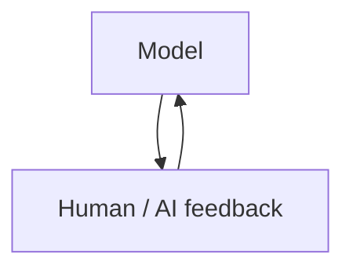

# From Models to Frontiers

*Advanced topics in large language modeling — Volume III*

*Sharif Uddin*

## Audience

Researchers, senior engineers, and technical leads who already build or critically evaluate LLM-based systems and want depth on **scaling**, **theory**, **alignment and safety**, **efficiency**, and **emerging paradigms** (multimodal models, agents, and open research questions). Readers should be comfortable with the vocabulary and day-to-day practice covered in *From Prompts to Systems* (Volume II); this volume assumes you can read papers and implementation-oriented documentation without needing every acronym explained from scratch. If you are the kind of reader who skims the **Try it** first to see whether your paper pile is lying to you, this is still the right volume.

---

## Introduction

### What this book is for

The first two volumes move from **what language models are** to **how to use them well in real workflows**. *From Models to Frontiers* steps back and forward at once: backward to the **scientific and engineering forces** that make today’s models possible, and forward to the **research directions** that will shape the next years—scaling and data, alignment, robustness, efficient training and deployment, multimodality, agents, and the open problems that still lack satisfactory answers.

If you have ever watched a **scaling curve** get treated like a promise and a **benchmark** get treated like a personality test, you already know why this book exists.

The goal is not to replace a PhD curriculum or a full systems course. It is to give you a **structured map of the frontier**: enough depth to read primary sources with judgment, to participate in technical debates, and to decide where your own learning or R&D should go next—whether you care about safety, performance, cost, or fundamental understanding.

### How this volume is organized

The outline groups topics into **pillars** that recur in both industry and academia: **scale and pretraining**, **alignment and societal impact**, **efficiency**, **capabilities beyond text**, and **open questions**. Within each part, chapters mix **conceptual framing** with **representative techniques** (to be expanded as you draft). Some themes—e.g. evaluation, interpretability, governance—appear in more than one part because they cut across pillars—same word, different altitude, not copy-paste.

### Prerequisites and suggested use

You will get the most from this book if you can follow discussions of **loss curves**, **fine-tuning**, **RLHF-style feedback**, and **API-level agent loops** at a high level. Where a topic depends on linear algebra, probability, or distributed systems, the text will signal that and point to standard references rather than rederive everything.

Use the outline as a **manuscript contract**: each section can grow into a chapter or be merged or split as your writing evolves. Keep a running bibliography in **Notes** or a separate references file when you start citing papers in earnest.

---

## Detailed outline

Each link below opens a **draft part**—introduction, contents table, full chapter prose, chapter takeaways, and *Try it* exercises—not only a bullet outline.

### Part I — Scale, data, and the pretraining stack

→ [from-models-to-frontiers-part-i-scale-data-and-the-pretraining-stack.md](from-models-to-frontiers-part-i-scale-data-and-the-pretraining-stack.md)

### Part II — Alignment, safety, and robustness

→ [from-models-to-frontiers-part-ii-alignment-safety-and-robustness.md](from-models-to-frontiers-part-ii-alignment-safety-and-robustness.md)

### Part III — Efficiency: training, inference, and systems

→ [from-models-to-frontiers-part-iii-efficiency-training-inference-and-systems.md](from-models-to-frontiers-part-iii-efficiency-training-inference-and-systems.md)

### Part IV — Beyond text: multimodal models and agents

→ [from-models-to-frontiers-part-iv-beyond-text-multimodal-models-and-agents.md](from-models-to-frontiers-part-iv-beyond-text-multimodal-models-and-agents.md)

### Part V — Frontiers and open problems

→ [from-models-to-frontiers-part-v-frontiers-and-open-problems.md](from-models-to-frontiers-part-v-frontiers-and-open-problems.md)

---

## Notes

This section collects **optional material** for Volume III: exercise index, glossary-style anchors, reading strategy, optional **figures**, and accessibility notes. Parts remain the canonical draft.

### Accessibility

Each part file includes a **plain list** mirroring the contents **table** for tools or readers that do not render tables well.

### Exercise index (*Try it* sections)

The *Try it* prompts are meant to be **concrete and slightly cheeky** where helpful—designed to surface real tradeoffs on your own reading list, not to grade you.

| Part | File | Rough focus |
|------|------|-------------|
| I | [part-i](from-models-to-frontiers-part-i-scale-data-and-the-pretraining-stack.md) | Scaling intuition; data leakage checklist |
| II | [part-ii](from-models-to-frontiers-part-ii-alignment-safety-and-robustness.md) | Align tradeoff; red-team scenario |
| III | [part-iii](from-models-to-frontiers-part-iii-efficiency-training-inference-and-systems.md) | Inference tradeoff; hardware assumption |
| IV | [part-iv](from-models-to-frontiers-part-iv-beyond-text-multimodal-models-and-agents.md) | Multimodal eval; agent failure mode |
| V | [part-v](from-models-to-frontiers-part-v-frontiers-and-open-problems.md) | Eval lens; reading list seed |

**Exercise index (plain list):** Part I — scaling, data hygiene · Part II — alignment tensions, robustness · Part III — train vs inference efficiency · Part IV — modality, agents · Part V — frontier eval, curriculum.

### Glossary export (Volume III anchors)

- **Scaling law** — Empirical relationship linking **compute**, **data**, **model size**, and **loss**; useful for budgeting, not prophecy.  
- **Chinchilla-optimal** — Roughly: for a given compute budget, **balance** parameters and tokens rather than parameters alone.  
- **Alignment** — Steering models toward **intended** behavior (helpful, honest, harmless)—**not** guaranteed by scale alone.  
- **RLHF / DPO** — Families of **preference-based** post-training (reinforcement from human feedback vs. direct preference optimization—details in papers).  
- **Emergence** — Capabilities that **appear** as scale increases; **mechanisms** and **definitions** remain debated.

### Reading strategy

- Prefer **primary** sources and **model / system cards** over hot takes.  
- Track **one** conference (e.g. NeurIPS, ICML, ACL) and **one** open-model release line relevant to your work.  
- Revisit *From Prompts to Systems* when a frontier topic connects back to **shipping** constraints.

### Optional figures (Mermaid)

**Pretrain → post-train (conceptual)**

**Alignment as feedback loop**

### Chapter notes

_Add paper lists, BibTeX, and open questions per chapter below._
