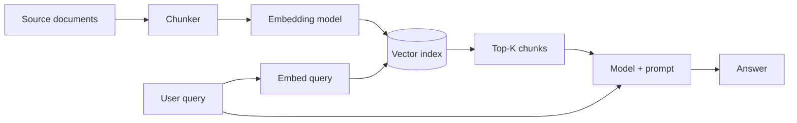

# Part III — Data, retrieval, and adaptation

*Sharif Uddin*

*[From Prompts to Systems](from-prompts-to-systems.md) · Volume II*

---

Not every problem is a prompt problem. When the model does not know what it needs to know — because the information is private, recent, too large to memorize, or too specialized to have appeared reliably in training data — prompting alone cannot fix it. This part is about choosing the right mechanism: when to retrieve, when to adapt, and how to implement each correctly.

---

## Contents of this part

*In the full volume table of contents, these correspond to sections 9–12.*

| | Chapter | What you will take away |
|---|--------|-------------------------|
| **1** | When to retrieve vs. prompt vs. fine-tune | Decision flow: freshness, privacy, cost, behavior consistency |
| **2** | Retrieval-augmented generation (RAG) | Chunking, embeddings, retrieval quality, grounding |
| **3** | Curating and labeling data for adaptation | Quality over quantity, formats, synthetic data risks |
| **4** | Tools and function calling | Safe tools, validation, orchestration patterns |

**Contents (plain list — same as table):**

1. When to retrieve vs. prompt vs. fine-tune — decision flow.
2. RAG — chunk, embed, retrieve, ground, generate.
3. Curating data — labels, quality, synthetic caveats.
4. Tools and function calling — contracts, validation, orchestration.

---

## Chapter 1 — When to retrieve vs. prompt vs. fine-tune

**If the answer lives in your wiki and changes every Monday, "try a longer system prompt" is not a strategy — it is denial.** Different problems have different root causes, and the right solution depends on which one you have.

### Three mechanisms and what they address

**Prompting alone** works when the knowledge the model needs is:
- Already in the model's training data (common knowledge, general reasoning)
- Stable enough that it does not need to be updated often
- Short enough to fit comfortably in a system prompt or few-shot examples
- Not proprietary or sensitive

**Retrieval (RAG)** works when:
- The information is **fresh**: it changes frequently, or is newer than the training cutoff
- The information is **private**: internal documents, customer data, proprietary knowledge
- The information is **large**: too much to fit in a system prompt, or too much to fine-tune on cost-effectively
- You need **grounding**: you want the model to cite specific sources rather than recall from training memory

**Fine-tuning** works when:
- You need **consistent behavior** across millions of requests that prompting alone cannot reliably achieve
- The task requires a **domain-specific style or format** that is hard to specify in a prompt
- You have a clear, stable behavioral gap, training data that would fill it, and the resources to maintain a fine-tuned model through provider updates
- Efficiency at scale: a smaller fine-tuned model doing one thing well is cheaper than a frontier model prompted to do that one thing

### The decision tree

Work through these questions:

1. **Is the information available in the model's training data at sufficient quality?**
   - Yes → Prompt engineering first. Only move to other mechanisms if prompting is insufficient.
   - No → Decide between retrieval and fine-tuning.

2. **Does the information change frequently, or is it proprietary?**
   - Yes → RAG. Fine-tuning snapshots information at training time; retrieval provides fresh content at query time.
   - No → Consider fine-tuning if behavior consistency is the goal, retrieval if information volume is the issue.

3. **Is the problem about facts/knowledge, or about behavior/style?**
   - Facts/knowledge → RAG almost always wins over fine-tuning (fresher, no retraining when content changes).
   - Behavior/style → Fine-tuning may help, but exhaust prompt engineering and few-shot first.

4. **Do you have the resources to maintain a fine-tuned model?**
   - Fine-tuned models need to be re-tuned when the base model updates, which providers do frequently. If you cannot commit to this maintenance, fine-tuning is a liability, not an asset.

*Friction:* Teams fine-tune because it sounds more engineering-y than "we improved the prompt." The right question is never "should we fine-tune?" It is "have prompting and retrieval failed to close a specific, measurable gap, and do we have training data that would close it?"

### Takeaway

- Prompting first: only escalate when prompting has clearly failed on a specific, measurable problem.
- RAG for fresh, private, or large knowledge; fine-tuning for stable behavior patterns.
- Fine-tuning requires ongoing maintenance through model updates — factor this cost in.

---

## Chapter 2 — Retrieval-augmented generation (RAG)

**RAG is a pipeline, and bad chunks in means fluent garbage out.** The quality of a RAG system is determined far more by retrieval quality than by the generation step. Most teams spend 80% of their attention on the model and prompt, and 20% on the retrieval — the opposite ratio from what usually matters.

### The RAG pipeline end to end

A complete RAG system has these stages:

**1. Chunking:** Split source documents into pieces that fit meaningfully in context. Chunk size involves a trade-off: smaller chunks retrieve more precisely but lose surrounding context; larger chunks carry more context but may be too broad to match specific queries.

Common strategies:
- *Fixed-size with overlap*: split at every N tokens, overlapping by M tokens to avoid splitting sentences mid-thought. Simple and often effective.
- *Semantic chunking*: split at natural section boundaries (headings, paragraphs, procedures). Produces more coherent chunks but requires document structure.
- *Recursive character splitting*: split at paragraph breaks, then sentence breaks, then word breaks — as needed to hit a target size. Good general default.

Chunk size matters enormously for your specific content. A 200-token chunk is appropriate for dense technical specifications; it is wasteful for narrative prose where context spans paragraphs.

**2. Embedding:** Convert each chunk into a vector representation using an embedding model. Chunks with similar meaning end up near each other in the embedding space. The choice of embedding model affects retrieval quality significantly — use the same model for embedding your documents and embedding queries.

**3. Indexing:** Store the vectors and the associated text chunks in a vector database or vector search index. At query time, the query is embedded with the same model and the closest vectors (nearest neighbors) are retrieved.

**4. Retrieval:** Given a user query, embed it, retrieve the top-K closest chunks from the index. K is typically 3–10, tuned based on your context budget and how much content is genuinely relevant per query.

**5. Injection and generation:** Insert the retrieved chunks into the context — usually labeled clearly as CONTEXT — and instruct the model to answer from them. Generate the response.

### Grounding: making the model cite, not hallucinate

A RAG system that produces confident answers not supported by the retrieved text is worse than a RAG system that says "I don't have enough information to answer this." Confidence without grounding is a betrayal of the user's trust in the retrieval step.

Grounding instructions to include in the system prompt:
- "Answer only from the provided CONTEXT sections."
- "If the context does not contain sufficient information to answer the question, say so explicitly."
- "Do not use information from your training data to supplement the context."
- "When quoting, use exact text from the context and note the source document."

Validate grounding in your evaluation suite by including queries where the answer is genuinely not in your documents — and checking that the model correctly says it cannot answer rather than hallucinating.

### Common RAG failure modes

**Retrieval returns the wrong chunks.** The embedding model found chunks that are semantically similar to the query but not actually relevant. This happens with ambiguous queries, technical terminology the embedding model was not trained on, or chunks that are too coarse.

*Fix:* Improve chunking (smaller, more focused chunks), add metadata filters (filter by document type, date, category before semantic search), or use hybrid search (semantic + keyword).

**The model ignores the retrieved context.** The model answers from training memory rather than the provided context. This is more likely when the training data contains conflicting information, when the context is long and buried, or when the query phrasing suggests a well-known answer.

*Fix:* Strengthen grounding instructions; put the context before the question, not after; consider adding a self-check step ("before answering, confirm the answer is supported by the context").

**Index is stale.** The documents were updated but the index was not re-built. The model retrieves outdated information and the user gets confidently stated information that was true six months ago.

*Fix:* Build index freshness into your monitoring. Trigger re-indexing on document updates. Display document dates to users when freshness matters.

### Takeaway

- RAG quality depends mostly on retrieval quality, not generation quality. Invest there first.
- Chunk size involves a trade-off between retrieval precision and context coherence. Test for your content.
- Use explicit grounding instructions and validate that the model correctly refuses when context is insufficient.
- Monitor index freshness; stale retrieval silently degrades answer quality.

---

## Chapter 3 — Curating and labeling data for adaptation

Whether you are building an evaluation set or fine-tuning a model, the quality of your data determines the quality of the outcome. **Data quality beats raw data size in almost every practical scenario.** One hundred well-labeled, representative examples are more valuable than one thousand noisy, duplicated, or biased ones.

### What makes data high quality

**Representativeness.** Your data should cover the actual distribution of inputs your system will receive — not just the easy cases, not just the cases you happen to have lying around, and not just the cases that make your current system look good. Include edge cases, ambiguous cases, and the cases that are hard to label.

**Consistency.** If two people labeled the same input differently, your training signal is noise. Labeling guidelines — written specifications of what each label means, with examples of difficult cases — are not bureaucracy; they are the difference between a dataset and a guessing game.

**Accuracy.** Labels that were generated by a previous model version, produced by raters who did not understand the task, or copied from a different but similar task will teach the wrong behavior. Audit a sample of your labels before trusting the dataset.

**Diversity.** A dataset that over-represents one user type, one writing style, or one language variety will produce a model or eval that only works for that population. Build collection processes that explicitly surface diverse examples.

### The feedback loop problem

When you label data using the output of a model you are trying to improve, you create a feedback loop. Synthetic data generated by the model — or labels produced by prompting the model — can encode the model's existing biases and errors. The model learns to be more consistent, not more correct.

Synthetic data is useful for bootstrapping (getting enough labeled data to start), for augmenting rare cases, and for testing specific behaviors. It is not a substitute for human-labeled ground truth on tasks where correctness matters.

*Direct address:* If your labeling queue is "whatever was cheapest to generate," your ground truth is a historical artifact of the previous model's limitations. It is not a north star — it is a map of the past.

### Practical data collection

For eval sets specifically:
- Collect real user inputs where possible (with appropriate consent and anonymization).
- Include inputs you know are hard or adversarial — not just representative inputs.
- Define expected outputs as **properties**, not exact strings. "The response should correctly identify the issue category and not give specific legal advice" is a better label than "the model should say exactly X."
- Review your eval set for label quality before trusting the metrics it produces.

For fine-tuning data:
- Start small and validate that the data actually improves the target behavior.
- Use the minimum dataset size that achieves the behavioral goal — more is not always better if the additional data introduces noise.
- Plan for dataset maintenance: as your product evolves and as base models update, your fine-tuning data may need to be refreshed.

### Takeaway

- Data quality beats data quantity. Invest in labeling guidelines and auditing.
- Synthetic data is useful for bootstrapping and augmentation; it is not a substitute for human-labeled ground truth.
- Define expected outputs as properties, not exact strings, for easier and more durable evaluation.
- Plan for dataset maintenance from day one.

---

## Chapter 4 — Tools and function calling

**Tools are your functions.** When the model needs to take an action — query a database, call an API, create a ticket, look up a price — you define the function, you define its schema, and your code executes it. The model's job is to decide when to call it and what arguments to provide. Your code's job is to validate those arguments before executing anything.

### How function calling works

You provide the model with a list of available tools, each described by:
- A name and description (what the tool does, when to use it)
- A JSON schema for its parameters (names, types, descriptions, required fields)

The model can then, at any turn, respond with a structured tool call instead of a text response. Your application receives the call, executes the function, and returns the result as a tool message. The model incorporates the result and continues.

A minimal tool definition:

    {
      "name": "get_order_status",
      "description": "Look up the current status of a customer order by order ID. Use this when the user asks about their order.",
      "parameters": {
        "type": "object",
        "properties": {
          "order_id": {
            "type": "string",
            "description": "The order ID, typically formatted as ORD-XXXXXX"
          }
        },
        "required": ["order_id"]
      }
    }

### Validation is not optional

The model may hallucinate tool arguments. It may call a tool that does not fit the situation. It may provide an order ID that looks plausible but belongs to a different customer.

Before executing any tool call:
1. **Validate the arguments against the schema.** Type checks, required fields, format validation.
2. **Validate business logic.** Does this order ID exist? Does this user have permission to access it?
3. **Check for injection.** If any argument contains untrusted user input, treat it as potentially adversarial.

Never execute a database write, an external API call, or any irreversible action based on model-generated arguments without explicit validation. The model has no concept of "real consequences."

*Memorable mistake:* The model "called" a function with a plausible-looking `user_id` that happened to belong to a different user's account. The argument passed schema validation. Business logic validation caught it. Without that second check, it would have been a serious data breach.

### Orchestration patterns

**Single model with tools.** The simplest architecture: one model, a set of tools, a loop. The model decides which tools to call; the application executes them; the model incorporates results. Good for: simple tool-use, task automation, information retrieval workflows.

**Router model.** A smaller, faster model classifies the request and routes to a specialized handler (a more capable model, a retrieval system, a scripted response). Good for: cost optimization, when request types are well-defined and separable.

**Pipeline (sequential).** Step 1 produces structured output that feeds Step 2. Classify → retrieve → answer, or extract → validate → transform. Good for: complex multi-step tasks where each step's output is the input to the next.

Choose complexity proportional to your failure modes. A single model with two or three tools is often simpler, cheaper to operate, and easier to debug than a multi-agent pipeline. Add orchestration complexity only when you have a specific problem it solves.

### Least privilege for tools

Apply the same principle to tools as to any application permission: give the model the minimum access needed to do the task.

- If a tool reads data, it should not also write it unless both operations are genuinely needed.
- If a tool writes data, that write should be reversible or approvable where possible.
- For irreversible actions (sending an email, processing a payment, deleting a record), add a human approval step in the loop or a confirmation step that shows the user what will happen before it does.

*One-line analogy:* The model is a very capable intern who will do exactly what you describe, without asking whether you really meant it. Design tool permissions accordingly.

### Takeaway

- Tools are your functions; the model generates calls, your code executes them.
- Validate all tool arguments in code before execution — schema validation plus business logic.
- Orchestration complexity should match the problem. Start simple.
- Apply least-privilege: irreversible actions should require human approval or confirmation.

---

## Try it

### Exercise 1 — Make the retrieval vs. prompt decision

Pick one real use case from your work or a project you know. Write two sentences explaining your decision: is this a retrieval problem, a prompting problem, or a fine-tuning problem? Include the specific constraint that drove the decision (freshness, privacy, scale, behavior consistency).

If your answer is "fine-tuning," challenge yourself: have you actually tried prompting with representative examples first? If not, do that first.

### Exercise 2 — Sketch a RAG pipeline

For a knowledge base you could imagine building (internal docs, product FAQ, a research corpus), sketch the chunking strategy: what size, what overlap, what natural boundaries exist in the content? What query types would the retrieval need to handle well?

Then identify the hardest retrieval case: a query that would likely retrieve the wrong chunks. What would you do to handle it?

### Exercise 3 — Write a tool schema

Write a JSON schema for one function relevant to something you build. Include name, description, parameters with types and descriptions, and required fields.

Then: what happens if the model hallucinates an argument value? Which arguments could cause harm if wrong? Add validation notes for each dangerous parameter.

### Exercise 4 — Find a stale RAG risk

If you have or are building a RAG system: identify the component most likely to become stale without anyone noticing. How would you detect that the index is out of date? What would a user experience if they hit a stale answer?

---

*End of Part III. Previous: [Part II — Prompting as engineering](from-prompts-to-systems-part-ii-prompting-as-engineering.md) · Next: [Part IV — Evaluation, quality, and safety in practice](from-prompts-to-systems-part-iv-evaluation-quality-and-safety-in-practice.md) · Or [main volume](from-prompts-to-systems.md).*
