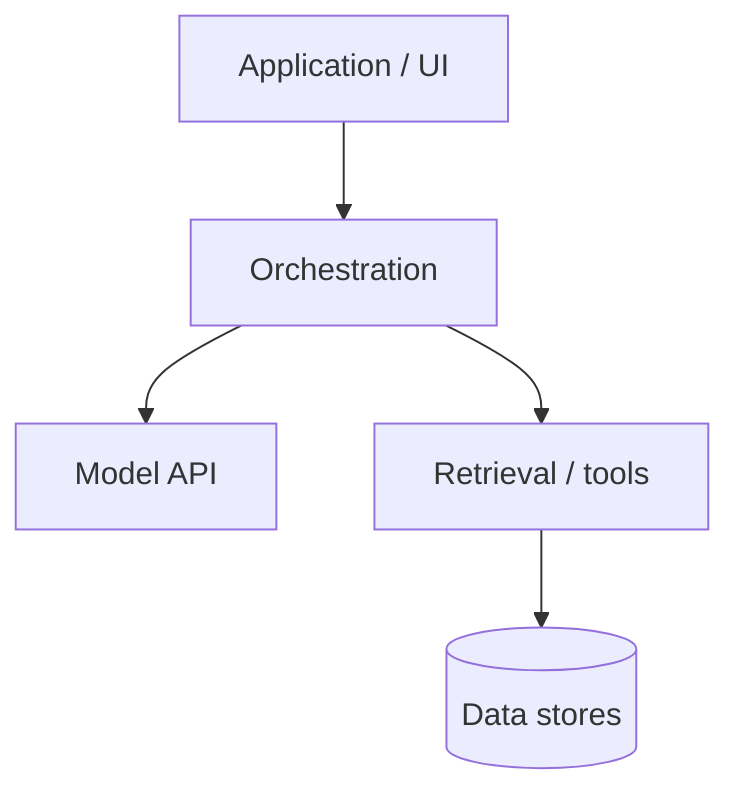
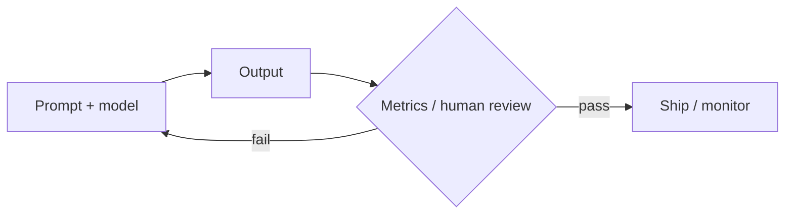

# From Prompts to Systems

*Intermediate practice with large language models — Volume II*

*Sharif Uddin*

## Audience

**Developers, analysts, product managers, and technical writers** who already use LLMs in daily work and want **clearer mental models**, **repeatable workflows**, and **enough depth to ship** features—not just one-off prompts—without yet diving into research-scale training or frontier theory (that is Volume III). You should be comfortable with *From Tokens to Understanding* (Volume I) or equivalent: tokens, context windows, basic prompting, and honest limits of the technology. If you sometimes jump straight to the *Try it* boxes to stress-test your current project, that is a valid way to read—this volume is written so exercises **interrupt** autopilot.

---

## Introduction

### What this book is for

Volume I answers **what** language models are and **how to begin** using them responsibly. *From Prompts to Systems* answers **how to turn that familiarity into practice you can defend**: choosing approaches (prompt vs. retrieval vs. fine-tuning), **iterating with data**, **measuring quality**, **wiring models into software**, and **operating** them with costs, failures, and teams in mind.

If you have ever watched a **demo** land in a meeting and then watched **production** quietly fall over on latency, logging, or a silent model upgrade, you already know why this book exists.

The emphasis is **applied**: fewer proofs, more **decision patterns**—when a longer prompt beats a pipeline change, when evaluation should block a release, how to structure an API layer so you can swap models later. The goal is that after this volume you can own an LLM-powered feature from prototype to something your team can maintain—and know what Volume III will unpack if you need to go deeper on training, safety science, or scale.

### How this volume is organized

The outline groups material into **pillars** that mirror real projects: **understanding what you are shipping**, **designing prompts and interactions**, **adapting behavior** (data, retrieval, light fine-tuning), **evaluating and monitoring**, **building integrations**, and **shipping responsibly**. Themes like **evaluation** and **safety** appear in more than one part because they are both design-time and runtime concerns—the same theme at different altitudes, not repetition for its own sake.

Chapters are written to support **hands-on progression**: you can draft exercises (small apps, eval sets, prompt libraries) per part even before the prose is final.

### Prerequisites and suggested use

You should be comfortable using at least one **chat or API** interface, reading **JSON**-shaped API responses, and thinking in terms of **inputs, outputs, and failure cases**. Light scripting (e.g. Python or JavaScript) will help for later chapters; where code is essential, the book can stay pseudocode-first.

Use the outline as a **manuscript contract**: merge or split chapters as your teaching style evolves. Keep implementation notes, vendor-specific quirks, and bibliography in **Notes** or sidecar files so the main text stays durable.

---

## Detailed outline

Each link below opens a **draft part**—introduction, contents table, full chapter prose, and chapter takeaways—not only a bullet outline.

### Part I — Mental models and the model lifecycle

→ [from-prompts-to-systems-part-i-mental-models-and-the-model-lifecycle.md](from-prompts-to-systems-part-i-mental-models-and-the-model-lifecycle.md)

### Part II — Prompting as engineering

→ [from-prompts-to-systems-part-ii-prompting-as-engineering.md](from-prompts-to-systems-part-ii-prompting-as-engineering.md)

### Part III — Data, retrieval, and adaptation

→ [from-prompts-to-systems-part-iii-data-retrieval-and-adaptation.md](from-prompts-to-systems-part-iii-data-retrieval-and-adaptation.md)

### Part IV — Evaluation, quality, and safety in practice

→ [from-prompts-to-systems-part-iv-evaluation-quality-and-safety-in-practice.md](from-prompts-to-systems-part-iv-evaluation-quality-and-safety-in-practice.md)

### Part V — Systems: APIs, deployment, and operations

→ [from-prompts-to-systems-part-v-systems-apis-deployment-and-operations.md](from-prompts-to-systems-part-v-systems-apis-deployment-and-operations.md)

### Part VI — Teams, ethics, and the path forward

→ [from-prompts-to-systems-part-vi-teams-ethics-and-the-path-forward.md](from-prompts-to-systems-part-vi-teams-ethics-and-the-path-forward.md)

---

## Notes

This section collects **optional material** for Volume II: sample prompts, a reading list, a **glossary export**, an **exercise index**, optional **figures**, and accessibility notes. It does not replace the parts.

### Accessibility

Part files use **tables** for “Contents of this part.” Each part also includes a **plain list** mirroring the table for readers or tools that do not render tables well.

### Exercise index (*Try it* sections)

The *Try it* prompts are meant to be **concrete and slightly cheeky** where helpful—designed to surface real tradeoffs on your own stack, not to grade you.

| Part | File | Rough focus |
|------|------|-------------|
| I | [part-i](from-prompts-to-systems-part-i-mental-models-and-the-model-lifecycle.md) | Playground vs product; read a model card |
| II | [part-ii](from-prompts-to-systems-part-ii-prompting-as-engineering.md) | Prompt template; debug one failure |
| III | [part-iii](from-prompts-to-systems-part-iii-data-retrieval-and-adaptation.md) | RAG vs prompt decision; tool contract |
| IV | [part-iv](from-prompts-to-systems-part-iv-evaluation-quality-and-safety-in-practice.md) | Define one metric; golden test idea |
| V | [part-v](from-prompts-to-systems-part-v-systems-apis-deployment-and-operations.md) | Sketch an API envelope; what to log |
| VI | [part-vi](from-prompts-to-systems-part-vi-teams-ethics-and-the-path-forward.md) | RACI snippet; Volume III preview |

**Exercise index (plain list):** Part I — product vs demo, model card · Part II — template + debug · Part III — RAG vs prompt, tools · Part IV — metric, golden tests · Part V — API, observability · Part VI — team handoff, frontier preview.

### Sample prompts (for APIs and eval)

1. **System prompt skeleton.** “You are [role]. Reply in [format]. If unsure, say what is missing. Never invent [constraint].”

2. **Eval rubric.** “Score the assistant answer 1–5 on correctness, helpfulness, and safety. Give one sentence of justification each.”

3. **RAG grounding.** “Using only the provided CONTEXT blocks, answer the question. If CONTEXT is insufficient, say so.”

4. **Regression check.** “Given INPUT and EXPECTED_SHAPE, does OUTPUT parse as valid JSON with keys […]?”

### Glossary export (Volume II core)

- **RAG (retrieval-augmented generation)** — Fetching relevant documents (or chunks) into **context** before generation, so answers can **ground** in supplied text.  
- **Golden set** — A fixed **evaluation** set of inputs (and often reference outputs) used to detect **regressions** when models or prompts change.  
- **Model card** — A structured description of a model’s **intent**, **data**, **limitations**, and **evaluation**—read before you commit.  
- **Tool / function calling** — The model emits **structured calls** (e.g. JSON) to bounded functions your app implements; not arbitrary code execution.  
- **Prompt injection** — User or untrusted content that **manipulates** the model into bypassing instructions or **misusing** tools—**trust boundaries** matter.

### Reading list (short)

- Provider **API documentation** and **safety** guides for the stack you ship.  
- Papers or posts on **RAG** architecture and **eval harnesses** once you need depth—*From Models to Frontiers* points to research-scale material.  
- *From Tokens to Understanding* (Volume I) for vocabulary; [*From Models to Frontiers*](../from-models-to-frontiers/from-models-to-frontiers.md) (Volume III) for training, scale, and frontier topics.

### Optional figures (Mermaid — for HTML/PDF)

**Stack: app → orchestration → model**

**Eval loop**

### Chapter notes

_Add your own manuscript notes, ticket links, and per-environment quirks below._
