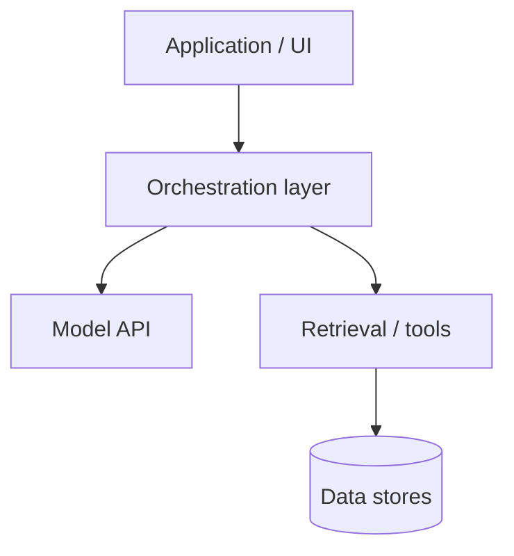
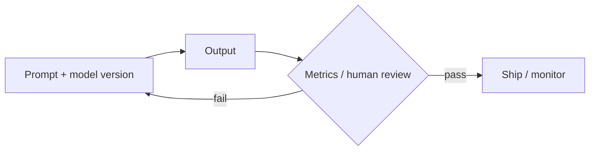

# From Prompts to Systems

*Intermediate practice with large language models — Volume II*

*Sharif Uddin*

---

## Who this book is for

This book is for people who are past the demo stage. You have used a language model, you have seen it be impressive, and you have seen it fail in ways that made you wonder whether it can be trusted in a real product. You want to know how to close the gap between "this demo is amazing" and "this feature works reliably in production."

More specifically, this book is for:

- **Developers** building any feature that calls an LLM API — even once.
- **Product managers** who need to choose between approaches, define what success looks like, and explain decisions to stakeholders.
- **Technical writers, analysts, and content strategists** building AI-assisted workflows.
- **Anyone who owns an LLM-powered feature** and needs to maintain it, measure it, and hand it off to someone else.

**What you should already know:** The concepts from Volume I — tokens, context windows, the prediction loop, hallucination as a structural property, basic prompting — are assumed. You do not need to have memorized every detail, but you should be able to explain each term comfortably. If something in this book references a Volume I concept that feels fuzzy, the Volume I parts are worth revisiting before continuing.

**Helpful but not required:** Light scripting ability (Python or JavaScript), comfort reading JSON-shaped API responses, and basic familiarity with git. The book stays pseudocode-first where possible, but some chapters will be richer if you can run an API call yourself.

---

## Introduction

### What this book is for

Volume I answers **what** language models are and **how to begin** using them responsibly. *From Prompts to Systems* answers the follow-on questions that arise as soon as you try to do something serious with them:

How do I choose between prompting, retrieval, and fine-tuning for my use case? How do I measure whether my feature is working? How do I build a prompt library that doesn't rot? What do I actually log? How do I keep costs from growing unexpectedly? How do I stay out of trouble when the model starts behaving differently after an update?

The emphasis is **applied**: fewer proofs, more decision patterns. When does a longer prompt beat a pipeline change? When should evaluation block a release? How do you structure an API abstraction layer so you can swap models later without rewriting everything?

The goal is that after this volume you can own an LLM-powered feature from prototype to something your team can maintain — and you understand the decisions well enough to defend them.

### The arc of this book

**Part I — Mental models and the model lifecycle.** The difference between a demo and a product, how training stages show up in model behavior, how to read a model card and choose a model, and how context and memory actually work in a system you build.

**Part II — Prompting as engineering.** Prompts are not vibes — they are versioned interfaces. This part covers prompt structure, iteration, debugging failure modes, and the UX of features that stream, fail gracefully, and get reviewed by humans.

**Part III — Data, retrieval, and adaptation.** Not every problem is a prompt problem. When to retrieve vs. prompt vs. fine-tune, how RAG actually works end-to-end, how to curate data for adaptation, and how to use tool/function calling safely.

**Part IV — Evaluation, quality, and safety in practice.** You ship what you measure. Defining metrics, building golden test sets, regression testing when models update silently, and layered safety architecture for product contexts.

**Part V — Systems: APIs, deployment, and operations.** Abstraction layers, observability, cost and rate limit management, and the security basics that every LLM application needs.

**Part VI — Teams, ethics, and the path forward.** Cross-functional roles, documentation, responsible deployment at an intermediate level, and the bridge to Volume III.

### How to use this book

The parts build on each other but can be used as standalone references. If you are in the middle of building something, jump to the part most relevant to your current problem. The *Try it* sections at the end of each part are designed for your actual project, not hypothetical exercises.

---

## Detailed outline

### Part I — Mental models and the model lifecycle

→ [from-prompts-to-systems-part-i-mental-models-and-the-model-lifecycle.md](from-prompts-to-systems-part-i-mental-models-and-the-model-lifecycle.md)

### Part II — Prompting as engineering

→ [from-prompts-to-systems-part-ii-prompting-as-engineering.md](from-prompts-to-systems-part-ii-prompting-as-engineering.md)

### Part III — Data, retrieval, and adaptation

→ [from-prompts-to-systems-part-iii-data-retrieval-and-adaptation.md](from-prompts-to-systems-part-iii-data-retrieval-and-adaptation.md)

### Part IV — Evaluation, quality, and safety in practice

→ [from-prompts-to-systems-part-iv-evaluation-quality-and-safety-in-practice.md](from-prompts-to-systems-part-iv-evaluation-quality-and-safety-in-practice.md)

### Part V — Systems: APIs, deployment, and operations

→ [from-prompts-to-systems-part-v-systems-apis-deployment-and-operations.md](from-prompts-to-systems-part-v-systems-apis-deployment-and-operations.md)

### Part VI — Teams, ethics, and the path forward

→ [from-prompts-to-systems-part-vi-teams-ethics-and-the-path-forward.md](from-prompts-to-systems-part-vi-teams-ethics-and-the-path-forward.md)

---

## Notes

### Accessibility

Every part file includes both a **table** and a **plain list** version of the contents for environments that do not render tables.

### Exercise index (*Try it* sections)

| Part | Rough focus |
|------|-------------|
| I | Playground vs product checklist; read a model card |
| II | Version a prompt template; debug one real failure |
| III | RAG vs prompt decision for your use case; tool schema |
| IV | Define one metric; build a 3-case golden set |
| V | Sketch an API abstraction; define log policy |
| VI | RACI for one feature; Volume III preview |

### Glossary (Volume II core terms)

- **RAG (Retrieval-Augmented Generation)** — Fetching relevant chunks of text into context before generation, so answers can be grounded in supplied documents rather than the model's training memory alone.
- **Golden set** — A fixed set of inputs (and expected properties) used to detect regressions when prompts or models change.
- **Model card** — A structured document describing a model's intended use, training data, known limitations, and evaluation results. Read before committing to a model in production.
- **Tool / function calling** — The model emits structured calls (usually JSON) to bounded functions your application implements. The model does not execute code; it generates the call, and your code executes it.
- **Prompt injection** — User or untrusted external content that manipulates the model into bypassing system instructions or misusing tools. A security concern for any system that processes untrusted input.
- **Sycophancy** — A tendency for the model to agree with or validate the user's position regardless of accuracy. A post-training failure mode that can undermine reliability.
- **Latency** — The time from sending a request to receiving the complete response. Critical for user experience; affected by model size, context length, and infrastructure.

### Sample prompts

1. **System prompt skeleton.** "You are [role]. Reply in [format]. If you are unsure about something, say what is missing rather than guessing. Never [constraint]."

2. **Eval rubric.** "Score this assistant response 1–5 on correctness, helpfulness, and format adherence. Give one sentence of justification for each score."

3. **RAG grounding instruction.** "Using only the provided CONTEXT sections below, answer the question. If the context does not contain enough information to answer, say so explicitly rather than guessing."

4. **Regression check.** "Given this INPUT and EXPECTED_SHAPE, does the OUTPUT satisfy all required properties? List any violations."

### Optional figures

**Stack: application → orchestration → model**

**Evaluation loop**

---

*Start reading: [Part I — Mental models and the model lifecycle](from-prompts-to-systems-part-i-mental-models-and-the-model-lifecycle.md)*
