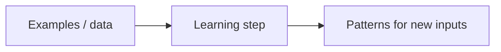

# Part I — Finding your bearings

*Sharif Uddin*

*[From Tokens to Understanding](from-tokens-to-understanding.md) · Volume I*

---

## Welcome

Before you open a chat window or an API panel, it helps to know **what kind of thing** you are talking to.

This first part gives you that grounding in plain language—no equations, no assumed background. Four short chapters, one clear goal: you leave with a stable mental picture of what an LLM actually is, where it came from, and why smooth language does not guarantee correct information.

> **The thread running through Part I:** fluent language is not the same as correct information. The chapters ahead show you how to enjoy the first without mistaking it for the second.

---

## Contents of this part

*In the full volume table of contents, these correspond to sections 1–4.*

| # | Chapter | What you will take away |
|---|---------|-------------------------|
| **1** | How to use this book | Scope, pace, and study habits |
| **2** | AI, machine learning, and language models | Vocabulary for the landscape; why language modeling is different |
| **3** | What an LLM is—and what it is not | Mechanics in one picture; three common misconceptions |
| **4** | A short history to the present | N-grams → neural nets → transformers → scale, intuitively |

**Plain list** (same content, for readers or tools that do not render tables):

1. **How to use this book** — scope, pace, study habits.
2. **AI, machine learning, and language models** — vocabulary; why language is a different kind of prediction problem.
3. **What an LLM is—and what it is not** — statistical model; not a database, person, or live web search by default.
4. **A short history to the present** — n-grams through scale, intuitively.

---

## Chapter 1 — How to use this book

### Pace and rhythm

You do not owe this book a single uninterrupted sprint. Most readers do better with **short visits**: read a section or two, pause, then take **one** concrete action before moving on. The *Try it* sections at the end of each part are built for that rhythm. They are optional in theory, but in practice they are how abstract ideas become habits.

What does "one concrete action" mean? It could be:

- Typing the exercise prompt into a chat tool and looking at what comes back.
- Writing a single sentence in your notes: "This chapter claimed X; I tried it and saw Y."
- Looking up one term you were not sure about and writing the definition in your own words.

Small moves. Do not wait until the whole book is finished before you test anything.

If you step away for days or weeks, start back by skimming the **contents** at the top of whichever part you are in. A thirty-second skim will remind you where you are in the arc from orientation to mechanics to responsibility.

### What is in scope—and what is not

This book is deliberately bounded. Knowing what is *not* here helps you set the right expectations.

| In scope | Out of scope |
|----------|--------------|
| Plain-language explanations and mental models | Training a model from scratch |
| Prompts you can try in any mainstream assistant | Mathematical derivations |
| Reminders about privacy, bias, and claim-checking | Every architecture name in the research literature |
| Habits and vocabulary built to last | Screenshots and menu labels (those go out of date) |

The exclusions are not oversights. Training from scratch and mathematical detail are genuinely important—but they belong in a different book, aimed at a different reader and a different goal. This book's goal is a **usable mental model**: one you can carry into real work, return to under pressure, and update as the technology changes.

Where a topic truly needs more room—deployment, retrieval, evaluation at scale—the later volumes pick up the story.

### Pointers to later volumes

When this book points forward to *From Prompts to Systems* (Volume II) or *From Models to Frontiers* (Volume III), treat the pointer as an open door, not a test you must pass today. Come back to it when you are ready.

For now, keep a scratch space—a note on your phone, a paper notebook, anything—for:

- **Prompts that worked** (or failed unexpectedly).
- **Words you looked up**, with your own definition alongside the official one.
- **Open questions**: things that confused you, or things you want to test later.

That scratch space will become more valuable than you expect. Many readers find, at the end of Part I, that their question list has grown—not shrunk. That is a good sign. Confusion that has been named is confusion that can be resolved.

**The book is a map and a set of habits**, not a race to the last page.

### Quick takeaway

- Read in short sessions; act on one idea before moving on.
- Use *Try it* sections to turn reading into practice.
- Keep notes on prompts, new terms, and open questions.
- Later volumes expand on deployment, retrieval, and evaluation—treat those pointers as invitations, not requirements.

---

## Chapter 2 — AI, machine learning, and language models

### Why the vocabulary matters

Open any news site and you will see **AI** attached to wildly different stories: self-driving car experiments, spam filters, fraud detection, image generators, and the chat assistant that has become hard to ignore. All are "about AI" in the loose sense journalists use, yet they describe **different engineering problems** with different failure modes.

Getting the vocabulary straight early saves you from arguing at cross-purposes—where one person is frustrated with a spam filter while the other is excited about a chat tool, and neither realises they are talking about different things. It also stops you from blaming the wrong system when something goes wrong, which is surprisingly common.

### Artificial intelligence — the broad label

**Artificial intelligence** covers machines or programs that do tasks we normally associate with human judgment: sorting, ranking, generating text, planning. The label does not, by itself, say anything about *how* the system works.

A chess program built from hand-written rules—"if the opponent does this, respond with that"—can still be called AI in casual conversation. But it is not **machine learning** in the modern sense, because its behaviour was fixed by people, not shaped by data. The programmer wrote every rule; the program never updates itself based on experience.

Think of **AI** as a job description: "does things people thought only humans could do." Machine learning is one way to hire for that job. There are others.

### Machine learning — the narrower sense

**Machine learning** is more specific: the system **adjusts using data** so it improves without a human writing a new rule for every case. You provide examples—inputs and the outputs you want—and the system searches for **patterns** that hold for new inputs it has never seen.

Consider a spam filter. No engineer writes rules like "flag messages with the phrase 'click here to claim your prize.'" Instead, the system sees millions of emails already labelled *spam* or *not spam* by humans, and it extracts statistical patterns that generalise to new messages. When conditions change—spammers evolve their phrasing—the model can be retrained on new data.

That process is deeply **statistical**. It tends to work well when tomorrow's world resembles yesterday's training data. It can fail—sometimes badly—when conditions shift or when the training data silently favours one group over another. A hiring tool trained on past decisions inherits the biases baked into those decisions. A medical model trained on one population may perform poorly on another. These are not edge-case concerns; they are a direct consequence of how machine learning works.

The following diagram marks the direction of travel. Keep in mind it omits almost everything—it is intentionally crude:



```text
  examples  --->  learning step  --->  patterns for new inputs
```

### Why language is harder than a single label

A classic image-recognition system picks **one label** from one image—cat or dog. Language does not work that way. Its challenge is fundamentally different.

Consider the sentence "I went to the bank." Whether "bank" means a riverbank or a financial institution depends entirely on **what came before**—and perhaps on what comes after. Text unfolds **one fragment at a time**, and each fragment's meaning is anchored to everything that preceded it.

Or consider the word "it" in: "The trophy didn't fit in the bag because it was too big." What is "it"? The trophy? The bag? A human reading that sentence resolves the ambiguity almost instantly using world knowledge—trophies and bags both have sizes, one must be bigger than the other. A system with no model of the world has to learn this disambiguation *statistically* from countless examples in training data.

A language model must therefore do something richer than label-picking: it has to work out **what is plausible next**, given all the text so far. That is why the output can sound so convincing—smooth grammar, confident tone—while a specific fact underneath is simply wrong. Chapter 3 explains the mechanism; for now, hold this in mind: **language modeling is a sequential, contextual game**, not a single snap decision.

### Where LLMs sit in the landscape

Across machine learning you will find systems tuned for **images**, **audio**, **robotics**, **tabular data**, and more. A **large language model** is built around **text** as its foundation—though many products now layer in other signals like images or audio.

This volume stays with the text core. Once you understand that core, understanding the added layers becomes straightforward.

When recent headlines say "AI," they often mean an LLM, or a **product** that wraps an LLM with search, tools, or company data. Those extra layers solve different problems. Keeping the layers distinct in your mind will save you from expecting one thing to do another thing's job—for example, expecting a base model to know today's news, or expecting a retrieval system to exercise judgment.

### Quick takeaway

- **AI** is a broad label—it says nothing about how the system works.
- **Machine learning** means the system improves by finding patterns in data, without a human writing rules for every case.
- Machine learning inherits biases from training data and can fail when conditions shift.
- **Language modeling** predicts plausible next text, not a single label—context across the whole sequence matters.
- Many products add layers (search, tools, documents) on top of the core model; keep those layers distinct in your mind.

---

## Chapter 3 — What an LLM is—and what it is not

### The one-sentence definition

A **large language model** is software trained to **continue text** in a way that **looks reasonable** in context. It is trained to sound like a good answer—not certified to **be** one. Everything else in this chapter follows from that single distinction.

**Large** refers to scale: billions of internal parameters compared with older models, which affects quality, speed, and cost. **Language model** means the system assigns **probabilities** to possible next **tokens** (small pieces of text—roughly words, or parts of words), given the text it has received so far.

At heart the model is answering one statistical question: **what might plausibly come next?** It is not consulting a database. It is not reasoning about truth. When you type a question, you are giving the model a **prefix**; it continues the prefix in the style of an answer, because that is the pattern its training rewarded.

Seen from that angle, an LLM is a **statistical portrait of language**, drawn from enormous amounts of writing—articles, books, code, forum discussions, documentation, and more. It absorbs grammar, register, genre—even the *shape* of expert arguments and code—because those regularities appear over and over in the data. That makes it genuinely useful for drafting, brainstorming, rephrasing, and exploring ideas, **as long as** you treat it as assistance rather than as an oracle.

### Tokens: the unit of prediction

The model does not read word-by-word. It reads **token-by-token**. A token is a fragment that might be a full word, part of a word, a punctuation mark, or a space. The exact breakdown depends on the tokeniser used during training.

A rough illustration (actual tokenisation varies by model):

| Text | Possible tokenisation |
|------|-----------------------|
| `playing` | `play` + `ing` |
| `ChatGPT` | `Chat` + `G` + `PT` |
| `2024` | `2024` (single token in many models) |
| `Hello, world!` | `Hello` + `,` + ` world` + `!` |

Why does this matter? Because the model's statistical view of text is built at this granular level. Unusual words may be split into fragments the model has to reassemble. Very long numbers or rare proper nouns may behave unexpectedly. Knowing that the model sees tokens, not words, helps you understand some of its stranger outputs—especially with names, numbers, and niche vocabulary.

### Three misconceptions that come up constantly

| What people sometimes assume | What is closer to the truth |
|------------------------------|-----------------------------|
| It looks answers up in a table of facts. | It does **not** work like a curated database. If something that looks like a lookup appears, a **separate** system—search, tools, retrieval—was deliberately added around it. |
| It is "someone inside the machine." | It has no biography, no feelings, no legal standing. Friendly pronouns in its replies are a **design choice** for dialogue, not evidence of a mind. |
| It always sees the live web. | By default, a model's knowledge is **frozen** at training time. Live browsing or tools must be added on purpose by the product. |

Each misconception leads to a different kind of mistake in practice. Believing the model is a fact database leads you to skip verification. Believing it is a person leads you to anthropomorphise errors as "lying" or "trying to deceive." Believing it has live web access leads you to trust outdated claims as if they were current. Knowing the truth does not make the model less useful—it makes it more useful, because you use it correctly.

### Core versus product

Your message does not go into a single magic box. Think of it in two layers: a **core** that only predicts likely text, and an optional outer layer that the product may add:


```text
  Your prompt  -->  LLM core (predicts next text)  -->  Answer you see
                           ^
                           |
               Optional: web search · tools · documents
               (added by the product, not the core model)
```

When a product advertises "real-time information" or "access to your documents," those features are built in the *extras* layer, not baked into the model itself. The core still works the same way—predicting likely continuations—but it is now predicting continuations that incorporate retrieved text. Understanding this distinction helps you debug surprising behaviour: if a product fails to find a recent event, the failure is often in the search layer, not the model's "intelligence."

### Why fluent prose can still be wrong

The training signal rewards **plausible continuation**, not verified fact. A confident tone, clear structure, and specific-sounding detail can wrap around a false claim just as easily as a true one. There is no internal alarm that fires when the paragraph does not match reality—only a signal that the paragraph resembles patterns the model saw during training.

A worked example helps. Suppose you ask the model for the population of a city. Its training data contained hundreds of sentences structured like "The population of [city] is [number]." When it fills in the blank, it picks a number that *fits that slot plausibly*—perhaps a real number it saw often, perhaps a blend of numbers, perhaps a confident-sounding guess. You cannot tell from the tone of the answer whether it got the number right or not.

This property has a name in the research literature: **hallucination**. The term is borrowed loosely from psychology—an experience that feels real but has no external basis. The word can be misleading (the model is not "experiencing" anything), but the practical meaning is useful: **a hallucination is a fluent, confident output that is factually false.** Hallucinations are not rare edge cases. They occur across all current models with varying frequency, particularly for:

- Specific numbers, dates, and statistics.
- Citations and references to papers, laws, or rulings.
- Details about people, companies, and organisations.
- Events close to or after the training cutoff.

Later parts of Volume I return to verification habits and situations where an LLM is simply the wrong tool. For now, keep this inequality in mind: **smooth writing does not imply guaranteed truth.**

### Quick takeaway

- An LLM continues text in a plausible way—it is not looking up facts.
- The unit of prediction is a **token**, not a word.
- It is not a person, not a database, and does not see the live web by default.
- Products add layers (search, tools, documents) around the core—know which layer you are relying on.
- Fluent, confident output can still contain factual errors; this is called hallucination and is a structural property of how the model works, not a bug to be fixed by a new version.

---

## Chapter 4 — A short history to the present

### Four beats in one melody

You do not need a full historian's timeline to use a chat assistant. You **do** need a story you can retell—how we moved from **counting short phrases** to **large neural models** that can mimic whole genres. Think of it as four beats in one melody, not four disconnected machines.

Each beat solved the main problem of the previous one—and introduced a new problem that the next beat had to address. Understanding that chain of problems and solutions gives you a durable mental model that will survive the next wave of headlines.

### Beat 1 — N-grams: counting what comes next

The oldest approach is the **n-gram**: count how often short sequences of words appear in a large corpus, then use those counts to guess the next word.

If the phrase "the cat sat on the" appears thousands of times followed by "mat," then "mat" scores higher than "theorem." This trick is easy to explain and was once enough for spell-checking, keyboard autocomplete, and simple text suggestions on mobile phones.

Concretely: an n-gram model of order 3 ("trigram") looks at the last two words and asks, "given these two words, what word comes next most often in my training data?" It does not look further back than two words. It has no representation of *meaning*—only of co-occurrence statistics.

Its weakness is equally clear. N-gram models struggle with:

- **Rare phrasing**: if the exact sequence has not appeared in the training data, the model has nothing to go on.
- **Long-range meaning**: the constraint of only looking back a few words means context from earlier in the sentence is simply lost.
- **Nonsense that sounds local**: a sentence can be built from locally plausible trigrams and still be globally incoherent.

A sentence like "colourless green ideas sleep furiously" (Noam Chomsky's famous example) is grammatically well-formed and locally plausible at the bigram level, yet semantically absurd. N-grams had no mechanism to notice.

### Beat 2 — Neural language models: learned representations

**Neural** language models replaced the giant lookup tables of n-gram counts with **learned representations**—compact, dense patterns the network discovers from the data itself.

The key idea is the **word embedding**: each word is mapped to a point in a high-dimensional numerical space, and words that behave similarly across many contexts end up near each other in that space. "Dog" and "cat" both appear near "pet," "vet," and "leash"; they end up close together even though their spellings share nothing. This structure is learned entirely from statistics, without any human labelling what "animal" means.

Neural models could look further back than n-grams—dozens of words rather than two or three—and they generalised better to rare vocabulary by sharing statistical support across similar words.

For years, though, these models were small by today's standards, and very long-range structure—the kind that spans paragraphs or whole documents—remained difficult to capture reliably. The network's "memory" of what it had read earlier faded as the sequence got longer.

### Beat 3 — Transformers and attention: looking back selectively

**Transformers**, introduced in a 2017 paper ("Attention Is All You Need"), changed the engineering path with a mechanism called **attention**. The intuition is worth sitting with for a moment.

Suppose you are trying to predict the next word in: "The trophy didn't fit in the bag because **it** was too big." What should the model pay attention to when it reaches "big"? It needs to connect "big" to "trophy" (or "bag"), not just to the word immediately before. Earlier architectures struggled with this; they processed text sequentially, and distant context faded.

**Attention** lets the model, at each prediction step, look back over the entire preceding sequence and learn **which earlier tokens are most relevant** for this specific prediction—not just the nearby ones. It is a form of dynamic, learned relevance scoring.

That selective attention, combined with greater depth and the ability to train on many examples in parallel, made it practical to condition on **much longer stretches of text**. Researchers could then scale up—more data, more compute, more parameters—and often see **steady quality gains**, until they ran into limits of hardware or data availability.

Transformers also enabled a critical training efficiency: unlike previous architectures, they could be parallelised across many processors simultaneously. This meant that adding more compute translated into better models in a predictable way—which set the stage for Beat 4.

### Beat 4 — Scale: mimicry at breadth

At **scale**—billions of parameters trained on broad slices of public text—something qualitatively different became visible in everyday life. The same training objective that once produced better spelling suggestions started producing passages that **imitated** explanations, code, translation, dialogue, formal argument, and the *shape* of expertise—without anyone writing a rule for each skill.

This emergence of broad competence from a single training objective was surprising even to many researchers. A model trained to predict the next token on internet text turns out to have implicitly learned to perform arithmetic, follow step-by-step instructions, write in the style of a legal document, and debug code—not perfectly, and not always reliably, but recognisably.

The explanation is structural. The training data contains examples of all these things. To predict text well across all those genres, the model must learn enough internal structure to imitate each genre. **Scale is the mechanism that makes that breadth of imitation feasible**—more parameters to store finer distinctions, more training data to cover more domains, more compute to let those patterns interact.

This is an observation about **imitation**, not a claim of human-like understanding. The model does not know it is imitating. It does not have a concept of expertise. But at sufficient scale, the training pressure produces outputs that are, in many domains and for many purposes, useful.

The following parts of Volume I leave history behind and turn to **mechanics**: tokens, the prediction step, and the limits of what fits in one request.

**Carry this moral forward:** scale can unlock startling mimicry; it does not, by itself, guarantee truth or meaning. Each beat of this history solved a problem and introduced a new one. The current beat is no different.

### A note on the timeline

Placing these beats on a rough timeline helps calibrate how fast the field has moved:

| Era | Dominant technique | Rough period |
|-----|-------------------|--------------|
| Statistical NLP | N-grams, rule-based methods | 1980s–2000s |
| Early neural NLP | Word embeddings, recurrent networks | 2013–2017 |
| Transformer era | Attention-based architectures | 2017–present |
| Scale era | Large pre-trained models | 2020–present |

These eras overlap; researchers did not discard earlier techniques overnight. N-grams still appear in production systems where speed matters more than fluency. The point of the table is not precise dates but a sense of the direction and pace.

### Quick takeaway

- **N-grams** count short phrases to guess what comes next—simple, interpretable, but limited by context length.
- **Neural models** learn compact representations that generalise better and handle rare vocabulary.
- **Transformers** add selective attention over long text, enabling much larger and more capable models.
- **Scale** unlocked broad mimicry of human writing; it did not solve truth or understanding.
- Each beat solved the main problem of the previous one—and introduced a new challenge for the next.

---

## Try it

Three short exercises. Use any mainstream chat tool you already have. Nothing is graded. The goal is to connect what you just read to what the model **actually does** in the moment.

### Exercise 1 — Test the "what it is not"

Type this prompt, or something close to it:

> *List three things a large language model is NOT—such as: not a database of verified facts, not a person, and not live web access by default. Use bullet points.*

Read the response alongside Chapter 3. If the model adds a fourth "not" that this chapter never claimed, note it down. If the model's explanation of any item differs from this chapter's, write down which account you find more convincing and why. That small friction is the lesson: the model continues plausibly, not accurately. The goal is to develop the habit of comparing what the model says against what you know to be true.

### Exercise 2 — Verify one claim

Ask the model for **one specific fact** you can check in a couple of minutes—a date, a count, a title, a name.

Then verify it using a second source (a search engine, an encyclopaedia, an official site). If the model was wrong, write a single sentence about **how it sounded**—confident, hedged, detailed. You are training your ear to notice confidence without accuracy.

If the model was right, that is fine—but do not conclude from one data point that it is always reliable. Try again with a more obscure fact.

### Exercise 3 — Watch the continuation instinct

Give the model an **incomplete sentence** with a deliberately absurd gap:

> *"The moon is made of [blank], which is why astronauts always bring [blank] on missions."*

Ask it to fill in the blanks seriously.

What did it do? It almost certainly produced a grammatically smooth, plausible-sounding response—either playing along, or gently correcting you. Either way, it did not refuse to continue. This is the continuation instinct in action: the model's job is to produce a plausible next piece of text, and it will find *some* way to do that even when the prompt is nonsensical. That instinct is useful (it makes the model fluent and responsive) and risky (it means the model will complete false premises with false conclusions). Remembering both sides of that trade-off is worth more than most prompt tricks.

---

*End of Part I. Previous: [main volume — introduction](from-tokens-to-understanding.md) · Next: [Part II — How it works (without equations)](from-tokens-to-understanding-part-ii-how-it-works-without-equations.md).*