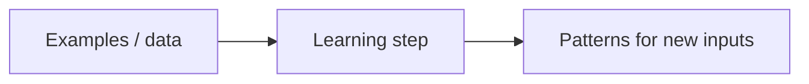
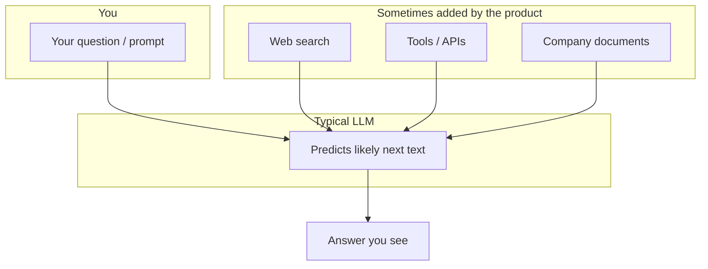

# Part I — Finding your bearings

*Sharif Uddin*

*[From Tokens to Understanding](from-tokens-to-understanding.md) · Volume I*

---

## Welcome

Before you open a chat window or an API panel, it helps to know **what kind of thing** you are talking to.

This first part is a quiet orientation: how the book is meant to be read; how the words *artificial intelligence* and *machine learning* actually get used in the wild; what people mean when they say *large language model*; and how we arrived—without equations—at the systems people discuss today.

> **Thread through Part I:** fluent language is not the same as correct information. The chapters ahead show you how to enjoy the first without mistaking it for the second.

---

## Contents of this part

*In the full volume table of contents, these correspond to sections 1–4.*

| # | Chapter | What you will take away |
|---|--------|-------------------------|
| **1** | How to use this book | Scope of this volume, pace, and study habits |
| **2** | AI, machine learning, and language models | Vocabulary for the landscape; why language modeling is different |
| **3** | What an LLM is—and what it is not | Mechanics in one picture; common misconceptions |
| **4** | A short history to the present | N-grams → neural nets → transformers → scale, intuitively |

**Plain list** (same as the table—for readers or tools that do not render tables well):

1. **How to use this book** — scope, pace, study habits.  
2. **AI, machine learning, and language models** — vocabulary; why language is a different prediction problem.  
3. **What an LLM is—and what it is not** — statistical model; not a DB, person, or web search by default.  
4. **A short history to the present** — n-grams through scale, intuitively.

---

## Chapter 1 — How to use this book

### Pace and rhythm

You do not owe this book a single uninterrupted sprint. Most readers will do better with **short visits**: a section or two, then a pause, then—when you are ready—**one** concrete action. The *Try it* sections at the end of each part are there for exactly that rhythm. They are optional in the strict sense, but in practice they are how the ideas stop being abstract.

If you step away for days or weeks, pick the thread back up by skimming the **contents** at the start of the part; you will see where this volume sits in the larger arc from orientation to mechanics to responsibility.

### What you will find here (and what you will not)

What you will find is plain-language explanation, a small set of mental models you can reuse when you read the news or a vendor page, and prompts you can type into any mainstream assistant. You will also see steady reminders about privacy, bias, and **checking claims** before you trust them.

What you will **not** find is a course in training a model from scratch, long mathematical derivations, or a catalogue of every architecture name in the research literature. Screenshots and menu labels go out of date; the habits and vocabulary in this book are meant to last. Where a topic truly needs room to breathe—deployment, retrieval, evaluation at scale—the later volumes pick up the story.

When something in these pages points forward to *From Prompts to Systems* (Volume II) or *From Models to Frontiers* (Volume III), treat that pointer as an open door, not a test you must pass today. For now, keep a scratch space—a note on your phone, a paper notebook, anything—for prompts that worked, words you had to look up, and questions you want to carry forward.

**The book is a map and a set of habits**, not a race to the last page.

---

## Chapter 2 — AI, machine learning, and language models in plain language

### Why the vocabulary matters

Open any news site and you will see the letters **AI** attached to wildly different stories. In one headline they refer to experiments in self-driving cars; in another, to a spam filter in your email; in a third, to the chat-style assistant that has become hard to ignore. All of those stories are “about AI” in the loose sense journalists use, yet they describe **different engineering problems**.

Sorting the vocabulary early saves you from arguing at cross-purposes—especially when someone’s frustration or excitement is really about **one** kind of system, while yours is about another.

### Artificial intelligence (broad)

**Artificial intelligence**, taken broadly, is a label for machines or programs that do tasks we associate with human judgment: sorting, ranking, generating text, planning, and so on. The label does not, by itself, tell you whether the system **learns from examples**.

A chess program built entirely from hand-written rules—“if the opponent does this, respond with that”—can still be called AI in conversation, but it is not **machine learning** in the modern sense, because its behavior was fixed by people, not shaped by data.

### Machine learning (narrower)

**Machine learning** means something more specific: the system **adjusts using data** so that it performs better on a task without a human writing a separate instruction for every case. You provide inputs, and usually the outputs you want; the machinery searches for **patterns** that generalize to new inputs. That process is deeply **statistical**. It tends to work when tomorrow’s world looks like yesterday’s data, and it can fail—sometimes badly—when the world shifts, or when the data silently favors one group over another.

The following picture is deliberately crude; it only marks the direction of travel:



```text
  examples  --->  learning step  --->  patterns for new inputs
```

### Why language breaks the tidy picture

So far, so tidy. **Language**, however, breaks the tidy picture of “one input, one label.” Many vision systems, for example, attach a single label to a single image—cat or dog. Text does not work that way. It unfolds **one fragment after another**, and what a fragment *means* depends on everything that came before in the sentence, the page, or the conversation.

A language model is therefore doing something richer than picking a label: it is working with **what is plausible next**, given the text so far. That is why the surface can be so convincing—smooth grammar, confident tone—while a specific fact underneath is simply wrong. Chapter 3 picks that problem apart; for now, the point is that **language modeling is a sequential, contextual game**, not a single snap decision.

### Large language models in the landscape

Elsewhere in machine learning you will find systems tuned for **images**, **sound**, **robots**, and more. A **large language model** is built around **text**—though many products now combine text with other signals, this volume begins from the text core.

When recent headlines say “AI,” they often mean an LLM, or a **product** that wraps an LLM together with search, tools, or company data. Those layers solve different problems. Keeping them distinct in your mind will spare you the disappointment of expecting one box to do another box’s job.

---

## Chapter 3 — What an LLM is—and what it is not

### The one-sentence idea

If you take one sentence from this chapter, let it be this: a **large language model** is software trained to **continue text** in a way that **looks reasonable** in context. It is trained to sound like a good answer, not certified to **be** a good answer. Everything else follows from that distinction.

The acronym unpacks in two parts. **Large** refers to scale—very many internal parameters, compared with older, smaller models—which matters for quality, speed, and cost. **Language model** means the system assigns **probabilities** to possible next **tokens** (small pieces of text), given everything you have fed it so far. At heart it is answering a statistical question—**what might plausibly come next?**—not a philosophical one about truth. When you “ask a question,” you are really supplying a **prefix**; the model continues in the style of an answer, because that is what its training rewarded.

Seen in that light, an LLM is a **statistical portrait of language** drawn from enormous amounts of writing. It picks up grammar, register, genre, even the shape of arguments and code, because those regularities appear in the data. That makes it genuinely useful for drafting, brainstorming, rephrasing, and exploration—**when** you treat it as assistance rather than as an oracle.

### Three confusions worth naming

Three confusions recur so often that they are worth naming outright, even at the risk of repetition.

| What people sometimes assume | What is closer to the truth |
|------------------------------|-----------------------------|
| It looks answers up in a table of facts. | It does **not** work like a curated database. If something like lookup appears, a **separate** system—search, tools, retrieval—was added on purpose. |
| It is “someone inside the machine.” | It has no biography, no conscience, no legal standing. Friendly pronouns are a **design choice** for dialogue, not evidence of a mind. |
| It always sees the live web. | A typical model’s factual picture is **frozen** at training time unless the product adds live browsing or tools. |

### A picture of core vs. product

When a diagram helps, imagine your message passing through a **core** that only predicts likely text, while optional pieces—search results, APIs, internal documents—may be wired in by the product around it:



```text
  Your prompt  -->  LLM (predicts next text)  -->  Answer you see
                        ^
                        |
            Optional inputs from the product:
            web search, tools, company documents
```

### Why polished prose can still be wrong

Why, then, can the prose look so polished and still be wrong? Because the training signal rewards **plausible continuation**, not verified fact. Clear structure, firm tone, and plausible detail can wrap around a false claim as easily as around a true one. There is no internal guarantee that the world matches the paragraph—only that the paragraph resembles answers the model saw during training.

Later parts of Volume I return to **hallucination**, **verification**, and situations where a model is simply the wrong tool. For now, hold the inequality in mind: **smooth writing does not imply guaranteed truth.**

---

## Chapter 4 — A short history to the present

### What you need from this chapter

You do not need a historian’s timeline to use a chat assistant today. You **do** need a story you can retell in your own words: how we moved from **counting short phrases** to **large neural models** that can mimic whole genres. Think of it as four beats in one melody—not four separate machines that have nothing to do with one another.

### Beat 1 — N-grams

The oldest strand is the **n-gram** idea: count how often short sequences of words appear in a large corpus, and use those counts to guess what comes next. If “the cat sat on the” appears constantly, “mat” earns a higher score than “theorem.” That trick helps with spell-checking and crude suggestion; it is easy to explain and was once enough for modest tools. Its weakness is also clear: it struggles with rare wording, with connections that stretch across long distances in a sentence, and with anything that depends on **meaning** rather than on nearby word habits alone.

### Beat 2 — Neural language models

**Neural** language models replaced giant tables of raw counts with **learned representations**—patterns in the data that the network discovers for itself. Words that behave similarly in context begin to **share** statistical support, which helps both fluency and rare words. For years, though, models were small by today’s standards, and very long structure in a document remained hard to capture.

### Beat 3 — Transformers and attention

**Transformers** and **attention** changed the engineering path. A fair mental image—without the wiring detail—is that when predicting the next token, the model learns **which earlier tokens to lean on heavily**. That mechanism, combined with depth and parallel training, made it practical to condition on **much longer stretches of text**. Researchers could then pour in more data, more compute, and more parameters and often see **steady gains**—until they ran into limits of data, hardware, or the task itself.

### Beat 4 — Scale

At **scale**—think billions of parameters and broad slices of public text—something visible in ordinary life began to happen. The same training objective that once produced better spelling started to produce passages that **imitated** explanations, code, dialogue, translation, even the *shape* of expertise, without anyone hand-writing a rule for each trick.

That is an observation about **imitation**, not a proof of human-like understanding. It means the training pressure, at sufficient scale, encourages a wide statistical mimicry of how people write—including writing that *looks* expert. The next parts of Volume I leave history behind and turn to **mechanics**: tokens, prediction step by step, and the limits of what fits in one request.

**Carry this chapter’s moral with you:** scale can unlock startling mimicry; it does not, by itself, solve truth or meaning.

---

## Try it

The exercises below are short. Use any mainstream chat tool you already have. They are not graded; they are meant to connect what you read to what the model **actually does** when you are not watching.

### Exercise 1 — “What an LLM is not”

Ask the model to list, in three bullet points, what an LLM is *not*—for example, not a database of verified facts, not a person, not live access to the web by default. Compare what you get to Chapter 3 of this part. If the model invents a fourth “not” that the book never claimed, strike it from your notes: that moment is the lesson.

### Exercise 2 — Verify one fact

Ask the model for **one specific fact** you can check elsewhere in a couple of minutes—a date, a number, a title. Verify it on a second source. If the fact was wrong, write a single sentence about **how** the model sounded (confident, hesitant, detailed). You are training your ear, not collecting mistakes for their own sake.

---

*End of Part I. Previous: [main volume — introduction](from-tokens-to-understanding.md) · Next: [Part II — How it works (without equations)](from-tokens-to-understanding-part-ii-how-it-works-without-equations.md).*
