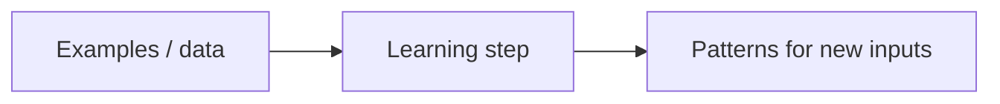
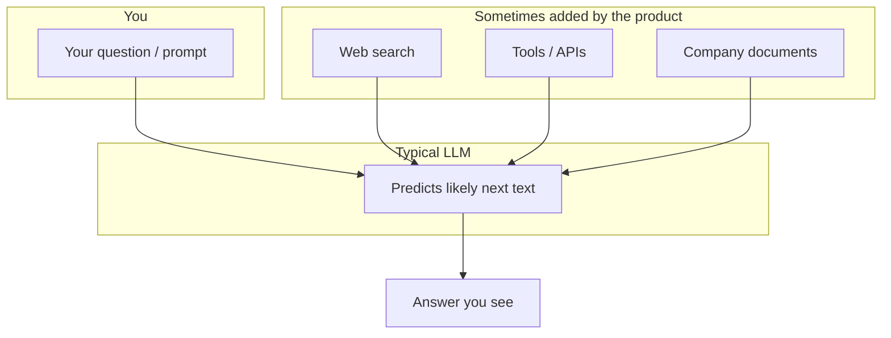

# Part I — Finding your bearings

*Sharif Uddin*

*[From Tokens to Understanding](from-tokens-to-understanding.md) · Volume I*

---

This part answers four questions in simple language (no math):

- How should you **use this book**?
- What do people mean by **AI**, **machine learning**, and **language models**?
- What is an **LLM**, really—and what is it **not**?
- How did we get from **simple word statistics** to **today’s large models**?

**One idea to carry through:** good writing from a model can still be **wrong**. You will learn to separate **smooth language** from **true facts**.

---

## Contents of this part

*In the full volume table of contents, these correspond to sections 1–4.*

| | Chapter | What you will take away |
|---|--------|-------------------------|
| **1** | How to use this book | Scope of this volume, pace, and study habits |
| **2** | AI, machine learning, and language models | Vocabulary for the landscape; why language modeling is different |
| **3** | What an LLM is—and what it is not | Mechanics in one picture; common misconceptions |
| **4** | A short history to the present | N-grams → neural nets → transformers → scale, intuitively |

**Contents (plain list — same as table, for readers or tools that do not render tables well):**

1. How to use this book — scope, pace, study habits.  
2. AI, machine learning, and language models — vocabulary; why language is a different prediction problem.  
3. What an LLM is—and what it is not — statistical model; not a DB, person, or web search by default.  
4. A short history to the present — n-grams through scale, intuitively.

---

## Chapter 1 — How to use this book

### The main idea

- You **do not** need to read this book from page 1 to the end in one week.
- Short sessions work well: read a little, **stop**, try one example (see *Try it* at the end of each part).
- If you stop for several days, start again from the **contents list** at the top of the part. That list shows where you are in the book.

### What this volume gives you

- Clear explanations (as far as possible without jargon walls).
- Words and pictures you can reuse when you read news or product pages.
- Example prompts you can type into a chat tool.
- Regular reminders: privacy, bias, and **checking facts**.

### What this volume does *not* try to do

- Train a model from zero (that is a different kind of course).
- Show long math proofs.
- Track every architecture name in the research world.
- Depend on one company’s buttons and menus (those change).

Harder topics point to **Volume II** (*From Prompts to Systems*) and **Volume III** (*From Models to Frontiers*).

### How to practice

1. Read one section.
2. Do **one** small action: try a prompt, or check one fact on another website.
3. Keep a **simple note file** (phone, paper, or computer): good prompts, new words, questions for later.

**Summary:** This book is a **map** and a set of **habits**, not a race.

---

## Chapter 2 — AI, machine learning, and language models in plain language

### Why vocabulary matters

The word **“AI”** appears in many headlines. The **same word** can mean different systems:

| Headline idea | Example of what “AI” might mean |
|---------------|----------------------------------|
| Cars | Self-driving experiments |
| Email | Spam filter |
| Chat | A large language model (or a product built around one) |

If two people use the word “AI” but mean different things, they will talk past each other. The list below fixes that.

---

### Artificial intelligence (AI)

- **Meaning:** A **wide** label for systems that do tasks we often link to people: sorting, ranking, writing, planning, and so on.
- **Important:** Not every “AI” system **learns from examples**.  
  - Example: a chess program built only from **hand-written rules** is still called AI in a loose way, but it does **not** learn from data like modern ML.

---

### Machine learning (ML)

- **Meaning:** The system **learns from data**. Humans do not write a separate rule for every case.
- You give **examples** (inputs, and usually correct outputs). The system looks for **patterns** that work on **new** inputs.
- It is **statistical**: it works best when future data looks like training data. It can fail when the world changes or the data is unfair or one-sided.

**Simple picture — data in, patterns out:**



*Same idea in plain text (works in any viewer):*

```text
  examples  --->  learning step  --->  patterns for new inputs
```

---

### Why language is a harder kind of task

Many tasks are **one label for one thing**:

- Photo → “cat” or “dog”.

**Language is not like that.** Text comes **one piece after another**. Meaning depends on **what came before** in the sentence, page, or chat.

So a **language model** is not only picking a single label. It works with **what word or fragment is likely next**, given the text so far. That is why the next words can **sound very natural** even when the content is false (we come back to that in Chapter 3).

---

### Where LLMs sit in the bigger picture

Other machine-learning tools include:

- **Vision:** images or video → labels, boxes, captions.
- **Speech:** sound → text, or text → sound.
- **Robotics:** sensing, planning, movement together.

A **large language model (LLM)** focuses on **text**. (Some products add images or sound; this book starts from **text**.)

Often, news “AI” means **an LLM** or a **product** that combines an LLM with search, tools, or other software. Those are **different layers**.

**Short recap:**

- **AI** = broad name for many kinds of systems.
- **Machine learning** = learn patterns from data.
- **Language model** = deal with **sequences** of text, step by step.
- **LLM** = a large, modern language model—one important branch of ML, not the whole of “AI.”

---

## Chapter 3 — What an LLM is—and what it is not

### In one sentence

An LLM is software trained to **continue text** in a way that **looks reasonable**. It is **not** the same as a fact database, a person, or the live web—unless extra tools are added on purpose.

---

### What “LLM” names

- **Large:** many internal parameters (we say “large” compared to older, smaller models). Size affects quality and cost.
- **Language model:** it assigns **chances** to possible next **tokens** (small pieces of text), based on everything you have given it so far.

So at core it answers: **“What might come next?”**—not **“What is true in the world?”**

---

### What it *is*

- A **statistical** model of language: it picks up patterns from huge amounts of text (grammar, style, tone, code layout, and so on).
- When you type a question, you are really giving a **starting text**; the model **continues** in a way that looks like a good answer **in form**.

**Good uses** (with care): drafts, brainstorming, rephrasing, exploring ideas—as **help**, not as a final authority.

---

### What it is *not* (very common mistakes)

| Myth | Simpler truth |
|------|----------------|
| “It looks up facts in a table.” | **No.** It does not work like a search engine’s index of verified facts. |
| “It is like a person inside the computer.” | **No.** It has no life story and no human responsibility. Friendly wording is **design**, not proof of a mind. |
| “It always knows the latest web news.” | **Not by default.** Training stops at a point in time unless the **product** adds live search or tools. |

If the app **can** search the web or call tools, that is an **extra feature**, not something all LLMs do by themselves.

---

### Why pretty text can still be wrong

The training goal is: **produce text that looks like good answers in the training data**. That is **not** the same goal as: **only say true things**.

So you can get:

- clear structure,
- confident tone,
- realistic detail,

…even when a **specific fact** is wrong.

**Rule of thumb:**

```text
Smooth writing  ≠  Guaranteed truth
```

Later parts of Volume I explain **hallucinations**, **how to check facts**, and **when not to use** a model.

---

### Simple diagram — you, the model, and optional tools



*Same idea in plain text (e.g. for PDF or plain Markdown viewers):*

```text
  Your prompt  -->  LLM (predicts next text)  -->  Answer you see
                        ^
                        |
            Optional inputs from the product:
            web search, tools, company documents
```

---

## Chapter 4 — A short history to the present

You do not need dates and names to use a chat tool. You only need a **rough story**: how we moved from **counting short phrases** to **today’s large neural models**.

---

### Step 1 — N-grams (old but easy to explain)

- **Idea:** Count **short chains of words** in a big pile of text.
- **Example:** After “happy”, “birthday” is very common. After “the cat sat on the”, “mat” is more common than “theorem.”
- **Good for:** spell-check, very simple suggestion.
- **Weak point:** hard with rare wording, long-distance connections, or **meaning**—because it mostly sees **local** word habits.

---

### Step 2 — Neural language models

- **Idea:** Instead of only counting, use a **network** that **learns** how words relate in context.
- **Gain:** similar words can **share** what the model learned; rare words are handled better than with tiny count tables.
- **Limit:** for a long time models were **small**; long structure in a document was still hard.

---

### Step 3 — Transformers and attention

- **Idea:** When predicting the next token, the model learns **which earlier words matter most** (“attention”).
- **Gain:** many layers + parallel training → much **longer context** (thousands of tokens in mature products).
- **Practical note:** more data + more compute + more parameters often brought **steady gains**—until limits hit (data, compute, or the task itself).

---

### Step 4 — Scale and what people noticed in daily life

- Models grew from **millions** to **billions** of parameters and trained on large text from the web and elsewhere.
- The output started to **look like** many **genres**: explanations, code, dialogue, translation—even when nobody hand-wrote rules for each style.

**This does not prove human-like understanding.** It means: at large scale, the training pushes the system to **imitate** patterns in human text—including text that **looks expert**.

**One-line summary:**  
First: local word statistics → then: neural models → then: transformers and scale → **fluent imitation** of many kinds of writing. **Truth and meaning** stay separate problems.

---

## Try it

These exercises are short. Use any major chat assistant.

1. **Three “nots”.**  
   Ask the model: *In three bullet points, what is an LLM **not**? (Not a database of facts, not a person, not live web by default.)*  
   Compare its answer to **Chapter 3** in this part. If it adds a fourth “not” that this book never said, **delete** that extra point from your notes.

2. **One fact, checked.**  
   Ask for **one specific fact** you can check in two minutes (a date, a number, a title).  
   Check it on another site.  
   Write **one line**: was the model’s tone **confident** or **uncertain** when it was wrong (if it was wrong)?

---

*End of Part I. Previous: [main volume — introduction](from-tokens-to-understanding.md) · Next: [Part II — How it works (without equations)](from-tokens-to-understanding-part-ii-how-it-works-without-equations.md).*
