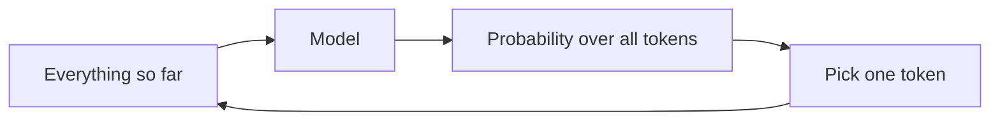
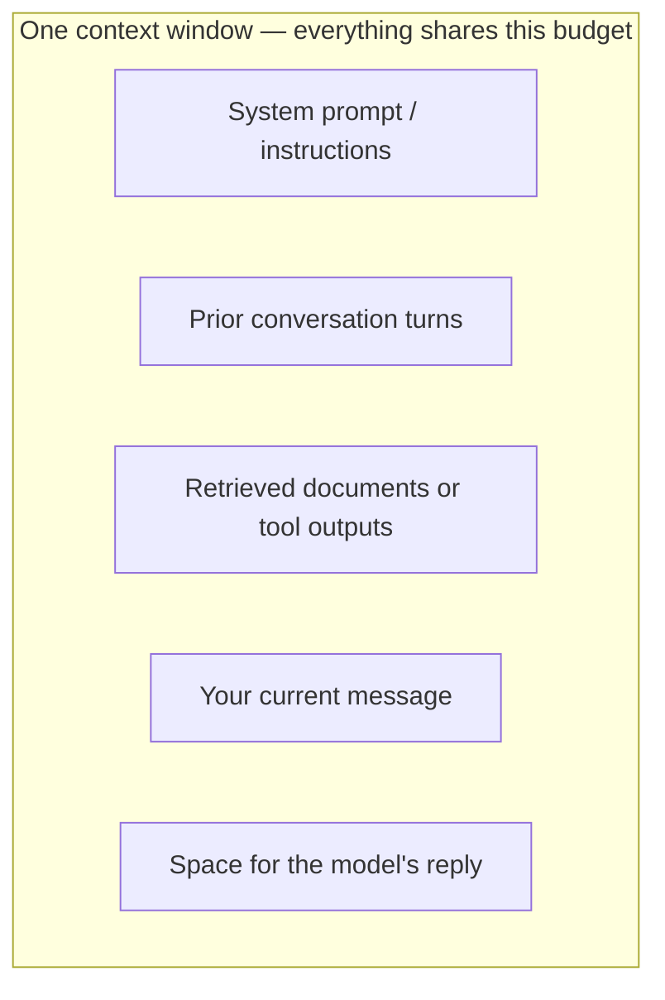

# Part II — How it works (without equations)

*Sharif Uddin*

*[From Tokens to Understanding](from-tokens-to-understanding.md) · Volume I*

---

Part I gave you **orientation**: vocabulary, history, and a clear line between fluency and truth. This part turns to **mechanics** — still without equations, but concrete enough that invoices, error messages, and model announcements start making sense. You will see how raw text becomes **tokens**, how the model turns a prefix into a **next token**, how **training and tuning** shape the model's behavior, and why **context length** is both a superpower and a hard ceiling.

Everything in this part connects back to one idea: the model is an extraordinarily sophisticated pattern-completion engine. Understanding *how* that engine runs explains why it does the things that surprise you — good and bad.

---

## Contents of this part

*In the full volume table of contents, these correspond to sections 5–8.*

| | Chapter | What you will take away |
|---|--------|-------------------------|
| **1** | Text as tokens | Why "token" is the unit of cost and memory, not always "word" |
| **2** | Prediction: the next piece of text | Next-token prediction, randomness, and misplaced confidence |
| **3** | Training and adaptation in one picture | From web-scale pretraining to chatty assistants — in one arc |
| **4** | Context windows and memory | What fits "in view," and what to do when it does not |

**Contents (plain list — same as table):**

1. Text as tokens — cost and limits in tokens, not always words.
2. Prediction: the next piece of text — sampling, temperature, confidence.
3. Training and adaptation in one picture — pretraining to chat assistants.
4. Context windows and memory — finite "view," forgetting in long chats.

---

## Chapter 1 — Text as tokens

**Have you ever paid for something and not known what the unit of measurement was?** Buying data by the "megabyte" used to confuse everyone. Buying LLM capacity by the "token" is doing the same thing to a new generation of users. If you do not know what a token is, you will misread your bill, misunderstand context limits, and occasionally get strange behavior from the model when it encounters text you would not expect to be unusual.

A **token** is the model's atomic unit of text. Not a character, not a word — a token. It is a fragment produced by a specific procedure called a **tokenizer**, and the exact fragments depend on the tokenizer used during training.

### How tokenization works

The tokenizer's job is to convert any text into a sequence of integer IDs from a fixed vocabulary — often 50,000 to 100,000 entries. Each ID points to a piece of text that the model has learned to recognize. The model never sees your raw text; it sees a sequence of numbers representing those pieces.

In English, many common words map to a single token. "the," "is," "of," "and" are all one token each. But the rules get stranger quickly:

| Your text | Likely tokenization |
|-----------|---------------------|
| `playing` | `play` + `ing` (2 tokens) |
| `unbelievable` | `un` + `believ` + `able` (3 tokens) |
| `2024` | `2024` (1 token in most models) |
| `getUserSessionConfig` | `get` + `User` + `Session` + `Config` (4 tokens) |
| `Hello, world!` | `Hello` + `,` + ` world` + `!` (4 tokens — note the space is part of the word token) |
| `…` (ellipsis) | may be 1 or 3 tokens depending on the tokenizer |

The general rule: **common sequences cost fewer tokens; rare sequences cost more**. A camelCase identifier your codebase invented will be chopped into pieces. A phrase that appears constantly in English text will often survive as one or two tokens.

### Why subwords? The vocabulary problem

Why not just tokenize by word? Two reasons.

First, vocabulary size. If every word form is its own token, you need a massive vocabulary — and you still cannot handle rare words, technical terms, names, or words in other languages. A subword approach keeps the vocabulary manageable: "un-" and "able" each appear in hundreds of thousands of words, so the model gets mileage from both pieces.

Second, morphology. Languages like Finnish, Turkish, or German form long compound words that are trivially split into meaningful subparts. A word-level tokenizer sees one unknown word; a subword tokenizer sees a sequence of recognizable components.

The tradeoff: the model must learn to reconstruct meaning from pieces. It handles this surprisingly well for common patterns, but it means that rare words and non-English text often require more tokens than you would intuitively expect.

### Why this matters in practice

**Cost.** API pricing is per token, not per word or character. A 750-word document is roughly 1,000 tokens in English — but that ratio shifts dramatically for code (often more tokens per character), for some languages (often more tokens per word), and for structured formats like JSON.

**Context limits.** The model's context window is measured in tokens. If the limit is 128,000 tokens, that sounds enormous — until your system prompt is 2,000 tokens, your chat history is 10,000 tokens, and you try to paste in a long document.

**Strange model behavior.** If you have ever seen a model behave oddly on a specific word — mispronounce a rare name, trip on a technical term, or make arithmetic errors on multi-digit numbers — tokenization is often the explanation. The model is not reading "3.14159"; it is reading a sequence of tokens that may split across the decimal point in ways that make arithmetic harder.

*Friction:* The most common budgeting mistake is accounting for the user's question and forgetting everything else — system prompt, tool outputs, retrieved documents, prior chat history. All of it eats tokens from the same fixed budget.

*Memorable detail:* A short camelCase method name like `calculateMonthlyCompoundInterestRate` can cost more tokens than the sentence "What is compound interest?" They are the same semantic load, but one is rare text and the other is common.

### A practical habit

Before working with a tool that has a context limit or charges per token, **paste your text into the provider's tokenizer** (most provide one) and look at the actual count. It takes thirty seconds and will save you from unpleasant surprises.

### Quick takeaway

- Tokens are subword fragments, not words. Common text is cheaper; rare text costs more.
- Cost and context limits are both measured in tokens.
- System prompts, history, and retrieved documents all share the same token budget as your question.

---

## Chapter 2 — Prediction: the next piece of text

**Imagine autocomplete — but instead of suggesting the next word on your phone keyboard, it writes the next 500 words, then 500 more, and keeps going until you tell it to stop.** That is, very roughly, what a language model does. Understanding the loop that makes this possible explains almost every behavior you will observe.

### The autoregressive loop

At the core of a large language model is one repeated operation, called **autoregressive generation**:

1. Given all the text so far (your prompt, plus any tokens the model has already generated), compute a probability distribution over every possible next token in the vocabulary.
2. Sample one token from that distribution.
3. Append the chosen token to the sequence.
4. Repeat from step 1.



```text
  Everything so far  →  Model  →  Probability over all tokens
                                          ↓
                                   Pick one token
                                          ↓
                           Append to sequence, repeat
```

The model does not generate the full answer in one step. It generates one token, then conditions the next step on everything including that token. This is why edits to early parts of the text can change what comes later — the chain is strictly causal.

### A walk-through

Suppose your prompt is: "The capital of France is"

Step 1: The model looks at this prefix and computes probabilities for every token in its vocabulary. "Paris" might score 0.92. "the" might score 0.02. "a" might score 0.01. Thousands of other tokens share the remaining 0.05.

Step 2: The model samples from this distribution. With high probability it picks "Paris."

Step 3: The new sequence is: "The capital of France is Paris"

Step 4: Repeat. Now it might pick "," with high probability, then "which," then "is," then "the," then "capital," then "city" — and so on, one token at a time, until it generates a stop token or reaches the maximum output length.

Notice that at no point does the model look up "capital of France" in a database. It produces "Paris" because, across billions of examples in its training data, "Paris" appeared after "The capital of France is" far more often than anything else. That is the mechanism — and it is why the model can be wrong while sounding completely certain.

### Temperature: the creativity dial

If the model always picked the single most likely next token, most outputs would be repetitive, predictable, and stilted. Real systems **sample** from the probability distribution instead of always taking the top pick.

**Temperature** is the parameter that controls how the sampling works. Think of it like this: the probability distribution is a weighted bag of marbles — each marble is a token, and the weight of each marble is how likely the model thinks it is. Temperature controls whether you use the weights exactly, or whether you flatten or sharpen them:

- **Low temperature (e.g. 0.1):** The distribution is sharpened. The most probable tokens get even more weight; the unlikely ones become even less likely. Outputs are more predictable, repetitive, and confident-sounding.
- **High temperature (e.g. 1.5):** The distribution is flattened. Unlikely tokens get a meaningful chance. Outputs are more varied and surprising — sometimes creative, sometimes incoherent.
- **Temperature 0 (or near 0):** The model nearly always picks the top token. Fully deterministic. Good for tasks where you want the same answer every time.
- **Temperature 1:** Uses the raw probability distribution from the model, unchanged.

*One-line analogy:* Low temperature is a quiz show contestant who only says the first thing that comes to mind. High temperature is that contestant after two coffees — more creative, occasionally wrong.

You do not need to set temperature yourself in most chat products — the provider picks a default. But understanding it explains why the same prompt gives different answers in separate conversations, and why creative writing tasks benefit from different settings than factual Q&A.

### "Sounds sure" is a structural property, not a quality signal

Here is the critical lesson from this chapter: **there is no step in the loop that checks whether the output is true.**

The model is trained on text that includes confident explanations, textbooks, encyclopedia entries, and expert writing. Confident, authoritative prose appears constantly in training data. So the model has learned, at a statistical level, that confident prose follows questions. It produces confident prose — regardless of whether the underlying facts are correct.

When you ask "What year was the Golden Gate Bridge completed?" and the model says "The Golden Gate Bridge was completed in 1937," it is not reporting from a database. It is continuing a prefix in the style of an answer. The year 1937 appears most often following that question pattern in the training data, so 1937 is what it produces. (In this case, it happens to be correct. In other cases, the most common-sounding answer is wrong.)

*Friction:* A common mistake is turning temperature down to make the model "more rigorous." Lower temperature produces more predictable, more confidently stated outputs — it does not produce more accurate ones. Statistical flatness is not the same as epistemic humility.

*Direct address:* If the model sounds certain, that tells you something about how common the style of a certain answer is in text. It tells you nothing reliable about whether that answer is correct. Keep these two things separate, and you will never be seriously misled.

### Quick takeaway

- The model generates text one token at a time, each step conditioned on everything before.
- Temperature controls the randomness of sampling — lower is more predictable, not more accurate.
- There is no truth-checking step in the generation loop. Confident-sounding output is a statistical artifact of training data, not a verification signal.

---

## Chapter 3 — Training and adaptation in one picture

**If you handed someone every book, article, and web page ever written and told them to absorb it all, they would know a great deal — and be terrible at answering your specific questions.** That is roughly the situation with a base language model. The training process has two phases: one that builds broad capability, and one that shapes it into something you can use. Understanding both helps you read model announcements, understand why behavior shifts between versions, and calibrate your expectations.

### Pretraining: learning from the internet

**Pretraining** is the large-scale first phase. The model is trained on an enormous text corpus — crawls of the web, digitized books, code repositories, scientific papers, forums, news archives — and asked to predict the next token, over and over, across hundreds of billions of examples.

From this single, simple objective, the model picks up an enormous amount of structure: grammar, register, genre conventions, factual associations that appear repeatedly in text, code syntax, mathematical reasoning patterns that show up in worked examples, and the rough shape of expert arguments in dozens of domains.

Think of it as reading everything ever written — not to memorize it, but to absorb its patterns deeply enough to continue any piece of it plausibly. A model after pretraining can write in the style of a legal brief, continue a Python function, translate between languages, and explain how photosynthesis works — all from the same base process.

*Anchor:* A pretrained model is like someone who has read every library in the world but has never had a conversation. Extraordinarily knowledgeable about patterns of text; not at all shaped to be a helpful assistant.

Pretraining is extremely expensive — tens of millions to hundreds of millions of dollars for frontier models, spread across weeks or months of computation on thousands of specialized processors. It also defines the model's **knowledge cutoff**: anything that happened after the training data was collected is unknown to the model by default.

### Instruction tuning: learning to answer, not just continue

A raw pretrained model, given the prompt "What is the capital of France?", might respond by generating more questions in the same style, or continuing in the voice of a quiz book, or producing a Wikipedia-style paragraph about geography. It is continuing text, not answering a question.

**Instruction tuning** (also called supervised fine-tuning or SFT) changes this. The model is trained on a curated dataset of examples showing: here is a question or instruction, here is a good answer. The model learns the format of being an assistant — answer the question, stay on topic, respond to follow-up, follow instructions like "be brief" or "use bullet points."

This stage is far cheaper than pretraining — it uses a small, carefully constructed dataset, not the entire internet. But it fundamentally changes the model's behavior from "continue this text" to "respond to this request."

### Preference tuning: learning what "better" means

Instruction tuning teaches format. **Preference tuning** (the most common form is called RLHF — reinforcement learning from human feedback, though related methods exist) teaches quality.

Human raters — or in some newer methods, an AI acting as judge — compare pairs of responses to the same prompt and indicate which is better: more helpful, more honest, safer, better-formatted. The model is then trained to produce responses that match the pattern of preferred outputs.

This is where the model's particular personality comes from: its tendency to hedge certain claims, its refusal patterns, its preferred response lengths, its level of formality. Those are not features the model discovered from pretraining — they are shaped by who did the rating and what they considered "better."

*Tiny vignette:* "One more epoch" of instruction tuning does not fix a problem introduced during preference training — they are different stages with different failure modes and different data. This distinction matters when debugging behavior changes after a model update.

### Base vs. chat: what the labels actually mean

When you see a model described as "base" or "foundation," it typically means a pretrained model without heavy chat-oriented tuning — powerful, but awkward for dialogue. When you see "chat," "instruct," or "assistant," it means the model has gone through at least instruction tuning, and often preference tuning too.

A behavior change after a provider updates their model may have come from any of these stages: a new pretraining data source, adjusted instruction tuning examples, or changed preference ratings. The word "smarter" in a release announcement does not tell you which. Sometimes "smarter" means better reasoning capability (pretraining improvement). Sometimes it means "follows instructions more reliably" (instruction tuning improvement). Sometimes it means "refuses fewer harmless requests" or "refuses more harmful ones" (preference tuning adjustment).

*Friction:* Teams upgrade to a new model version and are surprised when behavior changes in ways unrelated to the announced capability improvements. Understand that capability (reasoning, knowledge) and alignment (style, refusals, format) are different axes, and any of them can shift between versions.

### Quick takeaway

- **Pretraining** builds broad language and world-knowledge capability from enormous text corpora. Expensive. Defines knowledge cutoff.
- **Instruction tuning** teaches the model to behave like an assistant. Shapes format and basic dialogue.
- **Preference tuning** (RLHF and related methods) nudges behavior toward what humans (or AI judges) rate as better. Shapes personality, refusals, and style.
- "Base" and "chat" are meaningful distinctions. Model updates can change any stage, not just the one announced.

---

## Chapter 4 — Context windows and memory

**Imagine you are working at a desk, but the desk only holds one sheet of paper — and every time you write a new line, the line at the top disappears.** That is closer to how a language model handles memory than any human analogy involving a brain or a filing cabinet.

The model has no invisible notebook. There is no long-term memory being maintained between sessions by default. Everything the model "knows" during a reply is whatever sits in the **context window** — the tokens you send this turn, including system instructions, prior messages, retrieved documents, and any other text the product injects before your message arrives.

### What a context window is

A **context window** (also called **context length**) is a hard limit on how many tokens the model can consider at once for a single request. This includes:

- The **system prompt** (instructions the product places before your message)
- Any **prior conversation** the product includes (chat history)
- **Retrieved documents** or tool outputs the system injects
- Your **current message**
- Space reserved for the model's **reply**

All of these share the same fixed budget. Context windows have grown dramatically in recent years — from 4,000 tokens to 128,000 or even 1 million tokens in some models. But even a million-token context has a ceiling, and the pricing for very large contexts can be significant.



```text
  ┌─────────────────────────────────────────────┐
  │  Context window (all tokens share this)      │
  │  • System prompt                             │
  │  • Prior conversation turns                  │
  │  • Retrieved documents / tool outputs        │
  │  • Your current message                      │
  │  • Space for the model's reply               │
  └─────────────────────────────────────────────┘
```

### Forgetting and what to do about it

In a chat interface, earlier messages are typically concatenated into the prompt each time. When the running total approaches the context limit, the product must do something: truncate from the top (oldest messages disappear), summarize old turns (lossy compression), or ask you to start a new thread.

The model has no access to anything that fell outside the window. If you mentioned an important constraint in message one and the chat has grown long enough that message one dropped out, the model will simply not know about it. It is not being forgetful in a human sense — it never had access in the first place.

*Tiny vignette:* Summarization is a lossy compression of your conversation. Fine for "remind me what we were discussing." Catastrophic if the dropped line was "the patient is allergic to penicillin."

### Three strategies for working within limits

**Measure your baseline first.** Before building any workflow that involves long documents or long conversations, find out how much of your context budget your system prompt and typical history consume. The surprises almost always come from things other than the user's actual question.

**Summarize old conversation history.** When a chat thread is getting long, ask the model to produce a compact summary of the key decisions and facts from earlier in the conversation, then paste that summary into the start of a new thread. You lose nuance but preserve the load-bearing information.

**Retrieve instead of paste.** If you have a large document, do not paste all of it into the context. Instead, identify the specific sections relevant to your current question and include only those. This is the manual version of what retrieval-augmented generation (RAG) systems do automatically — and it is often more effective than hoping the model can find what it needs in a haystack of text.

*Friction:* "The AI should just remember our whole conversation" is the context window fighting human intuition about memory. The product interface may look like a persistent conversation; the underlying model only sees what fits in the current window. Those two things are different, and the product controls how the gap is managed.

*Direct address:* If something important happened twenty turns ago and the behavior changed inexplicably, check whether those turns are still in the window. The answer is often no.

### Why context costs money

Longer contexts are not free for providers either — processing attention over many tokens requires more compute. This is why long-context features are sometimes priced at a premium, why some providers charge different rates for input and output tokens, and why very large context windows are often offered at higher tiers. Context is a resource. Treating it as unlimited, even when the limit is technically large, leads to unexpected costs.

### Quick takeaway

- The context window is a hard limit on everything the model can see in one request — system prompt, history, documents, and your message combined.
- Material outside the context window is invisible to the model. "Forgetting" in long chats is real and architectural, not a personality quirk.
- Practical strategies: measure your baseline, summarize old history, retrieve instead of paste.
- Long context costs more compute. Treat it as a resource.

---

## Try it

Four short exercises. Use any mainstream chat tool you have access to. Nothing is graded — the goal is to turn the abstractions above into something you have directly observed.

### Exercise 1 — Count your tokens

Find a paragraph you have written recently — an email, a document section, anything around 100–150 words. If your provider has a public tokenizer tool, paste the text in and look at the token count. Note:

- The rough ratio of words to tokens (typically 1.3–1.5 for English prose)
- One word or punctuation mark that split in a way you did not expect

If you have access to two different text types, compare English prose with a code snippet of similar word count. Which is more expensive per word? Why?

### Exercise 2 — Same prompt, two temperatures

Ask a short creative question — something like "Write an opening sentence for a story set in an unusual location" — twice, in two separate chats. If your product exposes a temperature or creativity slider, try low and high settings. If it does not, the natural variation between fresh chat sessions is enough.

Compare the two responses. Which would you trust more for a factual question? Which would you prefer for brainstorming? What does this tell you about what temperature controls?

### Exercise 3 — Find the context limit in a long document

Take a long document — something over 2,000 words — and try asking the model questions about different parts of it: the beginning, the middle, and the end. Does the model answer with equal accuracy for all three parts?

Try pasting a much longer document if you have one. Does the model start missing things toward the end? This exercise is a direct observation of what happens at or near context limits — the model's answers degrade even when it appears to be considering the whole document.

### Exercise 4 — Base vs. chat behavior

Most providers allow you to access a base (pretrained, minimally tuned) model alongside their chat model. If yours does, give both the same prompt that sounds like the beginning of an article — something like: "Large language models were first introduced in"

The base model will probably continue the sentence as if writing an article. The chat model will probably treat it as a question and answer it. This single observation captures the difference between pretraining and instruction tuning more concretely than any explanation can.

---

*End of Part II. Previous: [Part I — Finding your bearings](from-tokens-to-understanding-part-i-finding-your-bearings.md) · Next: [Part III — Capabilities and limits](from-tokens-to-understanding-part-iii-capabilities-and-limits.md) · Or [main volume](from-tokens-to-understanding.md).*