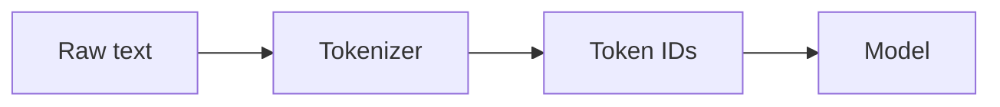
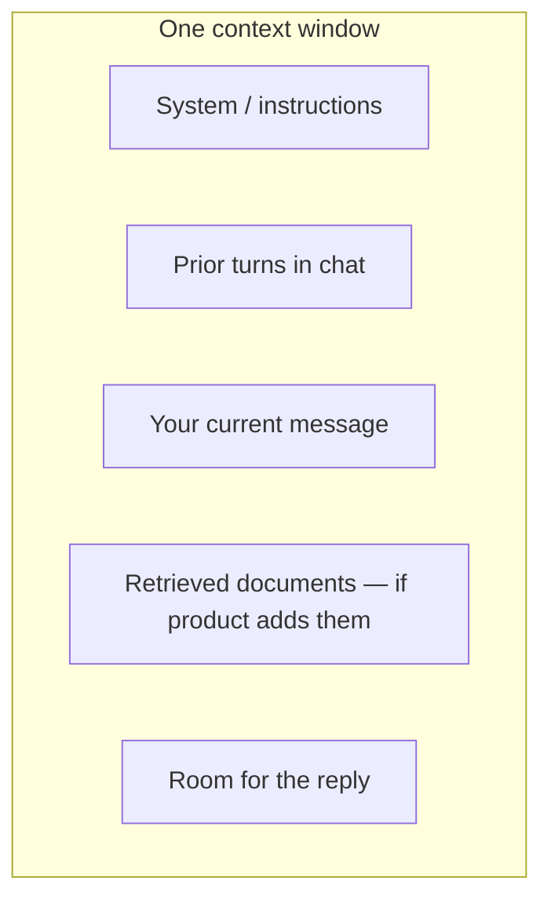
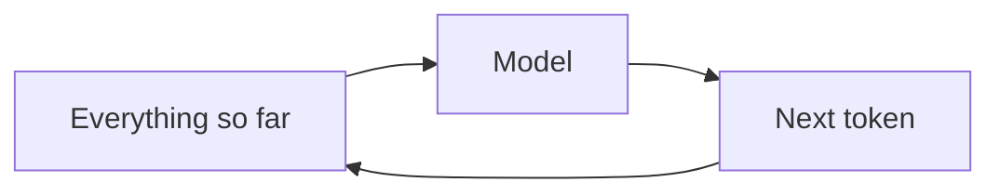

# From Tokens to Understanding

*An introduction to large language models — Volume I*

*Sharif Uddin*

---

## Who this book is for

This book is for anyone who has used a chat assistant — or knows they should — and wants to understand what is actually happening beneath the surface. No calculus. No programming experience. No prior AI coursework.

If you can follow a well-written article about technology and you are willing to try a few short exercises in a chat window, you have everything you need to read this book.

More specifically, this book is for:

- **Curious readers** who have tried ChatGPT or a similar tool and felt both impressed and faintly suspicious, and want to know which instinct to trust.
- **Students and early-career professionals** who want a grounded introduction to a technology that is reshaping their field.
- **Experienced professionals** in non-technical roles — managers, writers, lawyers, doctors, teachers — who use or evaluate AI tools and need a clear picture of what they can and cannot rely on.
- **Developers and engineers** who are comfortable with code but want a plain-language foundation before diving into APIs and systems work (Volume II covers that).

What this book is *not* for: people who want to train models, study the math, or build ML systems from scratch. Those are worthy goals, but they belong to a different book with different prerequisites.

---

## What you will walk away with

By the end of this volume, you will be able to:

- Explain in plain language what a large language model is, how it generates text, and why it sounds confident even when it is wrong.
- Read model documentation and provider announcements without getting lost in jargon.
- Write prompts that actually work — not magic incantations, but clear specifications.
- Recognize the most common failure modes: hallucination, ignored instructions, format drift.
- Know when *not* to use an LLM, which matters as much as knowing when to use one.
- Handle the responsibility questions: privacy, misinformation, academic integrity, and professional disclosure.
- Prepare yourself for Volume II if you want to build features and systems.

---

## Introduction

### Why this book exists

Large language models arrived in everyday tools — search, writing aids, coding helpers — faster than most curricula could absorb. If you have ever pasted a paragraph into a chat box and felt both impressed and a little suspicious, you are already in the right mood for this book. That tension is healthy and worth maintaining. These tools are genuinely useful. They are also genuinely unreliable in ways that are easy to miss because the failures sound exactly like the successes.

*From Tokens to Understanding* exists to close the gap between using these tools and understanding them. The goal is not to make you an ML engineer. It is to give you a **stable mental picture**: what these systems are doing under the hood at a conceptual level, what they are not, and how to interact with them so you get useful results without mistaking fluency for truth.

That last phrase is the thread that runs through every chapter: **fluency is not truth**. A language model is trained to produce plausible text. Plausible is not the same as accurate, and the gap between those two things is where most real-world problems with these tools originate.

### The arc of this book

The volume is divided into six parts, each building on the previous one:

**Part I — Finding your bearings.** Before anything else, you need the right vocabulary and a clear picture of what kind of thing you are dealing with. These chapters cover the AI/ML/LLM distinction, the one-sentence definition of what a language model actually does, and a short history of how we got here.

**Part II — How it works (without equations).** This is the mechanics layer: tokens (the unit of cost and limits), the next-token prediction loop (the heartbeat of every response), training stages (how a model goes from raw text-predictor to chat assistant), and context windows (the hard constraint on what the model can "see" at once).

**Part III — Capabilities and limits.** What are these systems genuinely good at, and where do they predictably fail? This part covers hallucination in detail (why it happens, not just that it happens), bias and fairness, and the practical realities of cost, speed, and access.

**Part IV — First steps with prompts.** The hands-on part. How chat interfaces are structured, how to write prompts that get closer to what you want, how to recover when the model drifts, and — critically — when to stop and use a different tool or a human expert.

**Part V — Responsibility in everyday use.** Privacy, misinformation, academic integrity, workplace norms. Not a manifesto, but practical habits for using these tools without causing harm to yourself or others.

**Part VI — What's next.** A consolidated glossary of core terms, a set of habits that will compound over time, and a clear pointer to Volume II (*From Prompts to Systems*) for when you are ready to build.

### How to read it

Read in short sessions and do the *Try it* exercises. The exercises are not optional decoration — they are how the abstract concepts become habits you can actually use. An idea you have tested once is worth five you have only read about.

If you get stuck or confused, that is normal and often useful. Write down what confused you. A named confusion is a confusion you can resolve; a vague sense that "I don't quite get it" is one that stays.

You do not need to read this cover to cover before using any of it. Parts III and IV in particular are useful as standalone references once you have read Parts I and II.

---

## How this volume is organized

Each link below opens a full part — with introduction, chapter prose, exercises, and navigation.

### Part I — Finding your bearings

→ [from-tokens-to-understanding-part-i-finding-your-bearings.md](from-tokens-to-understanding-part-i-finding-your-bearings.md)

*What kind of thing is an LLM? Where did it come from? Why does fluent language not imply correct information?*

### Part II — How it works (without equations)

→ [from-tokens-to-understanding-part-ii-how-it-works-without-equations.md](from-tokens-to-understanding-part-ii-how-it-works-without-equations.md)

*Tokens, prediction, training, context windows — the mechanics that explain why the model behaves the way it does.*

### Part III — Capabilities and limits

→ [from-tokens-to-understanding-part-iii-capabilities-and-limits.md](from-tokens-to-understanding-part-iii-capabilities-and-limits.md)

*What LLMs reliably do well, where they fail, and what bias and cost look like in practice.*

### Part IV — First steps with prompts

→ [from-tokens-to-understanding-part-iv-first-steps-with-prompts.md](from-tokens-to-understanding-part-iv-first-steps-with-prompts.md)

*Writing prompts that work, diagnosing failures, knowing when to stop.*

### Part V — Responsibility in everyday use

→ [from-tokens-to-understanding-part-v-responsibility-in-everyday-use.md](from-tokens-to-understanding-part-v-responsibility-in-everyday-use.md)

*Privacy, misinformation, academic integrity, and the habits that protect you and others.*

### Part VI — What's next

→ [from-tokens-to-understanding-part-vi-whats-next.md](from-tokens-to-understanding-part-vi-whats-next.md)

*Core glossary, compounding habits, and the bridge to Volume II.*

---

## Detailed outline

→ See parts below.

---

## Notes

### Accessibility

Every part file includes both a **table** and a **plain list** version of the contents, so the structure is readable in any environment including screen readers and plain-text pipelines.

### Exercise index (*Try it* sections)

Each part ends with a *Try it* section — exercises designed to surface real model behavior, not to test you. They are slightly cheeky by design.

| Part | Rough focus |
|------|-------------|
| I | Test the "what it is not"; verify one factual claim; observe the continuation instinct |
| II | Token counting; temperature experiment; training stage observation |
| III | Hallucination probe; strengths vs. limits self-assessment |
| IV | Structured vs. vague prompt; failure mode diagnosis |
| V | Terms of service skim; redaction practice |
| VI | Glossary recall; Volume II preview |

### Glossary (Volume I core terms)

Definitions for the five most-used terms in this volume. Full context for each is in the part where it is introduced.

- **Token** — The model's atomic unit of text (roughly a word or part of a word). Cost and context limits are counted in tokens, not characters or words.
- **Context window** — The maximum amount of text the model can consider in one request. Everything outside this window is invisible to the model during that request.
- **Prompt** — Everything you send as input for a turn: system instructions, your message, any prior conversation the interface includes, and any documents or retrieved text the product injects.
- **Hallucination** — A confident, specific, fluent output that is factually false or unsupported. Not a rare edge case — a structural property of how these models work.
- **Fine-tuning** — Further training on a smaller, task-specific dataset to change the model's behavior. Distinct from prompting (no weights change) and from retrieval (no training involved).

### Sample prompts (adapt freely)

These templates work in any mainstream chat tool.

1. **Explain like I'm new.** "Explain [concept] in three short paragraphs for someone who has never studied machine learning. End with one thing that is still commonly misunderstood."

2. **Constrained rewrite.** "Rewrite the following text for [audience]. Keep under [N] words. Do not add new factual claims."

3. **Uncertainty probe.** "Answer [question]. After your answer, list two things you are least sure about and explain how I could verify them."

4. **Format drill.** "Given [input], return only: (1) three bullet takeaways, (2) one risk, (3) one question I should ask an expert before acting on this."

### Reading list

- **Your model provider's documentation and system/model card** — the single most useful reference for the specific tool you use.
- Russell & Norvig, *Artificial Intelligence: A Modern Approach* — broad context for the AI landscape.
- Jurafsky & Martin, *Speech and Language Processing* — deeper NLP foundations for readers who want the textbook treatment after Volume I.
- *From Prompts to Systems* (Volume II of this series) — the natural next step.

### Optional figures

**Tokenization (conceptual flow)**

**Context window (what fits in one request)**

**Autoregressive generation (simplified)**

---

*Start reading: [Part I — Finding your bearings](from-tokens-to-understanding-part-i-finding-your-bearings.md)*