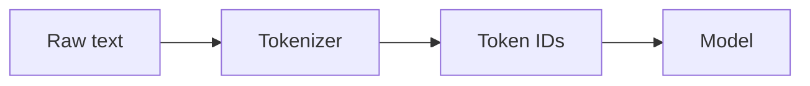
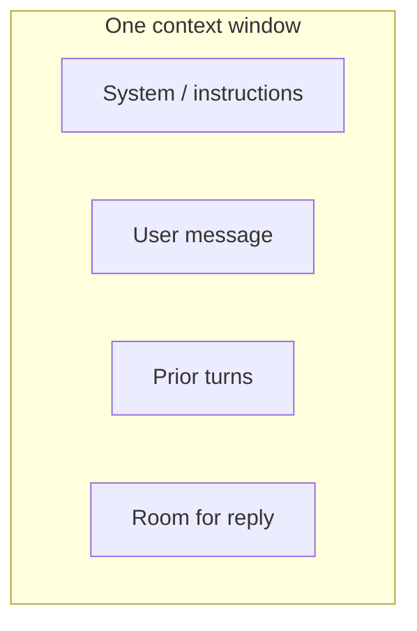
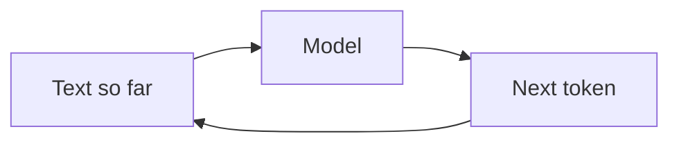

# From Tokens to Understanding

*An introduction to large language models — Volume I (Basic)*

*Sharif Uddin*

## Audience

**Curious readers, students, and professionals** who want **plain-language explanations**, **minimal math**, and enough orientation to use LLMs **confidently and responsibly**—without assuming prior machine-learning coursework. If you can read a short article online and follow step-by-step examples in a chat interface, you have enough background to start here. (If you sometimes skim the theory and jump to the *Try it* boxes, that is allowed—the book is written so the exercises **interrupt** passive reading on purpose.) This volume prepares you for *From Prompts to Systems* (Volume II), which assumes the vocabulary and habits you build in these pages.

---

## Introduction

### What this book is for

Large language models arrived in everyday tools—search, writing aids, coding helpers—faster than many curricula could absorb. If you have ever pasted a paragraph into a chat box and felt both impressed and a little suspicious, you are already in the right mood.

*From Tokens to Understanding* gives you a **stable mental picture**: what these systems are doing under the hood (at a **conceptual** level), **what they are not**, and **how to interact with them** so you get useful results without mistaking fluency for truth. The goal is **understanding and safe first steps**, not job-ready ML engineering. You will learn to read **tokens** and **context limits**, write **clear prompts**, spot **common failure modes**, and think about **privacy, bias, and misuse** before you rely on an LLM for anything important. When you are ready to wire models into products, measure quality, and choose RAG versus fine-tuning, **Volume II** picks up from there.

### How this volume is organized

Here is the arc—**not** a uniform template inside every chapter, but a path you can feel under your feet. We move from **orientation** (what LLMs are in the landscape of AI) to **mechanics** (tokens, prediction, context—still without equations) to **capabilities and limits**, then to **practical prompting** and **responsibility**. A short **bridge** chapter points to intermediate topics so you know how the trilogy fits together.

Examples stay **tool-agnostic** where possible: any major chat assistant can illustrate the ideas. Optional “go deeper” notes can live in **Notes** or appendices so the main line stays welcoming.

### Prerequisites and suggested use

No calculus or programming is required. **Curiosity** and willingness to **try prompts yourself** are enough. If you later learn a little Python or JavaScript, it will help when you move to Volume II—but this book does not depend on it.

Use the outline as a **manuscript contract**: you can merge chapters for a shorter course or expand “mechanics” if your readers want more diagrams. Keep jargon tables and reading lists in **Notes** so chapters stay readable on first pass.

---

## Detailed outline

Each link below opens a **draft part**—introduction, contents table, full chapter prose, and chapter takeaways—not only a bullet outline.

### Part I — Finding your bearings

→ [from-tokens-to-understanding-part-i-finding-your-bearings.md](from-tokens-to-understanding-part-i-finding-your-bearings.md)

### Part II — How it works (without equations)

→ [from-tokens-to-understanding-part-ii-how-it-works-without-equations.md](from-tokens-to-understanding-part-ii-how-it-works-without-equations.md)

### Part III — Capabilities and limits

→ [from-tokens-to-understanding-part-iii-capabilities-and-limits.md](from-tokens-to-understanding-part-iii-capabilities-and-limits.md)

### Part IV — First steps with prompts

→ [from-tokens-to-understanding-part-iv-first-steps-with-prompts.md](from-tokens-to-understanding-part-iv-first-steps-with-prompts.md)

### Part V — Responsibility in everyday use

→ [from-tokens-to-understanding-part-v-responsibility-in-everyday-use.md](from-tokens-to-understanding-part-v-responsibility-in-everyday-use.md)

### Part VI — What’s next

→ [from-tokens-to-understanding-part-vi-whats-next.md](from-tokens-to-understanding-part-vi-whats-next.md)

---

## Notes

This section collects **optional material**: prompts to adapt, a short reading list, a **glossary export**, an **exercise index**, **optional figures** (e.g. for HTML/PDF), and accessibility notes. It does not replace the parts—those stay the canonical draft.

### Accessibility

Part files use **tables** for “Contents of this part.” Each part also includes a **plain list** under the heading **Contents (plain list — same as table)** so the same structure is available when tables are hard to use (some ebook pipelines, screen-reader setups, or plain-text export).

### Exercise index (*Try it* sections)

The *Try it* prompts are meant to be **slightly cheeky** where helpful—designed to surface real model behavior, not to grade you.

| Part | File | Rough focus |
|------|------|-------------|
| I | [part-i](from-tokens-to-understanding-part-i-finding-your-bearings.md) | Three “nots” vs Chapter 3; verify one fact |
| II | [part-ii](from-tokens-to-understanding-part-ii-how-it-works-without-equations.md) | Token count; temperature |
| III | [part-iii](from-tokens-to-understanding-part-iii-capabilities-and-limits.md) | Hallucination probe; strengths vs limits |
| IV | [part-iv](from-tokens-to-understanding-part-iv-first-steps-with-prompts.md) | Structured vs vague prompt; fix one failure |
| V | [part-v](from-tokens-to-understanding-part-v-responsibility-in-everyday-use.md) | Terms of service skim; redaction |
| VI | [part-vi](from-tokens-to-understanding-part-vi-whats-next.md) | Glossary recall; Volume II preview |

**Exercise index (plain list):** Part I — three “nots”, one fact checked · Part II — tokens, temperature · Part III — hallucination probe, strengths vs limits · Part IV — structured prompt, fix failure mode · Part V — terms of service, redaction · Part VI — glossary recall, Volume II preview.

### Sample prompts (adapt freely)

These are **templates**, not magic strings. Swap domain and constraints.

1. **Explain like I’m new.** “Explain [concept] in three short paragraphs for someone who has never studied machine learning. End with one thing that is still misunderstood.”

2. **Constrained rewrite.** “Rewrite the following text for [audience]. Keep under [N] words. Do not add new factual claims.”

3. **Uncertainty probe.** “Answer [question]. After your answer, list two things you are least sure about and how I could verify them.”

4. **Format drill.** “Given [input], return only: (1) three bullet takeaways, (2) one risk, (3) one question I should ask an expert.”

5. **Red-team (carefully).** Only in safe contexts: “What mistakes might someone make when interpreting LLM outputs?” Use output as discussion, not as authority.

### Glossary export (Volume I core)

Short definitions aligned with [Part VI — Chapter 1](from-tokens-to-understanding-part-vi-whats-next.md). For full context, read the part where each term is motivated.

- **Token** — A model’s atomic piece of text (often a subword); **cost** and **context limits** are counted in tokens.  
- **Context (window)** — How much text the model can consider at once for a request; long chats may **drop** older turns.  
- **Prompt** — All **input** you supply for a turn (instructions, examples, included history).  
- **Hallucination** — Confident **false** or **ungrounded** specific claims; not mere disagreement.  
- **Fine-tuning** — Further **training** on a smaller dataset to steer behavior; distinct from prompting alone and from retrieval.

### Reading list (short, non-exhaustive)

- Russell & Norvig, *Artificial Intelligence: A Modern Approach* — broad context for “AI” vs narrow tools.  
- Jurafsky & Martin, *Speech and Language Processing* (relevant chapters) — deeper NLP for readers who want textbooks after Volume I.  
- Your model provider’s **documentation** and **system card / model card** for the product you actually use—primary for behavior and limits.  
- Follow-up in this series: [*From Prompts to Systems*](../from-prompts-to-systems/from-prompts-to-systems.md), then [*From Models to Frontiers*](../from-models-to-frontiers/from-models-to-frontiers.md).

### Optional figures (for PDF / HTML builds)

Mermaid diagrams render on many Markdown hosts (e.g. GitHub). You can paste these into slides or export via tooling.

**Tokenization (conceptual flow)**

**Context window (what fits in one request)**

**Autoregressive step (simplified)**

### Chapter notes

_Add your own manuscript notes, citations, and per-chapter todos below._

